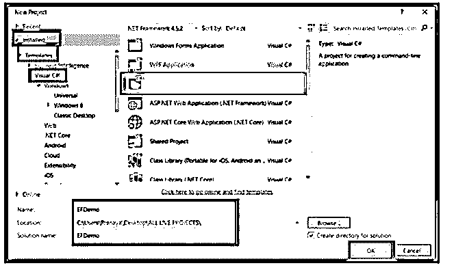
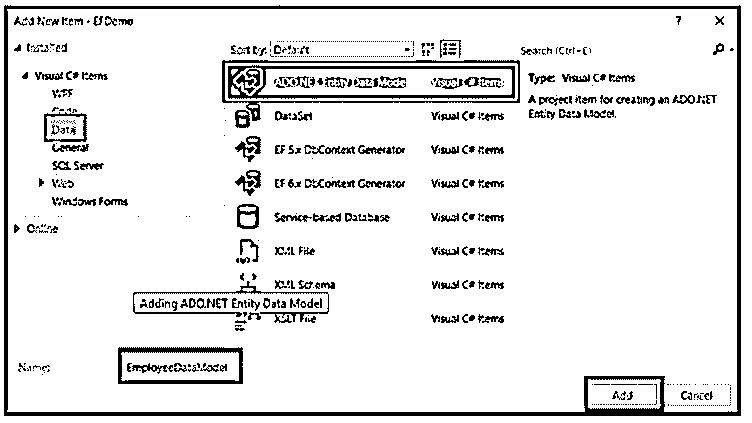
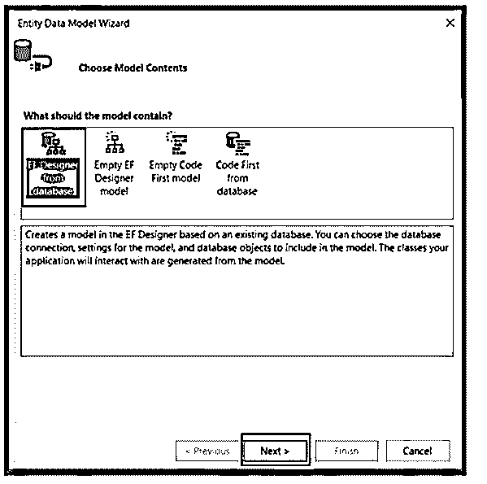
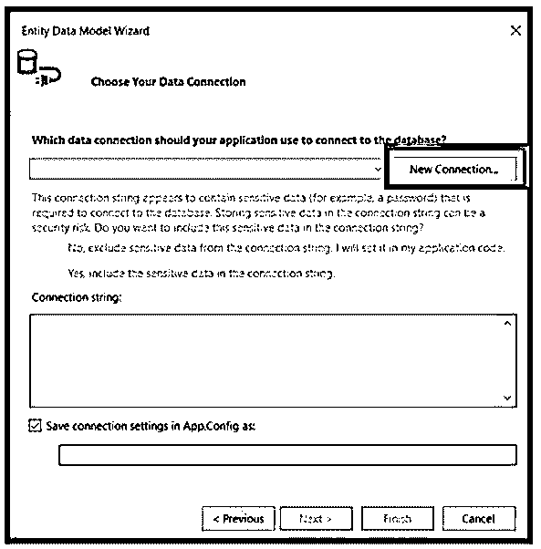
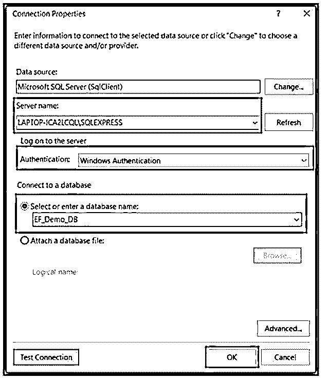
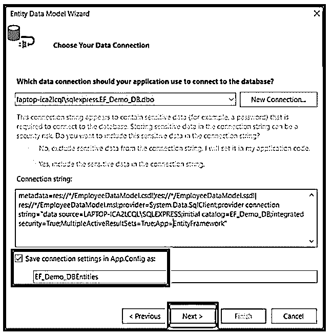
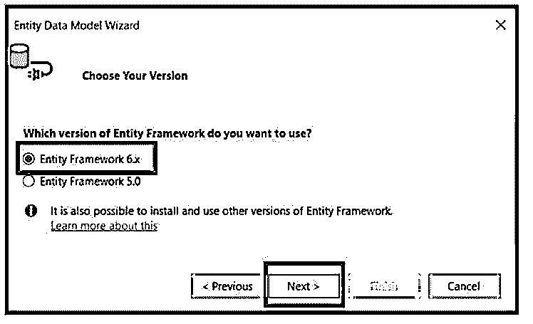
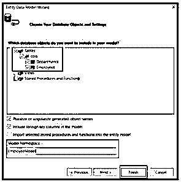
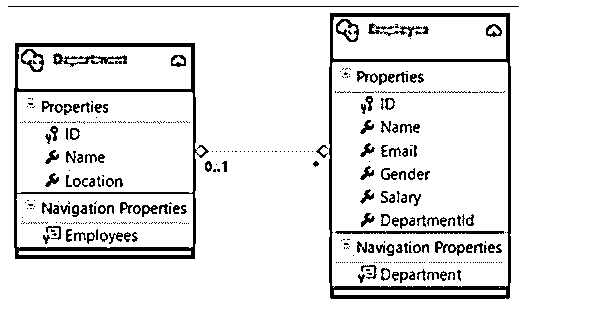
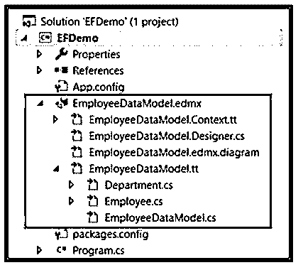

# 实体框架 C#

> 原文：<https://www.educba.com/entity-framework-c-sharp/>


## 实体框架 C#简介

以下文章提供了实体框架 C#的概要。实体框架是一个对象关系映射(ORM ),通过消除应用程序中的冗余工作来帮助提高用户的应用程序生产率。EF 构建所需的 DB 命令来写入或读取 DB 中的数据，并完美地执行它们。最后，EF 在 DB 中执行查询，并将结果放入域对象中，以便与应用程序一起工作。

### C#中的实体框架是什么？

实体框架是一个对象源关系映射(ORM)框架。Net 应用程序，它允许开发人员通过使用特定于领域的对象来处理关系数据，而无需了解存储数据的数据库的列和表。此外，它描述了实体框架最小化了开发人员通常编写的数据访问代码。

<small>网页开发、编程语言、软件测试&其他</small>

### C#项目中的实体框架

让我们假设 Department 和 Employee 表包含几个部门的记录和各个部门的雇员。

为了实现这一点，我们必须构建 Department 和 Employee 类。然后，为了从数据库中检索这些数据，我们需要对 ADO.NET 进行编码。最后，在检索数据时，我们必须创建 Employee 和 Department 对象，用恢复的数据填充它们。
以上整个事情很繁琐，但是通过实体框架，很容易；那些事情可以自动完成；我们需要向 EF 提供数据库模式。让我们来看看使用 EF 创建应用程序的以下步骤。

为了创建数据库模式，使用 SQL 脚本创建数据库 EF_Demo_DB，并创建雇员和部门表

**代码:**

```
-- to create the Database EF_Demo_DB
CREATE DATABASE EF_Demo_DB;
GO
-- Use EF_Demo_DB database
USE EF_Demo_DB;
GO
-- to Create the table Departments
CREATE TABLE Departments
(
ID INT PRIMARY KEY IDENTITY(1,1),
Name VARCHAR(50),
Location VARCHAR(50)
)
Go
-- to Create the table Employees
CREATE TABLE Employees
(
ID INT PRIMARY KEY IDENTITY(1,1),
Name VARCHAR(50),
Email VARCHAR(50),
Gender VARCHAR(50),
Salary INT,
DepartmentId INT FOREIGN KEY REFERENCES Departments(ID)
)
Go
-- --to Populate the table with few records
INSERT INTO Departments VALUES ('HR', 'Bangalore')
INSERT INTO Departments VALUES ('Sales', 'Cochin')
INSERT INTO Departments VALUES ('IT', 'Chennai')
Go
--to Populate the table with few records
INSERT INTO Employees VALUES ('Philip', 'Philip@g.com', 'Male', 45000, 2)
INSERT INTO Employees VALUES ('Mary', 'Mary@g.com', 'Female', 30000, 2)
INSERT INTO Employees VALUES ('Valarie', 'Valarie@g.com', 'Female', 35000, 3)
INSERT INTO Employees VALUES ('John', 'John@g.com', 'Male', 80000, 1)
INSERT INTO Employees VALUES ('Joseph', 'jojog.com', 'Male', 60000, 1)
INSERT INTO Employees VALUES ('Steve', 'Steve@g.com', 'Male', 45000, 3)
INSERT INTO Employees VALUES ('Peter', 'Peter@g.com', 'Male', 60000, 1)
INSERT INTO Employees VALUES ('Rio', 'rio@g.com', 'Female', 345000, 3)
INSERT INTO Employees VALUES ('Ben', 'Ben@g.com', 'Male', 70000, 1)
Go 
```

**创建控制台应用程序**

数据准备就绪后，创建一个名为 EFDemo 的新控制台应用程序，如下所示:




**添加 ADO.NET 实体数据模型**

要创建控制台应用程序，请添加 ADO.NET 实体数据模型，右键单击该项目，然后添加-新建项目-数据-ADO.NET 实体数据模型，并将名称设置为 EmployeeDataModel，如下所示。




点击添加按钮，从数据库中选择 EF 设计师，点击下一步按钮，从数据库中选择 EF 设计师。这里，我们使用 EF 数据库优先的方法。




单击“下一步”按钮后，它会要求您选择如下所示的数据连接向导；单击新建连接按钮。




单击 New Connection 按钮，提供必要数据库详细信息，最后单击“Test Connection”并单击 OK。




选择数据连接并在 App 中保存实体连接设置。然后，配置如下所示，给名字 EF_Demo_DBEntities，点击下一步按钮。




在这里，它要求您选择实体框架 6.x 并选择下一步按钮，如图所示。




选择所需的表，将模型名称空间更改为“EmployeeModel”，然后单击所示的 Finish 按钮。




单击“完成”按钮将生成 EmployeeDataModel.edmx 文件。




这是 EDMX 文件的结构，如下所示，




使用 EF，我们创建了应用程序。

**代码:**

```
namespace EFDemo
{
class Program
{
static void Main(string[] args)
{
using (EF_Demo_DBEntities DBEntities = new EF_Demo_DBEntities())
{
List<Department> listDepartments = DBEntities.Departments.ToList();
Console.WriteLine();
foreach (Department dept in listDepartments)
{
Console.WriteLine(" Department = {0}, Location = {1}", dept.Name, dept.Location);
foreach (Employee emp in dept.Employees)
{
Console.WriteLine("\t Name = {0}, Email = {1}, Gender = {2}, salary = {3}",
emp.Name, emp.Email, emp.Gender, emp.Salary);
}
Console.WriteLine();
}
Console.ReadKey();
}
}
}
} 
```

### 数据库模式和类

实体框架功能:

让我们来看看实体框架的特点:

*   **建模:** EF 基于具有各种数据类型的 get/ set 属性的属性构建 EDM。如果向数据库存储或查询实体数据，它将使用该模型。
*   **查询:**实体框架支持 LINQ 查询从数据库中获取数据。数据库提供商将 LINQ 的查询翻译成特定于数据库的查询语言。EF 允许对数据库执行 SQL 查询。
*   **变更跟踪:**实体框架跟踪需要提交给 DB 的属性值的情况下发生的变更。
*   **存储:**实体框架在调用 SaveChanges()方法的同时，基于对实体的修改，执行对数据库的插入、删除和更新命令。此外，实体框架 EF 提供了 SaveChangesAsync()方法。
*   **并发:**实体框架默认使用乐观并发来保护另一个用户的更改，因为数据是从数据库中提取的。
*   **缓存:**实体框架包括初始级别的开箱即用缓存。因此查询从缓存中返回数据，而不是命中 DB。
*   **配置:**实体框架支持使用数据注释属性或 API 配置 EF 模型，默认情况下覆盖约定。
*   **内置约定:**实体框架通过编程配置模式遵循约定，包含自动配置 EF 模型的默认规则。

### 结论

在本文中，我们看到了 EF 的特性以及如何创建实体框架。然而，与 EF 相比，使用 ADO.NET 电码是乏味的。此外，这是一个耗时且容易出错的过程，因此微软提供了一个名为 Entity Framework 的框架来自动化我们应用程序的整个数据库相关工作。

### 推荐文章

这是一个实体框架 C#的指南。这里我们讨论一下 C#项目中的简介和实体框架，以便更好的理解。您也可以看看以下文章，了解更多信息–

1.  [c#中的汇编引用](https://www.educba.com/assembly-reference-in-c-sharp/)
2.  [时间戳到日期 C#](https://www.educba.com/timestamp-to-date-c-sharp/)
3.  [C#读取文件](https://www.educba.com/c-sharp-read-file/)
4.  [C# URL 编码](https://www.educba.com/c-sharp-url-encode/)


