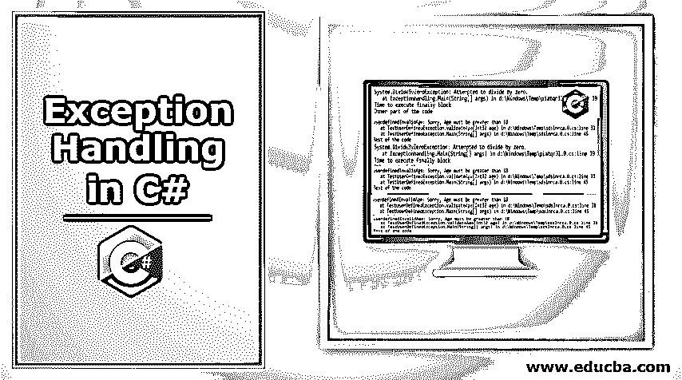

# C#中的异常处理

> 原文：<https://www.educba.com/exception-handling-in-c-sharp/>




## C#中异常处理的介绍

我们不能期望用户一直输入正确的细节。但是，如果不正确或意外的输入没有得到正确处理，整个代码可能会崩溃或陷入无限循环。这是在执行程序时由于意外情况或输入而出现的问题。例如，当一个数被零除时，结果是无穷大。[异常处理是](https://www.educba.com/exception-handling-in-java/)告诉程序继续下一个代码块或者在某些情况下提供定义的结果的方式。

### C#中异常处理的关键字

异常处理可以用下面四个关键字来完成。

<small>网页开发、编程语言、软件测试&其他</small>

1.  **Try:**Try 块定义了要处理的异常的类型。这就是异常被捕获的地方。它总是与一个制动块配对。
2.  **Catch:** 一旦 try 块定义了类型并在执行过程中得到一个异常，Catch 块将确认要使用的异常处理程序的类型。该块还将确定在哪里处理异常。正如关键字所示，这就像是捕捉异常。
3.  **最后:**这个块有一些语句集。不管抛出了什么异常，在 final 块中定义的语句总是会被执行。
4.  **Throw:** 当一个异常被捕获时， [throw 关键字用于](https://www.educba.com/throw-keyword-in-java/)显示被捕获的异常。

通过定义异常处理程序，您可以将软件或代码从许多麻烦中解救出来。在可能出现异常的地方定义异常处理程序是一个好的做法。

**语法:**

每当引发异常时，声明的方法都会借助 try 和 catch 关键字捕获异常。我们需要将这种组合放在代码的一部分，这是一个异常。这些代码被称为受保护代码。您也可以为一个 try 关键字定义多个 catch 关键字。在内容的结尾，代码的最后部分将被执行到，无论是否引发异常，都将被执行。

**代码:**

```
try
{
//Define the statement that could cause an exception.
}
Catch(ExceptionName secondException)
{
//error handling code
}
Finally
{
//define the statement that will be executed
}
```

### C#中的异常处理是如何工作的？

有许多用于处理异常的预定义类。try 块覆盖了可能抛出异常的代码部分，catch 确认在捕获到异常时该做什么。块的最后一部分定义了无论是否检测到异常都必须做什么，如果设置了异常，抛出部分显示消息。

#### C#中的异常类

C#中有许多类可以用来表示异常。所有的类都是从名为 System 的主类派生出来的。例外。很少有类也是从 System 派生的。ApplicationException 和 System.SystemException

### C#中异常类的示例

异常源自系统。异常类。下面是 C#常见异常类的列表。

| **异常** | **描述** |
| 系统。DivideByZeroException | 处理试图将一个数除以零时出现的错误。 |
| 系统。NullReferenceException | 处理引用不存在的对象时的错误。 |
| 系统。InvalidCastException | 尝试无效转换时处理错误。 |
| 系统。IO 异常 | 处理所有输入输出错误。 |
| 系统。FieldAccessException | 当试图访问未授权的类时 |

#### 1.C#尝试/捕捉

在 C#中，异常处理是通过 try 和 catches 块完成的。C#中的 try 块用于放置可能引发异常的代码。该异常由 catch 块处理。

##### 不带 try/catch 的 C#示例

**代码:**

```
using System;
public class exceptionhandling
{
public static void Main(string[] args)
{
int a = 10;
int b = 0;
int x = a/b;    //we are trying to divide the number with zero
Console.WriteLine("other part of the code");
}
}
```

**输出:**
T3】


##### C# try/catch 示例

**代码**

```
using System;
public class ExExample
{
public static void Main(string[] args)
{
try
{
int a = 10;
int b = 0;
int x = a / b;
}
catch (Exception e) { Console.WriteLine(e); }
Console.WriteLine("Rest of the code");
}
}
```

**输出:**
T3】


### C#中异常类的使用最后

不管异常是否被捕获，它都会向您显示消息。

**代码**

```
using System;
public class Exceptionhandling
{
public static void Main(string[] args)
{
try
{
int x = 5;
int y= 0;
int z = x / y;
}
catch (Exception obj) { Console.WriteLine(obj); }
finally { Console.WriteLine("Time to execute finally block"); }
Console.WriteLine("Other part of the code");
}
}
```

**输出:**
T3】


#### 1.未处理异常的 C# finally 示例

**代码**

```
using System;
public class ExceptionHandling
{
public static void Main(string[] args)
{
try
{
int p = 6;
int q = 0;
int r= p/q;
}
catch (NullReferenceException nullObject) { Console.WriteLine(nullObject); }
finally { Console.WriteLine("Exception not handled. Now Finally section will be executed"); }
Console.WriteLine("Other part of the code");
}
}
```

**输出:**
T3】


#### 2.C#用户定义的异常

不仅是系统定义的，我们还可以设置自己的异常。然而，我们需要继承代码来完成这项工作。

**代码**

```
using System;
public class userdefinedInvalidAge : Exception
{
public userdefinedInvalidAge (String errorMessage)
: base(errorMessage)
{
}
}
public class TestUserDefinedException
{
static void validateAge(int age)
{
if (age < 18)
{
throw new userdefinedInvalidAge("Sorry, Age must be greater than 18");
}
}
public static void Main(string[] args)
{
try
{
validateAge(12);
}
catch (userdefinedInvalidAge e) { Console.WriteLine(e); }
Console.WriteLine("Rest of the code");
}
}
```

**输出:**
T3】


### 结论

在任何你认为可能因为任何事情而产生错误的地方，都应该使用异常处理程序。使用 catch 语句并从一般异常开始到特定异常是非常重要的。如果没有适当的异常处理程序，您的整个软件或代码都将面临风险。

### 推荐文章

这是 C#中异常处理的指南。这里我们讨论 C#中异常处理的工作原理、例子和 c#的使用。您也可以浏览我们的其他相关文章，了解更多信息-

1.  [c#的用途](https://www.educba.com/uses-of-c-sharp/)
2.  [C# if 语句](https://www.educba.com/c-sharp-if-statement/)
3.  [VB.NET 的异常处理](https://www.educba.com/exception-handling-in-vb-dot-net/)
4.  [c#中的重载和重写](https://www.educba.com/overloading-and-overriding-in-c/)


