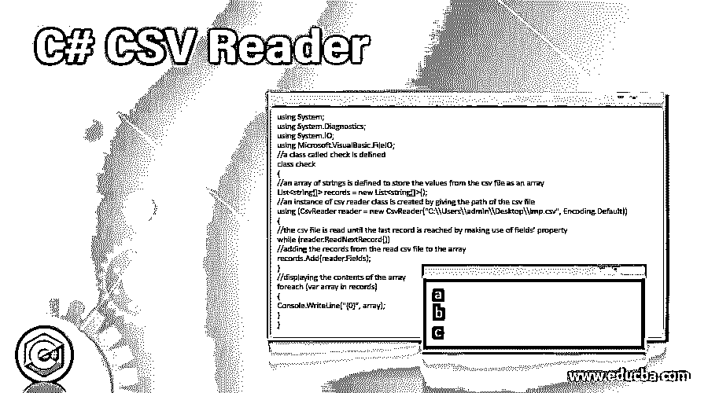
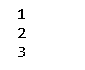

# C# CSV 阅读器

> 原文：<https://www.educba.com/c-csv-reader/>




## C# CSV 阅读器简介

一个简单的 C#类库是轻量级和开源的，可以从文本文件和字符串中读取 CSV 格式的数据，在 C#中称为 CSV Reader 它的最新版本必须下载并包含在我们作为编译的 DLL 或源创建的项目中，并且它在 Microsoft visual studio 2008 或 CSVReader.cs 和 StringConverter.cs 的所有版本中进行自我构建。可以下载以将 CSV 阅读器直接包含在我们的源代码中，该源代码可以添加到我们在 Microsoft visual studio 上进行的 C#项目中，CSV 阅读器类属于 DataSreams.csv 命名空间。

**C # CSV 阅读器的语法如下:**

<small>网页开发、编程语言、软件测试&其他</small>

```
public sealed class CsvReader : ReaderBase
```

### C# CSV 阅读器的工作原理

*   每当需要通过 C#程序读取逗号分隔值文件时，我们就使用 CSV Reader。
*   CSV 读取器属于 DataStrems.csv 命名空间。
*   CSV Reader 是一个简单的轻量级开源库，可以从文本文件和字符串中读取 CSV 格式的数据。
*   CSV Reader 的最新版本可以从 Microsoft visual studio 2008 下载，并且必须包含在我们作为编译的 DLL 或源代码创建的项目中。
*   将 CVS 阅读器包含到源代码中的另一种方法是下载 CSVReader.cs 和 StringConverter.cs，并添加到我们在 Microsoft Visual Studio 上创建的项目中。

### C# CSV 阅读器示例

下面举几个例子

#### 示例#1

程序演示 CSV 阅读器在一个程序中读取 CSV 文件的内容

**代码:**

```
using System;
using System.Diagnostics;
using System.IO;
using Microsoft.VisualBasic.FileIO;
//a class called check is defined
class check
{
//an array of strings is defined to store the values from the csv file as an array
List<string[]> records = new List<string[]>();
//an instance of csv reader class is created by giving the path of the csv file
using (CsvReader reader = new CsvReader("C:\\Users\\admin\\Desktop\\imp.csv", Encoding.Default))
{
//the csv file is read until the last record is reached by making use of fields’ property
while (reader.ReadNextRecord())
//adding the records from the read csv file to the array
records.Add(reader.Fields);
}
//displaying the contents of the array
foreach (var array in records)
{
Console.WriteLine("{0}", array);
}
}
```

**输出:**


在上面的程序中，定义了一个名为 check 的类。然后定义一个字符串数组，将 csv 文件中的值存储为一个数组。然后，通过给出 csv 文件的路径来创建 csv 阅读器类的实例。然后，利用字段的属性从 csv 文件中读取记录，直到到达最后一条记录，然后使用 Add 方法将读取的记录添加到数组中。然后显示数组的内容。输出如上所示。

**Note:** Please save the input file in .csv format before providing the path of the file as input to the program.

#### 实施例 2

程序演示 CSV 阅读器在一个程序中读取 CSV 文件的内容

**代码:**

```
using System;
using System.Diagnostics;
using System.IO;
using Microsoft.VisualBasic.FileIO;
//a class called check is defined
class check
{
//an array of integers is defined to store the values from the csv file as an array
List<int[]> records = new List<int[]>();
//an instance of csv reader class is created by giving the path of the csv file
using (CsvReader reader = new CsvReader("C:\\Users\\admin\\Desktop\\imp1.csv", Encoding.Default))
{
//the csv file is read until the last record is reached by making use of fields’ property
while (reader.ReadNextRecord())
//adding the records from the read csv file to the array
records.Add(reader.Fields);
}
//displaying the contents of the array
foreach (var array in records)
{
Console.WriteLine("{0}", array);
}
}
```

**输出:**




在上面的程序中，定义了一个名为 check 的类。然后定义一个字符串数组，将 csv 文件中的值存储为一个数组。然后，通过给出 csv 文件的路径来创建 csv 阅读器类的实例。然后，利用字段的属性从 csv 文件中读取记录，直到到达最后一条记录，然后使用 Add 方法将读取的记录添加到数组中。然后显示数组的内容。输出如上所示。

**Note:** Please save the input file in .csv format before providing the path of the file as input to the program.

### 优势

使用 CSV Reader 有几个优点。它们是:

*   在我们的程序中使用 CSV 阅读器是读取 CSV 格式文件的最简单的方法。
*   在我们的程序中使用 CSV Reader 读取 CSV 格式的文件时，程序的性能非常好。
*   我们程序中使用的 csv 阅读器完全遵循 CSV 文件的文件格式，使得阅读任务尽可能简单。
*   如果我们在程序中使用 csv 阅读器，就没有必要使用第三方库来读取 CSV 格式的文件。

### 结论

在本教程中，我们通过 CSV Reader 的定义、语法和工作原理(通过编程示例及其输出)以及在我们的程序中使用 CSV Reader 读取 CSV 格式的文件的优势，来理解 C#中 CSV Reader 的概念。

### 推荐文章

这是一个 C# CSV 阅读器指南。在这里，我们讨论了 C# CSV 阅读器的工作原理和例子，以及代码和输出。您也可以看看以下文章，了解更多信息–

1.  [R CSV 文件](https://www.educba.com/r-csv-files/)
2.  [c#中的分部](https://www.educba.com/partial-in-c-sharp/)
3.  [C#序列化](https://www.educba.com/c-serialization/)
4.  [Python 读取 CSV 文件](https://www.educba.com/python-read-csv-file/)


