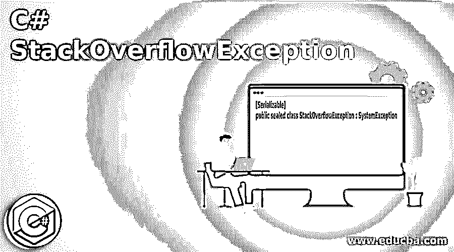
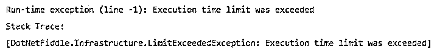
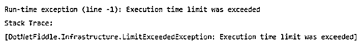

# C#堆栈溢出异常

> 原文：<https://www.educba.com/c-sharp-stackoverflowexception/>




## c# stack overflow 异常简介

以下文章提供了 C# StackOverflowException 的概述。每当我们调用太多嵌套在彼此内部的方法，并且每次调用都在内存中创建一个堆栈，导致无限的不受控制的递归并终止程序而不显示错误消息时，就会引发异常，使用该异常无法恢复，并且 try 和 catch 块也无法捕获该异常，这种情况称为 StackOverflowException。

这个 StackOverflowException 是由称为操作码的微软中间语言(MSIL)指令抛出的。LocalLoc 指令和 StackOverflowException 类有几个方法，像 StackOverflowException()、stack overflow exception(string message)、stack overflow exception(string message、exception innerexception)等。

<small>网页开发、编程语言、软件测试&其他</small>

**语法:**

```
[Serializable]
public sealed class StackOverflowException : SystemException
```

### 工作

*   每当需要调用太多嵌套在彼此内部的方法时，每次调用都会在内存中创建一个堆栈，导致无限的不受控制的递归，并终止程序而不显示错误消息，使用这种方法无法恢复，并且 try 和 catch 块也无法捕获异常，这种情况称为 StackOverflowException。
*   被称为操作码的微软中间语言(MSIL)指令抛出。LocalLoc 指令。
*   StackOverflowException 类有几种方法，如 StackOverflowException()、stack overflow exception(string message)、stack overflow exception(string message、exception innerexception)等。

### C#堆栈溢出异常的示例

 **下面是提到的例子:

#### 示例#1

C#程序演示当运行时发生无限递归时的堆栈溢出异常。

**代码:**

```
using System;
//a class called program is defined
public class program
{
// a method called rec is defined which takes a value as parameter and increases its value by one
static void Rec(int vals)
{
// since we have written a recursive loop and 0 is passed as a parameter, it ends in an infinite loop causing exception
Console.WriteLine(vals);
Rec(++vals);
}
//main method is called
public static void Main()
{
//The rec method is called to start the infinite recursion
Rec(0);
}
}
```

**输出:**




在上面的程序中，定义了一个名为 program 的类。然后定义了一个名为 rec 的方法，它将一个值作为参数，并将其值加 1。然后调用 main 方法，在该方法中，通过将零作为参数传递来开始递归的无限循环。然后，由于我们已经编写了一个递归循环，0 作为参数传递，它在一个无限循环中结束，导致异常。

#### 实施例 2

C#程序演示 StackOverflowException，即使在使用 try 块和 catch 代码块捕获异常后，运行时仍会发生无限递归。

**代码:**

```
using System;
//a class called check is defined
public class check
{
// a method called ex is defined which takes a value as parameter and increases its value by one
static void ex(int equals)
{
Console.WriteLine(equals);
ex(++equals);
}
//main method is called within which try and block methods are defined to catch the exception
public static void Main()
{
try
{
//The ex method is called by passing zero as a parameter to start the infinite recursion
ex(0);
}
catch (StackOverflowException ep)
{
Console.WriteLine(ep.Message);
}
}
}
```

**输出:**




在上面的程序中，定义了一个名为 check 的类。然后定义了一个名为 ex 的方法，它将一个值作为参数，并将其值加 1。然后调用 main 方法，其中定义了 try 块和 catch 块。递归的无限循环从将零作为参数传递给 try 块中的 ex 方法开始。然后，由于我们已经编写了一个递归循环，0 作为参数传递，它在一个无限循环中结束，导致异常。即使我们编写了 catch 块来捕获异常，它也无法捕获这个异常，因为这个异常超出了要捕获的 catch 块的范围。

### C#中避免 stack overflow 异常的步骤

*   当内存中的堆栈已满时，会发生堆栈溢出，这个问题可以通过设置堆栈的深度来解决，这个信息可以由调试器提供。大多数编程语言都允许设置堆栈的大小或递归的最大深度值。
*   既然我们有机会设置堆栈深度的值，我们必须设置一个尽可能小的值，并观察输出。如果输出没有溢出，我们可以将其更改为更大的值，如果发生堆栈溢出，我们将能够解码为堆栈深度设置的正确值。
*   因为即使我们可以使用 try 代码块和 catch 代码块，也无法捕获 StackOverflowException，所以通过使用调试器了解堆栈的深度，我们可以创建自己的异常。因此，要创建可以捕获 StackOverflowException 的异常，必须借助调试器了解堆栈的深度。
*   导致递归的代码是 StackOverflowException 的原因。因此，必须对代码进行手动和统计分析，并事先找出是否有任何东西会导致程序中的无限递归。

### 推荐文章

这是一个 C# StackOverflowException 的指南。这里我们讨论避免 stack overflow 异常的介绍、工作、例子和步骤。您也可以看看以下文章，了解更多信息–

1.  [C#排序集](https://www.educba.com/c-sharp-sortedset/)
2.  [C#使用静态](https://www.educba.com/c-using-static/)
3.  [C#字典](https://www.educba.com/c-sharp-dictionary/)
4.  [c#中的分部](https://www.educba.com/partial-in-c-sharp/)


**