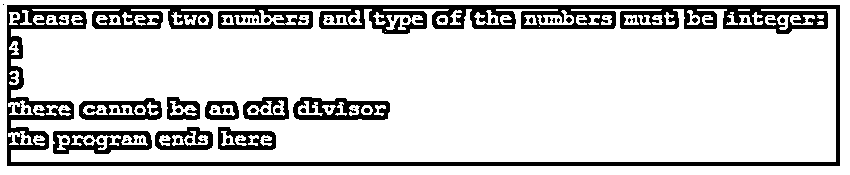

# C#中的自定义异常

> 原文：<https://www.educba.com/custom-exception-in-c-sharp/>


## C#中自定义异常简介

应用于我们正在处理的应用程序的业务规则被违反，并且如果为此引发异常，则此类异常被称为自定义异常，并且此自定义异常类是从应用程序异常或异常类派生的，并且此应用程序异常类包含在。版本中的. net 框架。Net v1.0 版。它被设计成 C#中自定义异常类的基类，我们使用关键字 throw 来引发 C#中的自定义异常，这些自定义异常类不同于 C#中系统创建的异常。

### C#中自定义异常的处理

*   应用程序执行期间发生的错误类型由异常处理。我们所说的错误是指在应用程序执行过程中出现的意外问题。相反，由于几个原因，在应用程序执行期间会出现异常。
*   应用程序使用异常处理来处理在应用程序执行期间预期会发生的异常。C#中的异常处理是使用两个关键字 try、catch、finally 和 throw 来完成的。
*   C#中的异常由类表示。C#中的这些异常类都是从 System。异常类，无论是以直接方式还是以间接方式。
*   应用程序异常类或 Exception 类用于创建可以引发的自定义异常。
*   只有当这些异常可以被捕获并以不同的方式处理时，创建自定义异常才有用。
*   如果我们在 C#中创建自定义异常，可以使用错误监控工具来监控应用程序发生的错误和错误日志。

### 例子

下面是提到的例子:

<small>网页开发、编程语言、软件测试&其他</small>

#### 示例#1

C#程序来演示在程序中使用自定义异常。

**代码:**

```
using System;
//a namespace called user defined is defined
namespace UserDefined
{
//a class called test weather is defined
class Testweather
{
//main method is called
static void Main(string[] args)
{
//an instance of the class temperat is defined
Temperat tem = new Temperat();
try
{
//the show method of temperat class is called using the instance of the temperat class
tem.show();
}
catch(WeatheriscoldException e)
{
Console.WriteLine("The weather is cold Exception: {0}", e.Message);
}
Console.ReadKey();
}
}
}
//a custom exception class called Weather is cold Exception class is created which is thrown if the weather is cold
public class WeatheriscoldException: Exception
{
public WeatheriscoldException(string message): base(message)
{
}
}
//a class called temperat is defined
public class Temperat
{
//a variable called temp is defined and assigned to zero
int temp = 0;
//a method called show is defined
public void show()
{
//the temperature is checked to determine the weather
if(temp == 0)
{
throw (new WeatheriscoldException("The temperature is found to be zero and hence the weather is cold"));
}
else
{
Console.WriteLine("The Temperature is: {0}", temp);
}
}
}
```

**输出:**


**说明:**

*   在上面的程序中，定义了一个名为 user defined 的名称空间。然后定义了一个称为测试天气的类。然后调用 main 方法。然后定义了 temperat 类的一个实例。然后使用 temperat 类的实例调用 temperat 类的 show 方法。
*   然后，创建一个名为天气寒冷异常类的自定义异常类，如果天气寒冷，将引发该异常类。然后定义了一个名为 temperat 的类。然后定义一个名为 temp 的变量，并将其赋值为零。然后定义了一个名为 show 的方法。然后检查温度以确定天气。

#### 实施例 2

C#程序来演示在程序中使用自定义异常。

**代码:**

```
using System;
//a namespace called exception handling is defined
namespace ExceptionHandling
{
//The custom exception class called odd num exception class is created by inheriting the exception class
public class OddNumException : Exception
{
//The property message is being overridden here
public override string Message
{
get
{
return "There cannot be an odd divisor";
}
}
}
//a class called check is defined
class check
{
//main method is called
static void Main(string[] args)
{
//three integer variables are defined
int a, b, c;
Console.WriteLine("Please enter two numbers and type of the numbers must be integer:");
a = int.Parse(Console.ReadLine());
b = int.Parse(Console.ReadLine());
try
{
//checking if the divisor is an odd number or an even number
if (b % 2 > 0)
{
//exception is thrown if the divisor is an odd number
throw new OddNumException();
}
c = a / b;
Console.WriteLine(c);
}
catch (OddNumException two)
{
Console.WriteLine(two.Message);
}
Console.WriteLine("The program ends here");
Console.ReadKey();
}
}
}
```

**输出:**




**说明:**

*   在上面的程序中，定义了一个名为异常处理的名称空间。然后这个名为 odd num exception class 的类是通过继承 exception 类创建的。那么属性消息将被覆盖。然后定义了一个名为 check 的类。然后调用 main 方法。然后，定义三个整数变量来获取两个输入整数变量，另一个整数变量用于存储整数输出。
*   然后使用 parse()方法解析这两个整数变量。然后检查第二个整数变量或除数，看它是奇数还是偶数，这是通过检查除数除以 2 的余数是否大于零或等于零来完成的。如果除数是奇数，就会抛出异常。

### 优势

下面是提到的优点:

*   C#中自定义异常类型的自定义处理可以通过调用代码来完成。
*   通过使用 C#中的自定义异常处理，可以自定义对自定义异常类型的监视。

### 推荐文章

这是 C#中自定义异常的指南。这里我们分别讨论 C#和示例中自定义异常的工作方式。您也可以看看以下文章，了解更多信息–

1.  [C# StringReader](https://www.educba.com/c-sharp-stringreader/)
2.  [C#自定义属性](https://www.educba.com/c-sharp-custom-attribute/)
3.  [c#中的正则表达式](https://www.educba.com/regular-expression-in-c-sharp/)
4.  [c#中的冒泡排序](https://www.educba.com/bubble-sort-in-c-sharp/)


