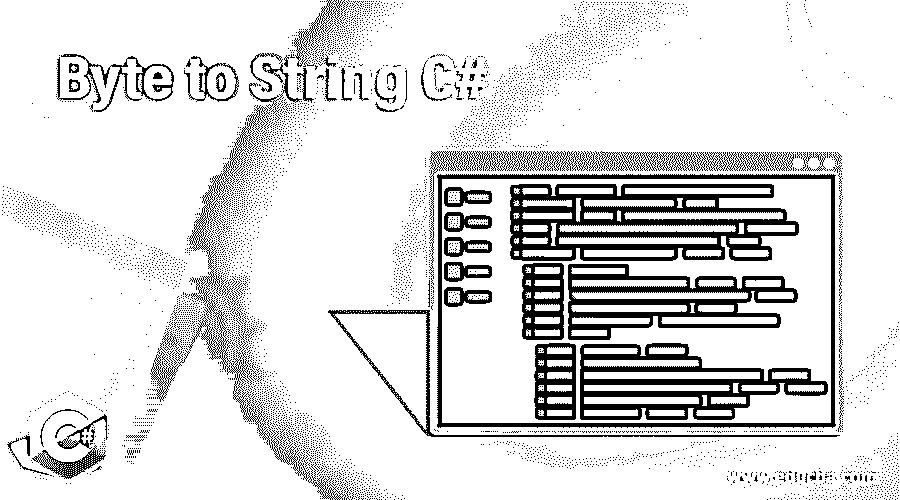
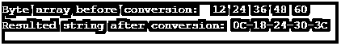
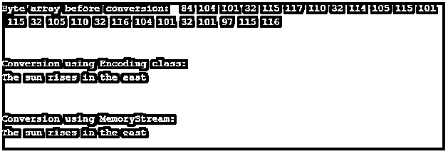

# 字节到字符串 C#

> 原文：<https://www.educba.com/byte-to-string-c-sharp/>




## C#字节到字符串简介

在本文中，我们将学习如何将字节数组转换成字符串。有许多方法可以帮助我们实现这一目标。这些方法中一个常见的方法是使用 System 命名空间中的 BitConverter 类。在这个主题中，我们将学习字节到字符串的 C#。

位转换器。ToString()方法及其所有重载形式使得将 byte[]转换为字符串变得很容易。这个方法基本上是将数值(它只不过是 byte[]的一个元素)转换成它的等价的十六进制形式的字符串。重载的窗体如下:

<small>网页开发、编程语言、软件测试&其他</small>

*   ToString(字节[])；
*   ToString(位元组[]，int 32)；
*   ToString(Byte[], Int32, Int32);

### 带解释的语法

下面是使用 BitConverter 将 byte[]转换为字符串的语法。ToString()方法:

```
public static string ToString(byte[] byteArray);
```

上面的方法将一个字节数组作为输入，并返回一个包含一些十六进制对的字符串。每一对都由连字符分隔，表示 byteArray 中的相应元素。

```
public static string ToString(byte[] byteArray, int startingIndex);
```

这里，ToString()方法接受两个参数； *byteArray* 是要转换为字符串的字节数组，startingIndex 是字节数组中要开始转换的元素的索引。

```
public static string ToString(byte[] byteArray, int startingIndex, int length);
```

这里，ToString()方法接受三个参数；byteArray 是要转换为字符串的字节数组，startingIndex 是要执行转换的字节数组中元素的索引，length 是要从 startingIndex 开始转换的字节数组元素的数量。

### C#中如何将字节转换成字符串？

如前所述，在 C#中有许多方法可以将字节数组转换为字符串。一种常见的方法是使用 BitConverter。ToString()方法。C#中 System 命名空间下的 BitConverter 类包含了几个将字节数组转换为基本数据类型的方法，因此我们可以使用该类的 ToString()方法将 byte[]转换为字符串。此方法有三种重载形式，如下所示:

```
ToString(byte[]);
```

此方法用于将整个字节数组的每个元素的数值转换为字符串，其中结果字符串将包含十六进制对，每个十六进制对由连字符分隔，并且每个十六进制对表示相应的字节数组元素。

```
ToString(byte[], Int32);
```

此方法将字节子数组中每个元素的数值转换为其等效的十六进制字符串对。此方法中的整数参数指定子数组的起始索引。

```
ToString(byte[], Int32, Int32);
```

此方法将部分或所有元素的数值从字节数组转换为十六进制字符串对。要转换的元素通过使用此方法的第二个和第三个参数来指定；第二个参数指定我们需要开始转换的起始索引，第三个参数指定要获取的元素的长度，即从前面指定的起始索引开始转换要获取的元素的数量。

除此之外，我们可以使用系统内部的编码类。使用 UTF-8 或 ASCII 字符集和编码将字节数组转换为字符串的文本命名空间。该类提供的 GetString()方法用于将字节数组中的字节解码为字符串。

*   UTF8。GetString(byte[])；
*   ASCII.GetString(字节[])；

encoding 类提供的其他编码方案包括 Unicode、UTF32、UTF7 等。

实现这种转换的另一种方法是使用 Convert。ToBase64String()方法用于将字节数组中的字节转换为字符串。

```
ToBase64String(byte[]); We can also use MemoryStream to convert byte array to string. But, first, we need to convert the byte array to the stream of bytes using MemoryStream class; then, we can read this entire stream using StreamReader class and then can return this stream as a string with the help of the ReadToEnd() method. Let us now understand this with the help of statements provided below:
```

```
using (MemoryStream memoryStream = new MemoryStream(bytes))
{
using (StreamReader streamReader = new StreamReader(memoryStream))
{
return streamReader.ReadToEnd();
}
}
```

上述语句中的“字节”是要转换为字符串的字节数组。因此，首先，我们在“memoryStream”对象中获得字节流形式的字节数组。然后，我们使用 StreamReader 类读取该流，并使用 ReadToEnd()方法将该流作为字符串返回，该方法读取该流并返回字符串值。

### C#字节到字符串的示例

下面提到了不同的例子:

#### 示例#1

使用 BitConverter 类将字节数组转换为字符串的示例。

**代码:**

```
using System;
using System.Globalization;
using System.Text;
using System.IO;
public class Program
{
public static void Main()
{
string resultedStr = string.Empty;
//defining byte array
byte[] bytes = new byte[5] { 12, 24, 36, 48, 60 };
//printing byte array before conversion
Console.Write("Byte array before conversion: ");
for (int i = 0; i < bytes.Length; i++)
{
Console.Write(" " + bytes[i]);
}
//converting byte array to string
resultedStr = BitConverter.ToString(bytes);
//printing string after conversion
Console.WriteLine("\nResulted string after conversion: {0}",
resultedStr);
Console.ReadLine();
}
}
```

**输出:**




#### 实施例 2

使用 Encoding 类和 MemoryStream 类将字节数组转换为字符串的示例。

**代码:**

```
using System;
using System.Globalization;
using System.Text;
using System.IO;
namespace ConsoleApp4
{
public class Program
{
public static void Main()
{
string str = "The sun rises in the east";
//converting string to array of bytes
byte[] bytes = Encoding.ASCII.GetBytes(str);
//printing byte array before conversion
Console.Write("Byte array before conversion: ");
for (int i = 0; i < bytes.Length; i++)
{
Console.Write(" " + bytes[i]);
}
//converting byte array to string using Encoding class
str = Encoding.ASCII.GetString(bytes);
//printing resulted string after conversion
Console.WriteLine("\n");
Console.Write("\nConversion using Encoding class: \n{0}",
str);
//converting byte array to string using MemoryStream class
Console.WriteLine("\n");
Console.WriteLine("\nConversion using MemoryStream: ");
using (MemoryStream memoryStream = new MemoryStream(bytes))
{
using (StreamReader streamReader = new StreamReader(memoryStream))
{
Console.Write(streamReader.ReadToEnd());
}
}
Console.ReadLine();
}
}
}
```

**输出:**




### 结论

在 C#中，我们可以使用 BitConverter、Encoding、MemoryStream 等类将字节数组转换为字符串。BitConverter 类提供的结果字符串包括十六进制对。使用 Encoding 类，我们可以使用相同的编码方案将 string 转换为 byte[]，将 byte[]转换为 string。

### 推荐文章

这是一个从字节到字符串的 C#指南。这里我们讨论如何在 C#中把字节转换成字符串，并给出代码和输出的例子。您也可以看看以下文章，了解更多信息–

1.  [C#字典](https://www.educba.com/c-sharp-dictionary/)
2.  [DataReader C#](https://www.educba.com/datareader-c-sharp/)
3.  [c#中的类型转换](https://www.educba.com/type-casting-in-c-sharp/)
4.  [c#中的分部](https://www.educba.com/partial-in-c-sharp/)


