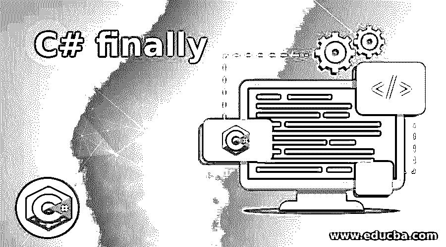
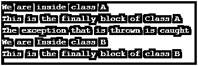
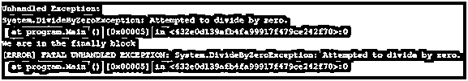

# C#终于

> 原文：<https://www.educba.com/c-sharp-finally/>




## C#简介最后

异常可能会导致错误，该异常会结束当前正在编程中运行的方法，并且该方法会打开一个文件或网络，该文件或网络需要随着当前方法的结束而关闭。为了克服这些问题，我们在 C#中有一个特殊的保留关键字 Finally，当 try 和 catch 块的执行停止时，这个 Finally 代码块将被执行，而不管是什么条件导致了执行的停止，也不管 try 块的执行是正常停止还是由于异常而停止。最终代码块被执行，释放被占用的资源是最终代码块的主要目的，它是在 try 和 catch 代码块之后编写的。

**语法:**

<small>网页开发、编程语言、软件测试&其他</small>

```
try
{
//Block of code
}
// this can be optional
catch
{
//Block of code
}
finally
{
//Block of code
}
```

### 在 C#中使用 finally 关键字

*   try 块中分配的任何资源都可以通过使用 Finally 代码块来清理，并且不管 try 块中引发的异常如何，Finally 代码块都会运行。
*   当控件离开 try 代码块时，将执行 Finally 代码块中的语句。控制作为正常执行或 goto 语句、break 语句、continue 语句或 return 语句的执行的一部分被转移。
*   如果有异常处理，与之关联的 finally 代码块肯定会运行，如果没有异常处理，finally 代码块的运行取决于异常展开操作的触发，而异常展开操作又取决于计算机的设置。
*   在 C#中，同一程序中不能有多个 Finally 代码块。
*   控件不会离开 finally 块，因为 finally 块中没有 goto 语句、break 语句、continue 语句或 return 语句。

### 实现 C#的例子最后

下面是 C#最后的例子:

#### 示例#1

演示 Finally 代码块在程序中的用法的 C#程序。

**代码:**

```
using System;
//a class called program is defined
class program
{
// a method called ClassA() is defined
static void ClassA()
{
try
{
Console.WriteLine("We are inside class A");
//An exception is thrown
throw new Exception("An exception is thrown");
}
//finally block is executed regardless of the exception is handled or not
finally
{
Console.WriteLine("This is the finally block of Class A");
}
}
// a method called ClassB() is defined
static void ClassB()
{
try
{
Console.WriteLine("We are Inside class B");
return;
}
//finally block is executed regardless of the exception is handled or not
finally
{
Console.WriteLine("This is the finally block of class B");
}
}
// Main Method is called
public static void Main(String[] args)
{
try
{
ClassA();
}
catch (Exception)
{
Console.WriteLine("The exception that is thrown is caught");
}
ClassB();
}
}
```

**输出:**




**说明:**在上面的程序中，程序就是定义的类。然后定义了一个名为 ClassA 的方法，其中编写了 try 和 finally 代码块。try 块抛出一个异常，该异常稍后被捕获。那么不管异常是否被处理，最后块都被执行。然后定义了一个叫做 ClassB 的方法。那么无论异常是否被处理，finally 块都会被执行。然后调用 main 方法。

#### 实施例 2

演示 finally 关键字在有异常处理的程序中的用法的 C#程序。

**代码:**

```
using System;
//a class called program is defined
public class program
{
// Main Method is called
static public void Main()
{
// two integer variables are defined to store two integers
intnum = 10;
int div = 0;
//try and catch block is defined in which an exception is raised by try block and is handled by catch block
try
{
int op = num / div;
}
catch (DivideByZeroException)
{
Console.WriteLine("The divisor can not be zero because it is impossible to divide by 0");
}
// finally block is executed regardless of the exception is handled or not
finally
{
Console.WriteLine("We are in the finally block");
}
}
}
```

**输出:**


**说明:**在上面的程序中，定义了一个名为 program 的类。然后调用 main 方法。然后定义两个整数变量来存储两个整数。然后定义 try 和 catch 块，其中异常由 try 块引发，并由 catch 块处理。然后，不管异常是否被处理，最后块都被执行。

#### 实施例 3

演示 finally 关键字在没有异常处理的程序中的用法的 C#程序。

**代码:**

```
using System;
//a class called program is defined
public class program
{
// Main Method is called
static public void Main()
{
// two integer variables are defined to store two integers
intnum = 10;
int div = 0;
//try and catch block is defined in which an exception is raised by try block and is handled by catch block
try
{
int op = num / div;
}
// finally block is executed regardless of the exception is handled or not
finally
{
Console.WriteLine("We are in the finally block");
}
}
}
```

**输出:**




**说明:**在上面的程序中，定义了一个名为 program 的类。然后调用 main 方法。然后定义两个整数变量来存储两个整数。然后定义 try 块。然后，不管异常是否被处理，最后块都被执行。程序的输出显示在上面的快照中。

### 优势

1.  最后，不管 try 块中发生了什么，代码块都会被执行，比如抛出或不抛出异常，如果有 return 语句，什么都不重要。
2.  finally 代码块的主要用途是释放 try 块中所有已分配的昂贵资源。
3.  最后，block 确保无论抛出任何异常都将执行操作。

**结论:**在本教程中，我们通过定义、语法、编程示例及其输出来理解 C#中 finally 关键字的概念。

### 推荐文章

这是 C#的最终指南。在这里，我们讨论 C#的介绍，最后，它的优势，以及它的例子和代码实现。您也可以浏览我们推荐的其他文章，了解更多信息——

1.  [c#中的随机数生成器是什么？](https://www.educba.com/random-number-generator-in-sharp/)
2.  [Java | Working | Applications 中的静态构造函数](https://www.educba.com/static-constructor-in-java/)
3.  [c#中的 text writer |示例](https://www.educba.com/textwriter-in-c-sharp/)
4.  如何在 C#中使用静态构造函数？


