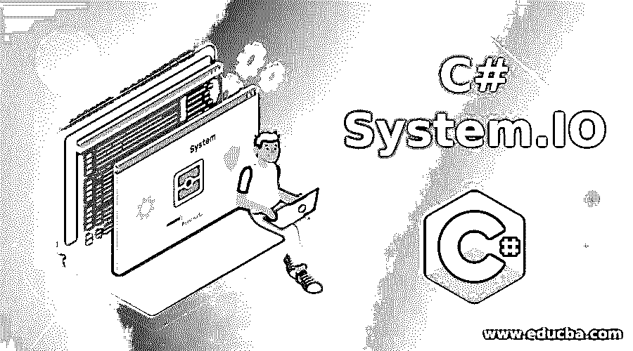

# C#系统。超正析象管(Image Orthicon)

> 原文：<https://www.educba.com/c-sharp-system-dot-io/>

## C#系统介绍。超正析象管(Image Orthicon)

C#系统。IO 是代表输入和输出的名称空间。换句话说，我们可以说 C#接受用户的输入，然后执行适当的操作来生成输出。即 C#系统。IO 只是处理输入并生成输出。C#系统。IO 命名空间由各种类、委托、结构和枚举组成。这些类用于从文件和数据流中读写数据。在本教程中，为了详细理解 C#命名空间，我们将讨论它的类、委托、结构和枚举。

### C#系统。IO 类别

下面是 C#系统支持的各种类的列表。IO 命名空间

<small>网页开发、编程语言、软件测试&其他</small>

*   **BinaryReader:** 这个类用于读取二进制格式的原始数据类型。
*   **BinaryWriter:** 这个类用于将二进制格式的原始数据类型写到流中。
*   这个类提供了对文件执行的各种方法，比如创建、删除、复制、重命名、移动等等。
*   FileInfo: 这个类用于提供关于文件的信息，比如创建、删除、复制和打开文件的属性和方法。
*   **FileFormatException:** 这个类用于处理格式异常。
*   **FileNotFoundException:** 该类用于处理未找到异常。
*   **FileLoadException:** 这个类用于处理加载异常。
*   这个类通过为 FileInfo 和 DirectoryInfo 对象提供一个基类来显示关于系统的信息。
*   **FileStream:** 这个类为文件提供流。它支持同步和异步读写操作。
*   **FileSystemEventArgs:** 该类用于为目录事件提供数据。
*   **FileSystemWatcher:** 该类用于在文件或目录发生变化时引发事件。
*   **Directory:** 这是一个密封类，表示一个静态方法，用于创建、枚举和删除一个目录及其子目录。
*   **DirectoryInfo:** 这是一个密封类，表示通过目录及其子目录创建、枚举和删除的实例方法。
*   **DirectoryNotFoundException:**该类用于在找不到文件或目录时引发异常。
*   **DriveInfo:** 这个类用于访问驱动器信息。
*   **DriveNotFoundException:** 该类用于在找不到驱动器时引发异常。
*   **BufferedStream:** 这是一个密封类，用于在读写操作中添加缓冲。
*   EndOfStreamException: 这个类用于在找不到流的结尾时引发异常。
*   **IOException:** 该类用于在发生输入/输出错误时引发异常。
*   **InvalidDataException:** 该类用于在找不到有效数据时引发异常。
*   **InternalBufferOverflowException:**该类用于处理内部缓冲区溢出异常。
*   这个类用来创建一个流，它的后台存储是内存。
*   **Stream:** 这是一个抽象类，用来提供字节流。
*   **StreamReader:** 这个类用于通过继承 TextReader 类从 bye stream 中读取字符。
*   **TextReader:** 这个类用于顺序读取字符。
*   TextWriter: 这个类用于以连续的方式编写字符。
*   **StringReader** :这个类用来通过继承 TextReader 类从 string 中读取数据。
*   **StringWriter:** 这个类用于通过继承 TextWriter 类将数据写入字符串。
*   **Path:** 这个类用于操作包含文件或目录路径信息的字符串。
*   **PipeException:** 这个类用于处理与管道相关的异常。
*   **PathTooLongException:** 该类用于在文件或目录的路径过长时引发异常。
*   **UnmanagedMemoryStream:** 这个类用于从托管代码中访问非托管内存块
*   **UnmanagedMemoryAccessor:** 这个类用于提供从托管代码对非托管内存块的随机访问。

### 代表和结构

下面是 C#系统支持的委托和结构列表。IO 命名空间。

#### C#系统。IO 代表

*   **ErrorEventHandler:** 用于定义控制 FileSystemWatcher 对象创建的错误事件的方法。
*   **rename eventhandler:**用于定义一个方法，控制 FileSyatemWather 类创建的重命名事件。
*   **FileSystemEventHandler:** 用于定义一个方法，控制由 FileStreamWatcher 类创建的创建、更改或删除事件。

#### C#系统。IO 结构

*   **WaitForChangedResult:** 用于显示文件中发生的变更的详细信息。

### C#系统。IO 枚举

下面是 C#系统支持的各种枚举列表。IO 命名空间

*   **FileAccess:** 用于声明常量来限制文件的访问，如读、写、打开等
*   **FileMode:** 用于定义文件模式，即操作系统如何打开特定的文件。
*   **FileOptions:** 用于表示为 FileStream 创建对象的各种选项。
*   **FileAttributes:** 用于为文件及其目录提供属性。
*   **FileShare:** 用于控制其他文件流对象对同一文件的访问类型。
*   **SearchOption:** 启用搜索选项搜索当前目录及其子目录。
*   **DriveType:** 用于声明网络、CDRom 等驱动类型的常量。
*   **HandleInheritability:** 用于指定子进程是否可以继承底层句柄。
*   **SeekOrigin**
*   **NotifyFilters:** 用于通知文件或文件夹的变更。

### 推荐文章

这是 C# System.IO 的指南，这里我们也讨论 C#系统支持的简介和各种枚举和委托类。您也可以看看以下文章，了解更多信息–

1.  [C# StringWriter](https://www.educba.com/c-sharp-stringwriter/)
2.  [C# StringReader](https://www.educba.com/c-sharp-stringreader/)
3.  [c#中的泛型](https://www.educba.com/c-sharp-delegates/) 
4.  [C#创建 JSON 对象](https://www.educba.com/c-sharp-create-json-object/)

