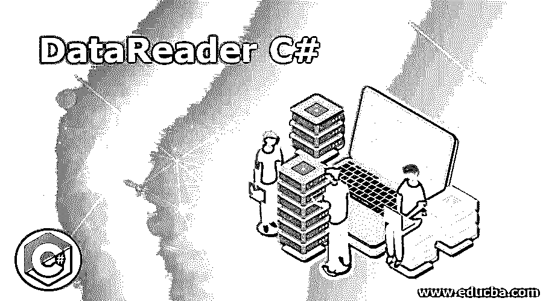
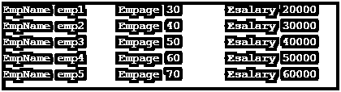

# DataReader C#

> 原文：<https://www.educba.com/datareader-c-sharp/>




## DataReader C#简介

数据读取器是用于从数据源读取数据的对象。这只能对数据源执行读取操作，而不能执行更新操作。数据作为数据流从数据源中检索。虽然数据读取器仅限于读取操作，但由于它是只读和只进的，因此非常高效和优化。中有两种类型的提供程序。Net 框架，它们是 SQLDataReader 和 OleDbDataReader。数据读取器通过减少系统开销来提高应用程序性能，因为它在给定时间点将唯一的一行存储在内存中。本文将详细介绍 c#中的数据读取器以及适当的示例。

**语法:**

<small>网页开发、编程语言、软件测试&其他</small>

sql 数据读取器在命名空间系统中可用。Data.SqlClient 和相应的程序集是 System.Data.SqlClient.dll。SQL 数据读取器初始化如下。

```
SqlDataReadersqlReader = sqlCmd.ExecuteReader();
```

执行读取器用于将 SQL 语句或过程传递给 sqlconnection 对象，相应的结果存储在 SqlDataReader 的 sqlreader 对象中。在从任何数据读取器中读取之前，它应该总是打开的，并且应该指向第一条记录。数据读取器的 read()方法用于读取，并向前移动到下一行。

oledb 数据读取器也以同样的方式工作。它在命名空间系统中可用。OleDb 和相应的程序集是 System.Data.OleDb.dll。oledbDataReader 对象用于连接到 OLEDB 数据源并从中获取数据。与 SQLDataReader 一样，oledbdata reader 也应该在执行读取操作之前打开。oledb 数据读取器初始化如下。

```
OleDbDataReaderoledbReader = oledbCmd.ExecuteReader();
```

其中 executereader 用于执行 SQL 语句或过程。

### 访问数据读取器结果

数据读取器对象有一个 read 方法，可用于访问结果集中的行。可以使用每个列值的名称或它们在结果集中出现的列顺序来访问它们。为了提高效率，一组预定义的类型转换方法来访问这样的值。当处理大量数据时，建议使用数据读取器，因为数据不存储在高速缓存中。建议在使用数据读取器对象后将其关闭。如果该命令有一些返回值或输出参数，则只有在数据读取器关闭时才可用。使用数据读取器时要记住的另一件重要事情是，当一个数据读取器使用一个连接时，不能在该连接上执行另一个数据读取器或任何其他操作。此外，需要记住的一件重要事情是，只有向前访问数据集是可能的。我们只能迭代到下一条记录，而不能迭代到前一条记录。

#### 使用多个集合

如果数据读取器返回多个结果集，可以使用数据读取器的 NextResult 方法来访问它们。在实现过程中，应该注意所有的结果集都是迭代的，并且结果集中的每一列都是可访问的。

### DataReader C#的实现示例

以下是 DataReader C#的示例:

#### 示例#1

通常，从数据读取器返回的结果集中读取数据是为了使用 while 循环迭代每一行。read 方法返回值为 bool 类型，如果存在下一行，则返回 true，对于最后一条记录，则返回 false。while 循环将一直执行，直到条件变为假。

**语法:**

```
while(rdr.Read())
{
// operation to be performed
// Access columns
// Data manipulation
}
```

与关闭 SQL 连接一样，关闭数据读取器始终是一种最佳做法。while 部分可以包含在 try 块中，数据读取器连接可以在 finally 块中关闭。

**语法:**

```
try
{
// operation to be performed
// Access columns
// Data manipulation
}
Catch
{
//Handle exception here
}
finally
{
//close the data reader connection
if (reader != null)
{
reader.Close();
}
// close thesql connection
}
```

**代码:**

```
using System;
using System.Windows.Forms;
using System.Data.SqlClient;
namespace test
{
public partial class test1 : Form
{
public test1()
{
InitializeComponent();
}
Public static void main()
{
string constr = null;
SqlConnectionscon ;
SqlCommandscmd ;
string sstat = null;
constr = "Data Source=testserver;Initial Catalog=testdb;User ID=test;Password=test";
sstat = "Select * from test";
scon = new SqlConnection(constr);
try
{
scon.Open();
scmd = new SqlCommand(sstat, scon);
SqlDataReadersstatReader = scmd.ExecuteReader();
while (sstatReader.Read())
{
Console.WriteLine("Name:" sstatReader.GetValue(0)  + "age:"  sstatReader.GetValue(1) );
}
sstatReader.Close();
scmd.Dispose();
scon.Close();
}
catch (Exception ex)
{
}
}
}
}
```

**输出:**


#### 实施例 2

**代码:**

```
using System;
using System.Windows.Forms;
using System.Data.OleDb;
namespace test
{
public partial class test : Form
{
public test()
{
InitializeComponent();
}
Public static void main()
{
string constr = null;
OleDbConnectionocon ;
OleDbCommandocmd ;
string sql = null;
constr = "Provider=Microsoft.Jet.OLEDB.4.0;Data Source=test.mdb";
sql = "select * from emp";
ocon = new OleDbConnection(constr);
try
{
ocon.Open();
ocmd = new OleDbCommand(sql, ocon);
OleDbDataReaderordr = ocmd.ExecuteReader();
while (ordr.Read ())
{
Console.WriteLine("EmpName:" ordr.GetValue(0) + "Empage:"  ordr.GetValue(1) + "Esalary" ordr.GetValue(2) );
}
ordr.Close();
ocmd.Dispose();
ocon.Close();
}
catch (Exception ex)
{
Console.WriteLine("Connection Failed");
}
}
}
}
```

**输出:**




### 结论

因此，本文详细介绍了 c#中的数据读取器。它还展示了如何以向前的方式从数据流中读取数据读取器。文章还详细介绍了两种类型的数据读取器，即 esql 数据读取器和 oledb 数据读取器。它展示了两种数据阅读器的工作方式，并给出了适当的例子。本文还介绍了如何使用 NextResult 方法处理多个结果集，以及如何使用 for 循环迭代每个数据行。要了解更多细节，建议编写示例程序并实践它们。

### 推荐文章

这是 DataReader C#的指南。在这里，我们讨论 C#中的 DataReader 简介及其示例，以及代码实现和输出。您也可以浏览我们推荐的其他文章，了解更多信息——

1.  [C#排序字典](https://www.educba.com/c-sharp-sorteddictionary/)
2.  [C#字符串格式()](https://www.educba.com/c-sharp-string-format/)
3.  [c#中的 text writer](https://www.educba.com/textwriter-in-c-sharp/)
4.  [c#中的静态构造函数](https://www.educba.com/static-constructor-in-c-sharp/)


