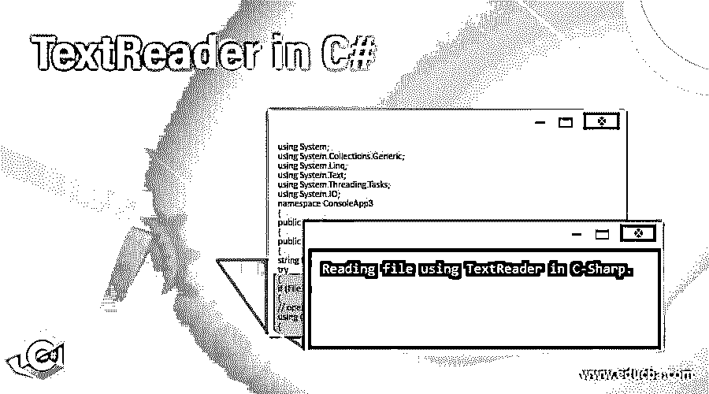
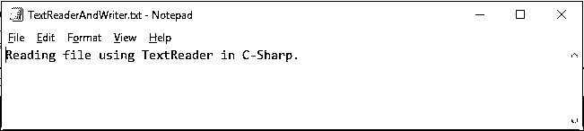

# C#中的 TextReader

> 原文：<https://www.educba.com/textreader-in-c-sharp/>




## C#中的 TextReader 简介

C#中的 TextReader 用于从文本文件中读取文本或连续的字符序列。在 System 下找到 TextReader 类。IO 命名空间。[是 StreamReader 和 StringReader 的抽象基类](https://www.educba.com/abstract-class-in-c-sharp/)，分别用于从 stream 和 string 中读取字符。我们无法创建 TextReader 的对象，因为它是抽象类。默认情况下，TextReader 不是线程安全的。类派生的 TextReader 类需要最低限度地实现 Peek()和 Read()方法，以便创建一个有用的 TextReader 实例。

****语法:****

<small>网页开发、编程语言、软件测试&其他</small>

创建 TextReader 的语法如下:

```
TextReader text_reader = File.OpenText(file_path);
```

上述语句将在“file_path”指定的位置打开一个文件。然后，在 text_reader 的帮助下，我们可以使用 TextReader 类的方法从文件中读取内容。

我们也可以在“using”块的帮助下创建 TextReader，如下所示:

```
using(TextReader text_reader = File.OpenText(file_path))
{
//user code
}
```

使用“using”块的优点是，在对象的工作完成并且不再需要该对象后，它会释放由该块中指定的对象获取的内存。

### C#中的 TextReader 是如何工作的？

为了使用 TextReader，有必要导入系统。代码中的 IO 命名空间。由于 TextReader 是一个抽象类，我们不能使用“new”关键字直接创建它的实例，但是我们可以使用 File 类的 OpenText()方法来实现相同的目的，如下所示:

```
TextReader text_reader = File.OpenText(file_path);
```

OpenText()方法将文件的位置作为输入，然后在相同的位置打开一个现有的 UTF-8 编码的文本文件进行读取。

文件。OpenText()方法返回 StreamReader 类的对象，该类是 TextReader 的派生类，因此有助于在代码中创建一个有用的 TextReader 类实例。此实例可用于调用 TextReader 类的方法，以从文件中读取内容。TextReader 类是从抽象类 MarshalByRefObject 派生的。其继承层次结构如下所示:

**对象→MarshalByRefObject→TextReader**

我们可以在 TextReader 的两个派生类(即 StreamReader 和 StringReader)的帮助下使用它。

*   ******StreamReader:****用于从字节流中读取特定编码的字符。**
***   ******string reader:****用于从字符串中读取文本。****

 ****请在下表中找到 TextReader 的一些重要方法:

| ****法**** | ****描述**** |
| **关闭()** | 它用于关闭 TextReader 并释放与之关联的任何系统资源。 |
| **排列()** | 它用于释放一个 TextReader 对象使用的所有资源。 |
| **Peek()** | 它用于读取下一个字符，而不改变阅读器的状态，并返回下一个可用字符，而不实际从阅读器中读取它。 |
| **Read()** | 它用于从文本阅读器中读取下一个字符，并且还将字符位置向前移动一个字符。 |
| **ReadLine()** | 它用于从文本阅读器中读取一行字符，并以字符串形式返回数据。 |
| **ReadToEnd()** | 它用于读取从当前位置到文本阅读器末尾的所有字符，并将它们作为一个字符串返回。 |

### C#中的 TextReader 示例

我们可以在 TextReader 构造函数中传递一个文本文件名来创建一个对象。以下是 C#中 TextReader 的不同示例。

#### 示例#1

使用 TextReader 的 ReadLine()方法读取文件中的一行。

**代码:**

```
using System;
using System.Collections.Generic;
using System.Linq;
using System.Text;
using System.Threading.Tasks;
using System.IO;
namespace ConsoleApp3
{
public class Program
{
public static void Main()
{
string file = @"E:\Content\TextReader.txt";
try
{
if (File.Exists(file))
{
// opening the text file and reading a line
using (TextReader textReader = File.OpenText(file))
{
Console.WriteLine(textReader.ReadLine());
}
}
else
{
Console.WriteLine("File does not exist!");
}
Console.ReadKey();
}
catch (Exception ex)
{
Console.WriteLine(ex.Message);
}
}
}
}
```

**输出:**


#### 实施例 2

使用 TextReader 的 ReadBlock()方法从文件中读取五个字符。

**代码:**

```
using System;
using System.Collections.Generic;
using System.Linq;
using System.Text;
using System.Threading.Tasks;
using System.IO;
namespace ConsoleApp3
{
public class Program
{
public static void Main()
{
string file = @"E:\Content\TextReader.txt";
try
{
if (File.Exists(file))
{
//Opening the text file and reading 5 characters
using (TextReader textReader = File.OpenText(file))
{
char[] ch = new char[5];
textReader.ReadBlock(ch, 0, 5);
Console.WriteLine(ch);
}
}
else
{
Console.WriteLine("File does not exist!");
}
Console.ReadKey();
}
catch (Exception ex)
{
Console.WriteLine(ex.Message);
}
}
}
}
```

**输出:**


#### 实施例 3

使用 TextReader 的 ReadToEnd()方法读取文本文件的全部内容。

**代码:**

```
using System;
using System.Collections.Generic;
using System.Linq;
using System.Text;
using System.Threading.Tasks;
using System.IO;
namespace ConsoleApp3
{
public class Program
{
public static void Main()
{
string file = @"E:\Content\TextReader.txt";
string content = String.Empty;
try
{
if (File.Exists(file))
{
//Opening a text file and reading the whole content
using (TextReader tr = File.OpenText(file))
{
content = tr.ReadToEnd();
Console.WriteLine(content);
}
}
else
{
Console.WriteLine("File does not exist!");
}
Console.ReadKey();
}
catch (Exception ex)
{
Console.WriteLine(ex.Message);
}
}
}
}
```

**输出:**


#### 实施例 4

使用 TextReader 读取文本文件的内容，并将其写入另一个文件。

**代码:**

```
using System;
using System.Text;
using System.Threading.Tasks;
using System.IO;
namespace ConsoleApp3
{
public class Program
{
public static void Main()
{
string fileToRead = @"E:\Content\TextReader.txt";
string fileToWrite = @"E:\Content\TextReaderAndWriter.txt";
StringBuilder content = new StringBuilder();
string str = String.Empty;
try
{
//checking if the file exists to read
if (File.Exists(fileToRead))
{
//Opening a text file and reading the whole content
using (TextReader textReader = File.OpenText(fileToRead))
{
while ((str = textReader.ReadLine()) != null)
{
content.Append("\n" + str);
}
}
}
else
{
Console.WriteLine("File does not exist!");
}
//checking if the file to write content already exists
if (File.Exists(fileToWrite))
{
File.Delete(fileToWrite);
}
//creating file if it does not exist
using (TextWriter textWriter = File.CreateText(fileToWrite))
{
textWriter.WriteLine(content);
}
Console.ReadKey();
}
catch (Exception ex)
{
Console.WriteLine(ex.Message);
}
}
}
}
```

**输出:**




### 结论

*   TextReader 是一个抽象类，用于从文本文件中读取文本或连续的字符序列。
*   StreamReader 和 StringReader 是 TextReader 的两个派生类，借助它们我们可以实现 TextReader 的方法来从文本文件中读取内容。

### 推荐文章

这是一个用 C#编写的 TextReader 指南。在这里，我们讨论 C#中的介绍和 TextReader 如何工作，以及示例和代码实现。您也可以阅读以下文章，了解更多信息——

1.  [c#中的抽象类](https://www.educba.com/abstract-class-in-c-sharp/)
2.  [C#抽象 vs 接口](https://www.educba.com/c-abstract-vs-interface/)
3.  [c#中的静态构造函数](https://www.educba.com/static-constructor-in-c-sharp/)
4.  [C#动态](https://www.educba.com/c-sharp-dynamic/)


****