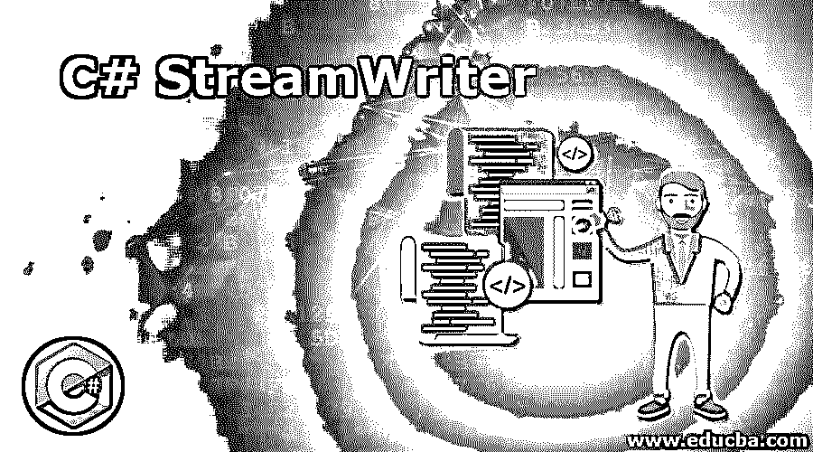

# c# streaming writer

> 原文：<https://www.educba.com/c-sharp-streamwriter/>




## C# StreamWriter 简介

为了将字符写入遵循特定编码的流中，我们使用了 C#中称为 StreamWriter 类的类和 StreamWriter 方法。StreamWriter 类的 Write()方法负责将字符写入流中。TextWriter 类是 StreamWriter 类的基类，也就是说，StreamWriter 类是从 TextWriter 类继承的，该 TextWriter 类提供了几个方法，可用于将对象写入字符串、将字符串写入文件、序列化 XML 等。和系统。IO.namespace 是定义 StreamWriter 的名称空间，StreamWriter 类提供了几种写方法，如 Write、WriteAsync、WriteLine、WriteLineAsync 等。

**C #中 StreamWriter 类的语法如下:**

<small>网页开发、编程语言、软件测试&其他</small>

```
public class StreamWriter : System.IO.TextWriter
```

### C#中 StreamWriter 类的使用

*   在 C#的文件操作中使用流来从文件中读取数据和将数据写入文件。
*   在应用程序和文件之间创建的额外层称为流。
*   流使得文件被平滑地读取并且数据被平滑地写入文件。
*   来自大文件的数据被分解成小块，然后发送到流。然后，应用程序从数据流中读取这些数据块，而不是试图一次读取全部数据。这就是使用流的好处。
*   将文件中的数据分成小块的原因是，当应用程序试图一次读取文件中的全部数据时，会影响应用程序的性能。
*   因此，每当要将数据写入文件时，首先将数据写入流，然后将数据从流写入文件。

### C# StreamWriter 示例

考虑下面的示例来演示如何使用 StreamWriter 将数据写入文件:

#### 示例#1

**代码:**

```
using System;
using System.IO;
using System.Linq;
using System.Text;
using System.Threading.Tasks;
//a namespace called program is defined
namespace program
{
//a class called check is defined
class check
{
//main method is called
static void Main(string[] args)
{
//the path of the file and the file name is assigned to a string variable
String pat = @"D:\Ex.txt";
//an instance of the string writer class is created, and the path of the file is passed as a parameter to append text to the file
using (StreamWriter sw = File.AppendText(pat))
{
//data to be appended to the file is included
sw.WriteLine("Welcome to StreamWriter class in C#");
//the instance of the streamwriter class is closed after writing data to the File
sw.Close();
//data is read from the file by taking the path of the file as parameter
Console.WriteLine(File.ReadAllText(pat));
}
Console.ReadKey();
}
}
}
```

**输出:**


在上面的程序中，定义了一个名为 program 的名称空间。然后定义了一个名为 check 的类。然后调用 main 方法。然后将文件的路径和文件名赋给一个字符串变量。然后创建 string writer 类的一个实例，并将文件的路径作为参数传递，以向文件追加文本。则包括要附加到文件的数据。然后，在将数据写入文件后，关闭流编写器类的实例。然后通过将文件的路径作为参数从文件中读取数据。

#### 实施例 2

演示 StreamWriter 类用法的程序:

**代码:**

```
using System.IO;
//a class called check is defined
class check
{
//main method is called
static void Main()
{
//an instance of streamwriter class is created and the path of the file is passed as a parameter
using (StreamWriter sw = new StreamWriter(@"D:\imp.txt"))
{
//write() method of stream writer class is used to write the first line so that the next line continues from here
sw.Write("Welcome to StreamWriter class in C# and ");
//writeline() method is used to write the second line and the next line starts from a new line
sw.WriteLine("this program is demonstration of StreamWriter class in C# ");
//writeline() method is used to write the third line and the next line starts from a new line
sw.WriteLine("I hope you are learning ");
}
}
}
```

**输出:**


在上面的程序中，定义了一个名为 check 的类。然后调用 main 方法。然后创建流编写器类的一个实例，并将文件的路径作为参数传递给流编写器，流编写器将数据写入该参数。然后使用 stream writer 类的 write()方法写入第一行，以便下一行从这里继续。然后使用 writeline()方法写入第二行，下一行从新的一行开始。然后使用 writeline()方法写入第三行，下一行从新的一行开始。程序的输出如上面的快照所示。

#### 实施例 3

演示 StreamWriter 类用法的程序:

**代码:**

```
using System.IO;
//a class called check is defined
class check
{
//main method is called
static void Main()
{
//an instance of the stream writer class is created and the path of the file to which the data must be written is passed as a parameter
using (StreamWriter sw = new StreamWriter(@"D:\Ex.txt"))
{
//a variable called plane is defined
string plane = "Tejas";
//an integer called high is defined
int high = 120;
//interpolation syntax in string is used to make code efficient.
sw.WriteLine($"The plane {plane} flies {high} feet high.");
}
}
}
```

**输出:**


在上面的程序中，定义了一个名为 check 的类。然后调用 main 方法。然后创建流写入器类的实例，并将数据必须写入的文件的路径作为参数传递。然后定义一个叫做 plane 的变量。然后定义一个叫做 high 的整数。然后使用字符串中的插值语法来提高代码效率。程序的输出如上面的快照所示。

### 结论

在本教程中，我们通过定义理解了 C#中 StreamWriter 类的概念，C#中 StreamWriter 类的语法，通过编程示例理解了 StreamWriter 类的工作原理及其输出。

### 推荐文章

这是一个 C# StreamWriter 的指南。在这里，我们讨论 C#中 StreamWriter 类的工作方式，并举例说明以便更好地理解。您也可以阅读以下文章，了解更多信息——

1.  [c#中的运算符优先级](https://www.educba.com/operator-precedence-in-c-sharp/)
2.  [C#接口](https://www.educba.com/c-sharp-interface/)
3.  [c#中的静态关键字](https://www.educba.com/static-keyword-in-c-sharp/)
4.  [c#中的文件处理](https://www.educba.com/file-handling-in-c-sharp/)


