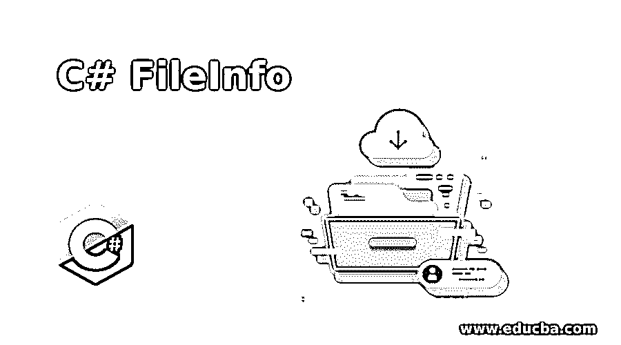

# C#文件信息

> 原文：<https://www.educba.com/c-sharp-fileinfo/>




## C# FileInfo 简介

在中处理文件。NET framework，使用的重要命名空间是 system。IO 命名空间，类似地，我们在 C#中有一个名为 fileinfo class 的类，它不包含静态方法，只有实例化的对象可以使用该类，磁盘上的文件或网络位置由 fileinfo 对象表示，filestream 对象可以在 FileInfo 对象的帮助下创建，而实例方法由 FileInfo 类提供，用于创建、删除、复制， 移动并打开文件，我们可以对文件的读写操作进行更多的控制，手动编写可以读取的代码，或者使用 fileinfo 类从文件中写入字节。

**C # FileInfo 类的语法如下:**

<small>网页开发、编程语言、软件测试&其他</small>

```
[SerializableAttribute]
[ComVisibleAttribute(true)]
public sealed class FileInfo : FileSystemInfo
```

### C# FileInfo 类的使用

要理解 C#中 FileInfo 类的工作原理，我们需要了解 FileInfo 类的构造函数、FileInfo 类的属性以及 FileInfo 类的方法。

**FileInfo 类的构造函数解释如下:**

*   **FileInfo(string):**FileInfo 类的一个新实例被初始化，它充当文件路径的包装器。

FileInfo 类有几个属性。它们解释如下:

*   **属性:**我们可以使用 Attributes 属性来获取或设置当前文件或当前目录的属性。

*   **CreationTime:** 我们可以使用 CreationTime 属性来获取或设置当前文件或当前目录的创建时间。

*   **Directory:** 我们可以使用 Directory property 得到父目录的一个实例。

*   **DirectoryName:** 我们可以用 DirectoryName 属性得到一个表示目录完整路径的字符串。

*   **Exists:** 我们可以使用 Exists 属性得到一个表示文件是否存在的值。

*   **FullName:** 我们可以使用 FullName 属性获取目录的完整路径或者文件的完整路径。

*   **IsReadOnly:** 我们可以使用 IsReadOnly 属性获取或设置一个值，该值可以确定当前文件是否具有只读属性。

*   **LastAccessTime:** 我们可以通过使用 LastAccessTime 属性来获取或设置当前文件或当前目录最后一次被访问的时间。

*   **Length:** 我们可以使用 Length 属性获得当前文件的大小，以字节为单位。

*   **Name:** 我们可以通过使用 Name 属性得到文件的名称。

**FileInfo 类有几种方法。它们解释如下:**

*   **AppendText():** 使用这个方法 AppendText()创建一个流编写器。通过使用这个流编写器，文本被附加到由 FileInfo 类的实例表示的文件中。

*   **CopyTo(String):** 使用这个方法 CopyTo(String)可以将一个现有文件复制到一个新文件中。

*   **Create():** 可以使用 Create()方法创建一个文件。

*   **CreateText():** 使用这个方法 CreateText()创建一个流写入器，这个流写入器写入一个新的文本文件。

*   **Decrypt():** 一个文件可以使用这个方法 Decrypt()解密，这个方法最初是由当前帐户使用 encrypt 方法加密的。

*   **Delete():** 使用 Delete()方法可以永久删除文件。

*   **Encrypt():** 可以使用 Encrypt()方法对文件进行加密，并且可以使用 Decrypt()方法对该文件进行解密，前提是用于加密的帐户与用于解密的帐户相同。

*   **GetAccessControl():** 使用这个方法 GetAccessControl()获得一个文件安全对象，它封装了访问控制列表(ACL)的条目。

*   **MoveTo(String):** 使用 MoveTo(String)方法可以将指定的文件从一个位置移动到新指定的位置。

*   **打开(文件模式):**可以使用 Open(文件模式)方法以指定的模式打开文件。

*   **OpenRead():** 可以使用 OpenRead()方法创建只读的文件流。

*   **OpenText():** 可以使用 OpenText()方法创建一个流阅读器，该方法可以从 UTF8 编码的现有文件中读取内容。

*   **OpenWrite():** 只能写入的文件流可以使用 OpenWrite()方法创建。

*   **Refresh():** 使用 Refresh()方法可以刷新对象的状态。

*   **Replace(String，String):** 使用 Replace(String，String)方法，可以将指定文件的内容替换为 FileInfo 类的当前对象所描述的其他文件的内容。

*   **ToString():** 使用 ToString()方法将路径作为字符串返回。

我们已经了解了 FileInfo 类的构造函数、FileInfo 类的属性和 FileInfo 类的方法，现在考虑下面的程序:

**代码:**

```
using System;
using System.IO;
namespace Program
{
class Check
{
static void Main(string[] args)
{
try
{
// the file location is specified where the file is to be created
string location = "C:\Users\shivakumarsh\Desktop\new.txt";
// instance of the fileinfo class is created
FileInfo file = new FileInfo(location);
// an empty file is created
file.Create();
Console.WriteLine("Creation of file is successfull");
}
catch(IOException e)
{
Console.WriteLine("Failed attempt to create file "+e);
}
}
}
}
```

**输出:**


在上面的程序中，声明了一个名为 program 的名称空间。然后定义由 try-catch 块组成的主方法。try 块由需要创建新文件的位置字符串组成。创建 file info 类的实例，并将位置字符串作为参数传递给 file info 类的实例。在 file info 类的对象上调用 Create()方法，在 location 字符串指定的位置创建一个新文件。如果文件创建成功，将打印成功消息，否则将引发一个异常，该异常包含在 catch 块中。

### C# FileInfo 示例

演示文件信息类用法的 C#程序。

**代码:**

```
using System;
using System.IO;
namespace Program
{
class Check
{
static void Main(string[] args)
{
// the file location is specified where the file is to be located
string location = "C:\Users\shivakumarsh\Desktop\new.txt";
// instance of the fileinfo class is created
FileInfo file = new FileInfo(location);
// The specified file is deleted
file.Delete();
Console.WriteLine("Deletion of file is successfull");
}
}
}
```

**输出:**


### 结论

在本教程中，我们通过定义来理解 C#中 FileInfo 类的概念，FileInfo 类的构造函数，FileInfo 类的属性，FileInfo 类的方法，通过例子来理解 FileInfo 类的工作。

### 推荐文章

这是一个 C# FileInfo 的指南。这里我们讨论构造函数和属性来理解 C# FileInfo 的工作原理，并举例来更好地理解。您也可以看看以下文章，了解更多信息–

1.  [c#中的反序列化](https://www.educba.com/deserialization-in-c-sharp/)
2.  [c#中的冒泡排序](https://www.educba.com/bubble-sort-in-c-sharp/)
3.  [C# foreach 循环](https://www.educba.com/c-sharp-foreach-loop/)
4.  [C#类](https://www.educba.com/c-sharp-class/)


