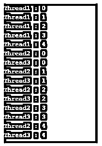

# C#中的多线程

> 原文：<https://www.educba.com/multithreading-in-c-sharp/>


## C#中多线程的介绍

要理解 c#中的多线程，我们先来了解一下什么是线程？

*   线程是一个轻量级的进程。
*   它是一个程序的执行路径。
*   它是操作系统中最小的处理单位。
*   因此，一个进程可以有多个线程。

因此，多线程是一个包含多个线程的过程，其中每个线程执行不同的活动。它节省了时间，因为不同的线程同时执行多个任务。它提高了 CPU 利用率，并提高了应用程序的效率。这是基于分时概念的。

<small>网页开发、编程语言、软件测试&其他</small>

### 带解释的语法

```
Thread first_thread_name = new Thread(new ThreadStart(method_to_be_executed1));
Thread second_thread_name = new Thread(new ThreadStart(method_to_be_executed2));
first_thread_name.Start();
second_thread_name.Start();
```

要创建一个线程，我们需要创建一个线程类的对象。线程类构造函数引用了 ThreadStartThreadStart 是一个代表的[委托，这是一个在线程开始执行时需要执行的方法。](https://www.educba.com/jquery-delegate/)

调用 Start()方法时，线程开始执行。

我们可以不使用 ThreadStart 委托来创建线程，如下面的语法所示:

```
Thread thread_name = new Thread(method_to_be_executed);
thread_name.Start();
```

### 在 C#中创建多线程

为了创建线程，我们需要导入系统。线程命名空间。我们可以使用 Thread 类创建和初始化线程。

#### 使用线程类的示例

**代码:**

```
using System;
using System.Threading;
public class MultiThreadingDemo
{
public static void Method1()
{
for (int i = 0; i <= 5; i++)
{
Console.WriteLine("Method1 : {0}", i);
}
}
public static void Method2()
{
for (int i = 0; i <= 5; i++)
{
Console.WriteLine("Method2 : {0}",i);
}
}
public static void Main()
{
// Creating and initializing threads
Thread thread1 = new Thread(Method1);
Thread thread2 = new Thread(Method2);
//beginning thread execution
thread1.Start();
thread2.Start();
}
}
```

**输出:**


#### 使用 ThreadStart 委托的示例

**代码:**

```
using System;
using System.Threading;
public class MultiThreading
{
public static void Method1()
{
for (int i = 1; i <= 5; i++)
{
Console.WriteLine("Method1 : {0}", i);
}
}
public static void Method2()
{
for (int i = 1; i <= 5; i++)
{
Console.WriteLine("Method2 : {0}", i);
}
}
}
public class MultithreadingDemo
{
public static void Main()
{
Thread thread1 = new Thread(new ThreadStart(MultiThreading.Method1 ) );
Thread thread2 = new Thread(new ThreadStart(MultiThreading.Method2 ) );
thread1.Start();
thread2.Start();
}
}
```

**输出:**


**Note:** It is not necessary that methods [used in multithreading](https://www.educba.com/what-is-multithreading/) should be static as in the above two examples, both the methods i.e. Method1 and Method2 are static. These methods can be nonstatic and in that case, we first need to create an object of the class containing methods and then can access the methods using the object.

在 C#中，一个程序总是包含一个线程，即主线程。当我们创建其他线程时，它就变成了一个多线程程序，在 C#多线程中，有两种类型的线程:

*   **前台线程**:即使主线程终止，这个线程也会一直执行，直到完成它的工作。
*   **后台线程**:当主线程终止时，后台线程也停止执行，与主线程一起终止。

### 举例说明方法

让我们用实例来看看 Thread 类的一些常用方法。

*   **Sleep():** 用于暂停当前线程的执行一段时间，以便其他线程开始执行。

**举例:**

```
using System;
using System.Threading;
public class Multithreading
{
public void Display()
{
for (int i = 1; i <= 10; i++)
{
Console.WriteLine(i);
//suspending execution of current thread for 100 milliseconds
Thread.Sleep(100);
}
}
}
public class MultithreadingDemo
{
public static void Main()
{
Multithreading multithreading = new Multithreading();
Thread thread1 = new Thread(new ThreadStart(multithreading.Display));
Thread thread2 = new Thread(new ThreadStart(multithreading.Display));
thread1.Start();
thread2.Start();
}
}
```

**输出:**


输出显示两个线程并行执行。

*   **Abort():** 用来终止线程或者我们可以说是用来永久停止线程的执行。

**例子**

```
using System;
using System.Threading;
public class Multithreading
{
public void Display()
{
for (int i = 0; i < 10; i++)
{
Console.WriteLine(i);
Thread.Sleep(100);
}
}
}
public class MultithreadingDemo
{
public static void Main()
{
Multithreading multithreading = new Multithreading();
Thread thread1 = new Thread(new ThreadStart(multithreading.Display));
Thread thread2 = new Thread(new ThreadStart(multithreading.Display));
Console.WriteLine("Threads start execution");
thread1.Start();
thread2.Start();
try
{
//terminating execution of thread using Abort()
thread1.Abort();
thread2.Abort();
Console.WriteLine("Threads execution terminated");
}
catch (ThreadAbortException threadAbortException)
{
Console.WriteLine(threadAbortException.ToString());
}
}
}
```

**输出:**


*   **Join():** 用于让所有调用线程等待，直到当前线程执行完毕终止。

**举例:**

```
using System;
using System.Threading;
public class Multithreading
{
public void Display()
{
for (int i = 0; i < 5; i++)
{
Thread thread = Thread.CurrentThread;
Console.WriteLine(thread.Name +" : "+i);
Thread.Sleep(100);
}
}
}
public class MultithreadingDemo
{
public static void Main()
{
Multithreading multithreading = new Multithreading();
Thread thread1 = new Thread(new ThreadStart(multithreading.Display));
Thread thread2 = new Thread(new ThreadStart(multithreading.Display));
Thread thread3 = new Thread(new ThreadStart(multithreading.Display));
//Assigning names to threads using Name property
thread1.Name = "Thread1";
thread2.Name = "Thread2";
thread3.Name = "Thread3";
thread1.Start();
//Making Thread2 and Thread3 wait until Thread1 completes execution
thread1.Join();
thread2.Start();
thread3.Start();
}
}
```

**输出:**




### C#中多线程的优势

下面是 C#的一些优点。

1.  帮助维护一个反应灵敏的用户界面:有时我们在应用程序中有一个耗时的方法。在这种情况下，如果我们使我们的应用程序多线程化，那么其他线程负责该方法的执行，而主线程可以专注于应用程序的响应。因此，它不会因为及时给予用户适当的响应而冻结我们的应用程序。
2.  提高应用程序的性能:如果我们有和处理器内核一样多的线程，那么每个线程将独立运行，增加每秒的计算次数。
3.  线程共享相同的地址空间，从而最大限度地减少了系统资源的使用。
4.  它使代码同时变得更快更简单。

### 结论

Thread 类提供了许多重要的属性，如优先级、名称、IsAlive、背景，我们可以在多线程应用程序中使用这些属性。线程同步是一种技术，通过这种技术，线程可以在特定时间内访问资源，而不会中断其他线程，直到它完成任务。

### 推荐文章

这是 C#中多线程的指南。在这里，我们还将讨论它们的基本概念、语法、创建以及 c#中多线程的例子。您也可以看看以下文章，了解更多信息–

1.  [c#中的对象](https://www.educba.com/objects-in-c-sharp/)
2.  [c#中的析构函数](https://www.educba.com/destructor-in-c-sharp/)
3.  [c#中的继承](https://www.educba.com/inheritance-in-csharp/)
4.  [c#中的 text writer](https://www.educba.com/textwriter-in-c-sharp/)


