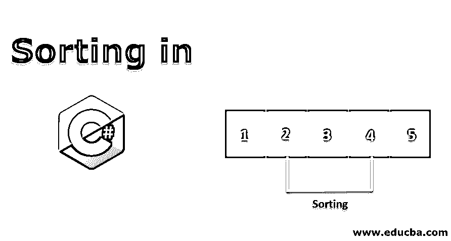
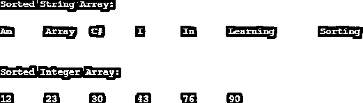
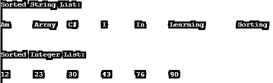
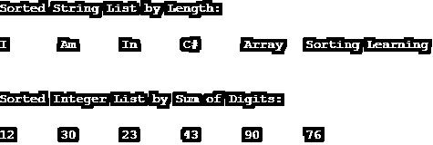
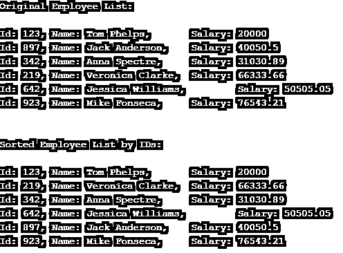
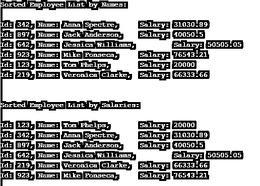

# 在 C#中排序

> 原文：<https://www.educba.com/sorting-in-c-sharp/>




## C#中排序的介绍

c#中的排序是按照特定顺序排列集合内容的过程。集合可以是数组、列表或任何其他数据组。集合可能包含简单类型和复杂类型的元素。简单类型可以是整数、字符串、浮点数等的集合。复杂类型可以是用户定义类型的对象集合，如雇员、学生等。复杂类型通常是嵌套的，这意味着对象可能有多个属性。

**例题**

<small>网页开发、编程语言、软件测试&其他</small>

*   **简单类型**
    *   整数集合–{ 1，2，3，4，5}
    *   字符串集合—{“马克”、“杰米”、“安娜”}
*   **复杂类型**
    *   {[姓名:“马克”，员工 Id:“123”，办公室:“伦敦”]，
        [姓名:“简”，员工 Id:“456”，办公室:“纽约”]，
        [姓名:“安妮”，员工 Id:“789”，办公室:“悉尼”] }

C#提供了内置的方法来对集合进行排序。无论是数组、列表还是任何泛型集合，C# Sort()方法都可以根据提供的比较器对其进行排序。在内部。Net 实现使用快速排序算法对 C#中的集合进行排序。我们将在本文的后续部分中对此进行更多的讨论。

### C#中排序是如何进行的？

如前所述。Net framework 使用快速排序方法对 C#集合中的元素进行排序。那么，什么是快速排序？

快速排序遵循分而治之的策略。这意味着，[排序算法](https://www.educba.com/sorting-algorithms-in-python/)选择一个枢纽元素，并基于该枢纽元素划分数组。比枢轴小的元素放在它的前面。比枢轴大的元素放在它的后面。这确保了 pivot 元素被排序。此外，数组被分为两部分——小于 pivot 的元素和大于 pivot 的元素。接下来，该算法对两个阵列采用相同的方法。

下面可以看到一个例子。

**未排序数组**–18，5，16，23，50，32

**第一步**(枢轴= 32)–18，5，16，23，32，50

**步骤 2a** 未排序数组–18，5，16，23
Pivot = 23
部分排序数组–18，5，16，23

**步骤 2b** 未排序数组–50
Pivot = 50
部分排序数组–50

**步骤 3a** 未排序数组–18，5，16
Pivot = 16
部分排序数组–5，16，18

**排序数组-**5，16，18，23，32，50

因此，Quicksort 有两个关键过程—选择枢轴和对阵列进行分区。算法的实现依赖于主元的选择。它可以是数组的第一个元素、最后一个元素、任意随机元素或中间值。一旦划分完成，枢轴被放置在正确的位置，算法被递归地调用，直到每个元素都被排序。

在 C#中进行排序时，就出现了稳定和不稳定快速排序的概念。在稳定的快速排序中，如果两个元素相等，它们在原始数组中的顺序将被保留。否则，它将处于不稳定的快速排序中。C#实现使用不稳定的快速排序。

### C#中的排序类型

在本文的这一部分，我们将主要关注 C#中的两种类型的集合——数组和列表。我们将深入探讨 C#如何对数组和列表进行排序。下一节将尝试用一些例子来解释它。

#### 1.在 C#中对数组排序

让我们看看在 C#中对数组排序的不同方法。

##### 形容词（adjective 的缩写）使用默认比较器

这是默认的 Sort()方法。如果没有明确传递比较子给方法，C#会使用递增顺序来排列元素。

**代码:**

```
using System;
public class Program
{
public static void Main()
{
String[] strArray = {"I", "Am", "Learning", "Array", "Sorting","In", "C#"};
int[] intArray = {23, 76, 12, 43, 90, 30};
Array.Sort(strArray);
Array.Sort(intArray);
Console.WriteLine("Sorted String Array:\n");
DisplayArray(strArray);
Console.WriteLine("\n\n\nSorted Integer Array:\n");
DisplayArray(intArray);
}
static void DisplayArray(string[] arr)
{
foreach (string a in arr)
{
Console.Write(a + "\t");
}
}
static void DisplayArray(int[] arr)
{
foreach (int a in arr)
{
Console.Write(a + "\t");
}
}
}
```

**输出:**




##### b.使用自定义比较器

我们还可以为 Sort()方法提供自己的自定义比较器。这将指示 C#编译器使用自定义比较器，而不是默认比较器。

要创建自定义比较器，我们需要从 IComparer 接口实现 Compare()方法。下面的代码演示了如何创建一个按降序对元素进行排序的比较器。

我们创建了一个类，从 IComparer 接口继承了它，实现了 Compare()方法，并重写了它以按降序比较元素。

**代码:**

```
using System;
public class DescendingComparer : System.Collections.IComparer
{
public int Compare(Object a, Object b)
{
return (new System.Collections.CaseInsensitiveComparer()).Compare(b, a);
}
}
public class Program
{
public static void Main()
{
String[] strArray = {"I", "Am", "Learning", "Array", "Sorting","In", "C#"};
int[] intArray = {23, 76, 12, 43, 90, 30};
Array.Sort(strArray, new DescendingComparer());
Array.Sort(intArray, new DescendingComparer());
Console.WriteLine("Sorted String Array in Descending Order:\n");
DisplayArray(strArray);
Console.WriteLine("\n\n\nSorted Integer Array in Desc Order:\n");
DisplayArray(intArray);
}
static void DisplayArray(string[] arr)
{
foreach (string a in arr)
{
Console.Write(a + "\t");
}
}
static void DisplayArray(int[] arr)
{
foreach (int a in arr)
{
Console.Write(a + "\t");
}
}
}
```

**输出:**


##### 碳（carbon 的缩写）使用键值对

C#还提供了一种使用一个数组中的键值对另一个数组进行排序的方法。下面的例子有人的名和姓的键值对。我们将使用 sort()方法按名字和姓氏对它们进行排序。

**代码:**

```
using System;
public class Program
{
public static void Main()
{
String[] firstNames = {"Tom", "Jack", "Anna", "Veronica", "Jessica", "Mike"};
String[] lastNames = {"Phelps", "Anderson", "Spectre", "Clarke",   "Williams", "Fonseca"};
Array.Sort(firstNames, lastNames);
Console.WriteLine("Sorted by First Names:\n");
DisplayArray(firstNames, lastNames);
Array.Sort(lastNames, firstNames);
Console.WriteLine("\n\nSorted by Last Names:\n");
DisplayArray(firstNames, lastNames);
}
static void DisplayArray(string[] arr1, string[] arr2)
{
for (int i = 0; i < arr1.Length; i++)
{
Console.WriteLine(arr1[i] + " " + arr2[i]);
}
}
}
```

**输出:**


#### 2.在 C#中对列表进行排序

让我们看看在 C# 中对[列表排序的不同方式。](https://www.educba.com/list-in-c-sharp/)

**Note** – To use Lists in C#, including the library System.Collections.Generic.

##### 形容词（adjective 的缩写）使用默认比较器

这是默认的 sort()方法。如果没有明确传递比较子给方法，c#会使用递增顺序来排列元素。

**代码:**

```
public class Program
using System.Collections.Generic;
{
public static void Main()
{
String[] strArray = {"I", "Am", "Learning", "Array", "Sorting", "In", "C#"};
List<string> strList = new List<string>(strArray);
int[] intArray = {23, 76, 12, 43, 90, 30};
List<int> intList = new List<int>(intArray);
strList.Sort();
intList.Sort();
Console.WriteLine("Sorted String List:\n");
DisplayList(strList);
Console.WriteLine("\n\n\nSorted Integer List:\n");
DisplayList(intList);
}
static void DisplayList(List<string> myList)
{
foreach (string a in myList)
{
Console.Write(a + "\t");
}
}
static void DisplayList(List<int> myList)
{
foreach (int a in myList)
{
Console.Write(a + "\t");
}
}
}
```

**输出:**




##### b.使用自定义比较器

我们还可以为 sort()方法提供自己的自定义比较器。这将指示 c#编译器使用自定义比较器，而不是默认比较器。

要创建自定义比较器，我们需要从 IComparer 接口实现 Compare()方法。下面的代码演示了如何创建一个按降序对元素进行排序的比较器。

我们创建了一个类，从 IComparer 接口继承了它，实现了 Compare()方法，并重写了它以按降序比较元素。

**代码:**

```
using System;
using System.Collections.Generic;
public class LengthComparer : IComparer<string>
{
public int Compare(string a, string b)
{
return (a.Length.CompareTo(b.Length));
}
}
public class DigitSumComparer : IComparer<int>
{
public int Compare(int a, int b)
{
int sum_a = 0;
int sum_b = 0;
while (a > 0)
{
sum_a += (a % 10);
a /= 10;
}
while (b > 0)
{
sum_b += (b % 10);
b /= 10;
}
return (sum_a.CompareTo(sum_b));
}
}
public class Program
{
public static void Main()
{
LengthComparer lc = new LengthComparer();
DigitSumComparer dsc = new DigitSumComparer();
String[] strArray = {"I", "Am", "Learning", "Array", "Sorting", "In", "C#"};
List<string> strList = new List<string>(strArray);
int[] intArray = {23, 76, 12, 43, 90, 30};
List<int> intList = new List<int>(intArray);
strList.Sort(lc);
intList.Sort(dsc);
Console.WriteLine("Sorted String List by Length:\n");
DisplayList(strList);
Console.WriteLine("\n\n\nSorted Integer List by Sum of Digits:\n");
DisplayList(intList);
}
static void DisplayList(List<string> myList)
{
foreach (string a in myList)
{
Console.Write(a + "\t");
}
}
static void DisplayList(List<int> myList)
{
foreach (int a in myList)
{
Console.Write(a + "\t");
}
}
}
```

**输出:**




### 对复杂列表类型进行排序

复杂列表类型是用户定义的列表。更准确地说，它们是用户定义的类的对象列表。由于是用户定义的，这些对象是各种原始类型的混合。很难对复杂的列表类型进行排序。C#编译器希望每个复杂类都从 IComparable 接口继承，并定义 CompareTo()方法。该方法包含如何比较列表元素进行排序的说明。

在下面的例子中，我们定义了一个用户定义的雇员类，并根据它们的 id 对雇员对象进行排序。

#### 示例#1

**代码:**

```
using System;
using System.Collections.Generic;
public class Employee : IComparable<Employee>
{
public int id {get;set;}
public string name{get;set;}
public double salary{get;set;}
public int CompareTo(Employee e)
{
return this.id.CompareTo(e.id);
}
}
public class Program
{
public static void Main()
{
List<Employee> emps = new List<Employee>();
emps.Add(new Employee()
{id = 123, name = "Tom Phelps", salary = 20000.00});
emps.Add(new Employee()
{id = 897, name = "Jack Anderson", salary = 40050.50});
emps.Add(new Employee()
{id = 342, name = "Anna Spectre", salary = 31030.89});
emps.Add(new Employee()
{id = 219, name = "Veronica Clarke", salary = 66333.66});
emps.Add(new Employee()
{id = 642, name = "Jessica Williams", salary = 50505.05});
emps.Add(new Employee()
{id = 923, name = "Mike Fonseca", salary = 76543.21});
Console.WriteLine("Original Employee List:\n");
DisplayList(emps);
emps.Sort();
Console.WriteLine("\n\nSorted Employee List by IDs:\n");
DisplayList(emps);
}
static void DisplayList(List<Employee> emp)
{
foreach (Employee e in emp)
{
Console.WriteLine("Id: " + e.id + ", Name: " + e.name + ",  Salary: " + e.salary);
}
}
}
```

**输出:**

**

** 

现在，一个显而易见的问题是，如果我们想根据其他一些属性对 Employee 类的对象进行排序呢？这是可能的。我们需要实现 IComparer 接口。让我们看一下下面的例子就明白了。

#### 实施例 2

**代码:**

```
using System;
using System.Collections.Generic;
public class Employee
{
public int id {get;set;}
public string name{get;set;}
public double salary{get;set;}
}
public class SortByName : IComparer<Employee>
{
public int Compare(Employee e1, Employee e2)
{
return e1.name.CompareTo(e2.name);
}
}
public class SortBySalary : IComparer<Employee>
{
public int Compare(Employee e1, Employee e2)
{
return e1.salary.CompareTo(e2.salary);
}
}
public class Program
{
public static void Main()
{
SortByName sbn = new SortByName();
SortBySalary sbs = new SortBySalary();
List<Employee> emps = new List<Employee>();
emps.Add(new Employee()
{id = 123, name = "Tom Phelps", salary = 20000.00});
emps.Add(new Employee()
{id = 897, name = "Jack Anderson", salary = 40050.50});
emps.Add(new Employee()
{id = 342, name = "Anna Spectre", salary = 31030.89});
emps.Add(new Employee()
{id = 219, name = "Veronica Clarke", salary = 66333.66});
emps.Add(new Employee()
{id = 642, name = "Jessica Williams", salary = 50505.05});
emps.Add(new Employee()
{id = 923, name = "Mike Fonseca", salary = 76543.21});
emps.Sort(sbn);
Console.WriteLine("Sorted Employee List by Names:\n");
DisplayList(emps);
emps.Sort(sbs);
Console.WriteLine("\n\nSorted Employee List by Salaries:\n");
DisplayList(emps);
}
static void DisplayList(List<Employee> emp)
{
foreach (Employee e in emp)
{
Console.WriteLine("Id: " + e.id + ", Name: " + e.name + ",  Salary: " + e.salary);
}
}
}
```

**输出:**




### 结论

因此，本文深入讨论了如何在 C#中对集合进行排序。我们主要关注数组和列表，因为这两个也涵盖了所有的基本类型。一旦很好地理解了 C#中排序的概念，在其他集合(如枚举、字典等)中实现排序就变得容易了。完成本文后，建议浏览 MSDN 文档，了解更多 C#中排序的实现。

### 推荐文章

这是一个 C#排序指南。在这里，我们讨论排序性能、排序类型(如数组和列表)以及示例和代码实现。您也可以阅读以下文章，了解更多信息——

1.  [c#中的对象](https://www.educba.com/objects-in-c-sharp/)
2.  [c#中的访问修饰符](https://www.educba.com/access-modifiers-in-c-sharp/)
3.  [c#中的指针](https://www.educba.com/pointers-in-c-sharp/)
4.  [Python 中的排序](https://www.educba.com/sorting-in-python/)


