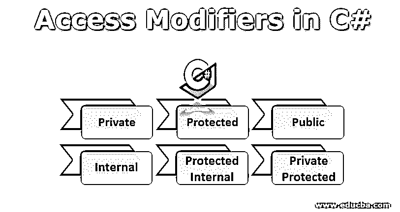
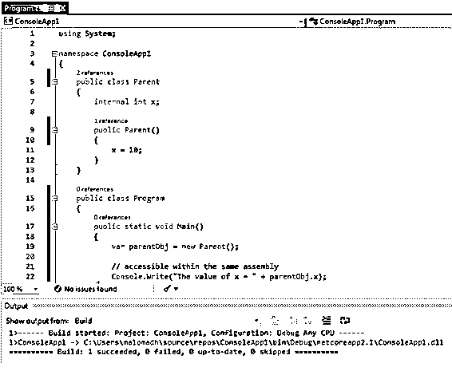
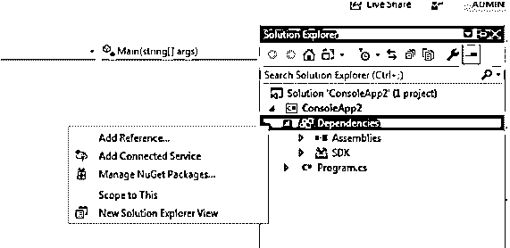
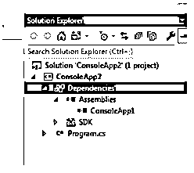
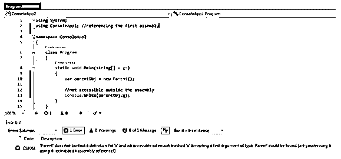
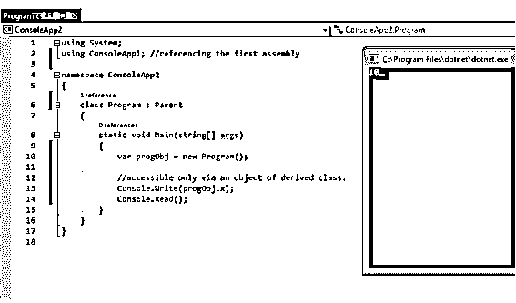
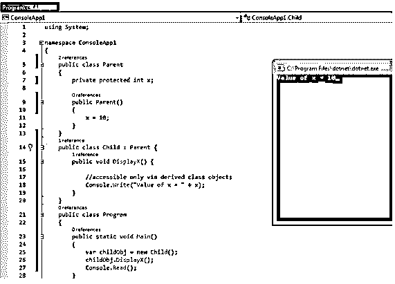

# C#中的访问修饰符

> 原文：<https://www.educba.com/access-modifiers-in-c-sharp/>




## C#中的访问修饰符简介

本文从 C#编程语言的角度介绍了面向对象编程的最基本概念。这个概念被称为–访问修饰符。要回答的第一个问题是——什么是访问修饰符？简单地说，访问修饰符控制哪些对象/变量/常量/方法(实际上是所有东西)可以在代码的哪个部分被访问。访问修饰符在证明面向对象编程中的抽象概念方面起着重要的作用。他们控制程序的什么部分应该对最终用户可见，什么部分不应该对最终用户可见。当然，最终用户最不关心算法中涉及的常数和变量。他只关心需要调用什么方法来获得输出。

### C#中访问修饰符的类型

C#为我们提供了四种类型的访问修饰符:

<small>网页开发、编程语言、软件测试&其他</small>

*   Private(默认的访问修饰符，枚举和接口除外)
*   受保护(轻微受限)
*   Public(无限制，枚举和接口的默认选择)
*   内部(同一程序集内的公共)

除了这四个访问修饰符之外，还有两个访问级别组合

*   受保护内部
*   私人保护

让我们用一个例子来理解每一个。

#### 1.私人的

私有是最受限制的访问级别。它也是所有常量、变量、用户定义的对象等的默认访问修饰符。默认情况下，只有枚举和接口是公共的。因此，如果您没有指定任何访问修饰符，C#会为它指定默认的修饰符。

私有对象在声明它们的类、结构或程序段的主体之外是不可访问的。任何在声明对象的主体范围之外访问该对象的尝试都会导致编译时错误。

**例#1**

```
using System;
class Employee //private by default
{
string name; //private by default
public string GetName()
{
return name;
}
public void SetName(string name)
{
this.name = name;
}
}
public class Program
{
public static void Main()
{
Employee emp = new Employee();
emp.SetName("John");
Console.Write("Employee name is " + emp.GetName());
// compile time error - 'Employee.name' is inaccessible due to its protection level
// Console.Write("Employee name is " + emp.name);
}
}
```

**输出:**

**

** 

**例 2**

```
using System;
public class Program
{
public static void Main()
{
int x = 5; //private to the Main method, accessible inside nested code blocks in the Main method
if (true)
{
int y = 10; //private to the if block, not accessible outside if block
Console.WriteLine("x = " + x);
Console.WriteLine("y = " + y);
}
Console.WriteLine("x = " + x);
// compile-time error - The name 'y' does not exist in the current context.
// Console.WriteLine("y = " + y);
}
}
```

**输出:**

**

** 

#### 2.保护

受保护的访问说明符将对象限制为只能从类的派生实例访问。因此，如果一个子类对象试图访问父类的受保护对象，这是允许的。非派生类不能访问任何类的受保护成员。当然，受保护的对象可以被它们自己的类的方法访问。

**举例:**

```
using System;
class Parent
{
protected string x;
public Parent()
{
x = "abc"; //accessible to own class methods
}
}
class Child : Parent // derived class
{
public static void Main()
{
var parentObj = new Parent();
var childObj = new Child();
Console.WriteLine(childObj.x); //accessible to derived class object instances
// compile-time error - Cannot access protected member 'Parent.x' via a qualifier of type 'Parent'; the qualifier must be of type 'Child' (or derived from it)
// Console.WriteLine(parentObj.x);
}
}
```

**输出:**


#### 3.公共

这是限制最少的访问修饰符。公共对象实际上对整个外部世界都是可访问的，因此使它们成为最高许可访问修饰符。当然，这要付出沉重的代价——最少保护的代价。

代码的任何部分都可以访问公共成员。这使得它们最不安全。任何代码逻辑都可以修改它们的值，这可能会导致意外的行为。因此，在公开任何对象之前，必须非常谨慎。

在我们在 private 访问修饰符示例中创建的同一个 Employee 类中，如果我们更改 public 的访问级别，我们将不需要任何 Getter 和 Setter 方法。事实上，最佳实践是将对象设为私有，并使用 C# Getter 和 Setter 属性。

**举例:**

```
using System;
class Employee
{
public string name;
}
public class Program
{
public static void Main()
{
Employee emp = new Employee();
emp.name = "John";
Console.Write("Employee name is " + emp.name);
}
}
```

**输出:**


#### 4.内部的

内部对象和方法只能在同一程序集中访问。当您想将任何对象公开，但又想将其访问权限限制在您正在编写的框架内时，这是一个非常有用的访问修饰符。

因此，本质上，所有内部对象都可以被同一个程序集的所有区域访问。

让我们创建两个控制台应用程序来理解这种工作方式。

**举例:**

**步骤 1:** 创建一个 C#控制台应用程序，并将以下代码放入其中:

```
using System;
namespace ConsoleApp1
{
public class Parent
{
internal int x;
public Parent()
{
x = 10;
}
}
public class Program
{
public static void Main()
{
var parentObj = new Parent();
// accessible within the same assembly
Console.Write("The value of x = " + parentObj.x);
}
}
}
```

**步骤 2:** 构建解决方案以获得。bin 文件夹中的 dll 文件。




**第三步:**创建另一个控制台应用程序，并从 ConsoleApp1 引用汇编文件。单击下图中的添加引用，并浏览到。步骤 2 中的 dll 文件。它必须类似于~/console app 1/bin/Debug/console app 1 . dll。




添加了。dll 文件，您应该在程序集下找到它。




**步骤 4:** 将以下代码放入 ConsoleApp2 中。

```
using System;
using ConsoleApp1; //referencing the first assembly
namespace ConsoleApp2
{
class Program
{
static void Main(string[] args)
{
var parentObj = new Parent();
//not accessible outside the assembly
Console.Write(parentObj.x);
}
}
}
```

**Step5:** 当你构建 ConsoleApp2 的时候，你会得到一个编译时错误，指示 ConsoleApp1 中的‘x’由于它的保护级别而不能在其他程序集中被访问。




#### 5.受保护内部

这是受保护访问修饰符和内部访问修饰符的组合。这里要理解的一个重要概念是，受保护的内部意味着受保护或内部。它是两个访问修饰符的[并集。绝不能认为是交集。](https://www.educba.com/c-union/)

因此，内部对象在程序集之外是不可访问的，而受保护对象对于任何程序集中的任何派生类都是可访问的。如果我只想保护其他程序集中的对象，而不想保护同一个程序集中的对象，该怎么办？简单的解决方案–将其声明为受保护的内部。

**举例:**

**步骤 1:** 让我们修改我们的 ConsoleApp1，以反映下面的代码。请注意，我们已经将变量“x”的访问级别更改为 protected internal。

```
using System;
namespace ConsoleApp1
{
public class Parent
{
protected internal int x;
public Parent()
{
x = 10;
}
}
public class Program
{
public static void Main()
{
var parentObj = new Parent();
// accessible within the same assembly
Console.Write("The value of x = " + parentObj.x);
}
}
}
```

**步骤 2:** 再次构建解决方案并替换。用更新后的。

**步骤 3:** 更新 ConsoleApp2 中的代码如下:

```
using System;
using ConsoleApp1; //referencing the first assembly
namespace ConsoleApp2
{
class Program: Parent
{
static void Main(string[] args)
{
var progObj = new Program();
//accessible only via an object of the derived class.
Console.Write(progObj.x);
Console.Read();
}
}
}
```

**第四步:**运行 ConsoleApp2 查看输出。




#### 6.私人保护

这是私有和受保护访问修饰符的联合组合。受保护的内部意味着受保护或内部。因此，私有对象在声明它的代码块之外是不可访问的，而受保护对象对于任何程序集中的任何派生类都是可访问的。如果我想限制对象的访问，即使是在其他程序集中的派生类中，该怎么办？简单的解决方案–将其声明为受保护的内部。

**举例:**

让我们将 ConsoleApp1 中“x”的访问级别修改为私有保护。

```
using System;
namespace ConsoleApp1
{
public class Parent
{
private protected int x;
public Parent()
{
x = 10;
}
}
public class Child: Parent {
public void DisplayX() {
// accessible only via derived class objects
Console.Write("Value of x = " + x);
}
}
public class Program
{
public static void Main()
{
var childObj = new Child();
childObj.DisplayX();
Console.Read();
}
}
}
```

**输出:**




### 表格比较

下面是 C#中访问修饰符的表格比较:

| **访问说明符** | **相同的装配** | **其他组件** |
| **同类** | **派生类** | **非派生类** | **派生类** | **非派生类** |
| **私人** | 是 | 不 | 不 | 不 | 不 |
| **公共** | 是 | 是 | 是 | 是 | 是 |
| **受保护的** | 是 | 是 | 不 | 是 | 不 |
| **内部** | 是 | 是 | 是 | 不 | 不 |
| **受保护的内部** | 是 | 是 | 是 | 是 | 不 |
| **私人受保护** | 是 | 是 | 不 | 不 | 不 |

### 结论

我们在上面的文章中已经看到，访问修饰符控制着项目中所有内容的访问。访问级别的各种组合涵盖了各种可访问性的需求。开发人员必须明智地选择，牢记安全性和在特定代码块中可访问对象的绝对必要性。

### 推荐文章

这是 C#中访问修饰符的指南。这里我们讨论了 C#中访问修饰符的引入类型，以及例子和输出。您也可以浏览我们推荐的其他文章，了解更多信息——

1.  [C#编译器](https://www.educba.com/c-sharp-compilers/)
2.  [c#中的析构函数](https://www.educba.com/destructor-in-c-sharp/)
3.  [PHP 中的访问修饰符](https://www.educba.com/access-modifiers-in-php/)
4.  [C#匿名函数](https://www.educba.com/c-sharp-anonymous-functions/)


