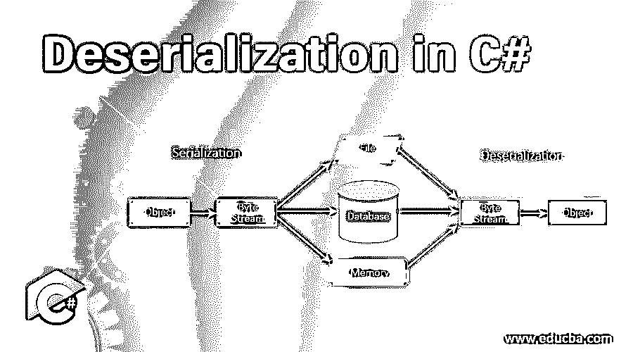
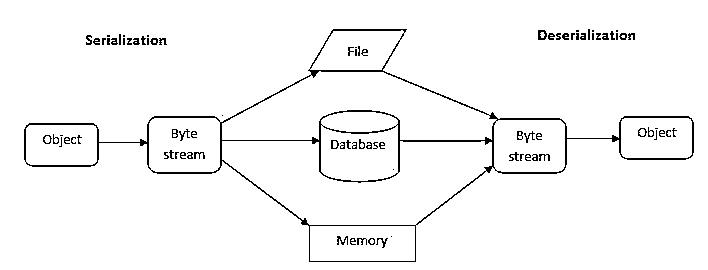
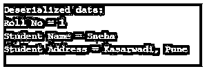
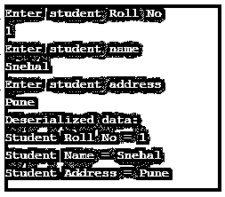

# C#中的反序列化

> 原文：<https://www.educba.com/deserialization-in-c-sharp/>




## **c#中反序列化介绍**

以下文章概述了 C#中的反序列化。我们先来看看序列化的过程。序列化是将对象转换为某种形式的过程，以便可以以流的形式写入，并可以存储在内存、数据库或文件中。它的主要目的是存储对象的状态。

现在，反序列化是与序列化相反的过程。它是读取字节流或将字节流转换回对象以便将其加载到内存中的过程。这个过程使我们能够在任何需要的时候重建一个物体。

<small>网页开发、编程语言、软件测试&其他</small>

**带解释的语法:**

使用 BinaryFormatter 进行反序列化的语法如下:

```
FileStream fileStream = new FileStream(filePath, FileMode.Open);
BinaryFormatter binaryFormatter = new BinaryFormatter();
ClassName objectName = (ClassName)binaryformatter.Deserialize(fileStream);
```

在上面的语法中，首先，我们通过给出文件的路径(filePath)创建了一个 fileStream 对象(FileStream ),我们将从该路径获取信息以重建该对象。之后，我们创建了一个 BinaryFormatter 对象。BinaryFormatter 是 System 下的一个类。runtime . serialization . formatters . binary 命名空间，用于序列化和反序列化对象。然后，我们使用 BinaryFormatter 的 Deserialize()方法反序列化该对象，该方法将 FileStream 的对象作为输入，并返回一个对象，我们将该对象转换为 ClassName 类型的对象，然后将其存储在 objectName 中。

### C#中反序列化是如何工作的？

对于 C#中的反序列化，我们需要先导入 System。IO 命名空间，以便打开包含将用于重建对象的数据的文件。然后我们需要导入系统。runtime . serialization . formatters . binary 命名空间，以便与负责序列化和反序列化对象的 BinaryFormatter 类一起工作。

假设我们有一个名为“Student”的类，它有两个属性，即“Name”和“RollNo”。使用序列化过程，我们将把类“Student”的数据属性写入一个文件。然后，通过调用 BinaryFormatter 类的 Deserialize()方法，我们可以从该文件中读取数据，并可以重建“Student”类的对象，我们称之为对象的反序列化。

使用 BinaryFormatter 反序列化 C#中的对象的步骤如下:

*   首先，我们需要创建一个流对象来读取序列化的信息或数据。
*   然后，我们将创建一个 BinaryFormatter 类的对象。
*   之后，我们将调用 BinaryFormatter 类的 Deserialize()方法来反序列化对象。这个方法将返回一个对象，我们可以将它转换为适当的类型。

在 C#中，有三种类型的序列化:

1.  二进制序列化
2.  XML 序列化
3.  JSON 序列化

因此，根据已完成的序列化，我们可以用三种方式反序列化对象。对于二进制序列化和反序列化，我们使用上面讨论的 BinaryFormatter 类，对于 XML 序列化和反序列化，我们使用 XMLSerializer 类，对于 JSON 序列化和反序列化，我们使用 JsonSerializer 类。

C#中序列化和反序列化的图形表示:




### C#中反序列化的示例

下面是一些例子:

#### 示例#1

显示二进制序列化和反序列化的示例。

**代码:**

```
using System;
using System.IO;
using System.Runtime.Serialization.Formatters.Binary;
namespace ConsoleApp4
{
class Program
{
public static void SerializingData()
{
string str = "Hello world!";
FileStream fileStream = new FileStream(@"E:\Content\content.txt",
FileMode.Create);
BinaryFormatter binaryFormatter = new BinaryFormatter();
binaryFormatter.Serialize(fileStream, str);
fileStream.Close();
}
public static void DeserializingData()
{
FileStream fileStream = new FileStream(@"E:\Content\content.txt",
FileMode.Open);
BinaryFormatter binaryFormatter = new BinaryFormatter();
string content = "";
content = (string)binaryFormatter.Deserialize(fileStream);
fileStream.Close();
Console.WriteLine("Deserialized data: ");
Console.WriteLine(content);
}
static void Main(string[] args)
{
SerializingData();
DeserializingData();
Console.ReadLine();
}
}
}
```

**输出:**


#### 实施例 2

显示自定义类的二进制序列化和反序列化的示例。

**代码:**

```
using System;
using System.IO;
using System.Runtime.Serialization.Formatters.Binary;
namespace ConsoleApp4
{
[Serializable]
public class Student
{
public int RollNo;
public string Name;
public string Address;
public Student(int rollNo, string name, string address)
{
RollNo = rollNo;
Name = name;
Address = address;
}
}
public class Program
{
public static void SerializingData()
{
Student student = new Student(1, "Sneha", "Kasarwadi, Pune");
//creating file to store data
FileStream fileStream = new FileStream(@"E:\Content\Student.txt",
FileMode.Create);
BinaryFormatter binaryFormatter = new BinaryFormatter();
//serializing data using Serialize() method
binaryFormatter.Serialize(fileStream, student);
fileStream.Close();
}
public static void DeserializingData()
{
Student student;
//opening file to read data
FileStream fileStream = new FileStream(@"E:\Content\Student.txt",
FileMode.Open);
BinaryFormatter binaryFormatter = new BinaryFormatter();
//creating object to store deserialized data
student = (Student)binaryFormatter.Deserialize(fileStream);
int rollNo = student.RollNo;
string name = student.Name;
string address = student.Address;
fileStream.Close();
//displaying deserialized data
Console.WriteLine("Deserialized data: ");
Console.WriteLine("Roll No = " + rollNo);
Console.WriteLine("Student Name = " + name);
Console.WriteLine("Student Address = " + address);
}
public static void Main(string[] args)
{
SerializingData();
DeserializingData();
Console.ReadLine();
}
}
}
```

**输出:**




#### 实施例 3

显示自定义类的 XML 序列化和反序列化的示例。

**代码:**

```
using System;
using System.IO;
using System.Xml.Serialization;
namespace ConsoleApp4
{
[Serializable]
public class Student
{
public int RollNo { get; set; }
public string Name { get; set; }
public string Address { get; set; }
public Student()
{
RollNo = 0;
Name = "N/A";
Address = "N/A";
}
}
public class Program
{
public static void SerializingData(Student student)
{
//creating file to store data.
FileStream fileStream = new FileStream(@"E:\Content\Student.txt",
FileMode.Create);
XmlSerializer xmlSerializer = new XmlSerializer(typeof(Student));
//calling serialize() method to serialize data to file
xmlSerializer.Serialize(fileStream, student);
fileStream.Close();
}
public static void DeserializingData()
{
//opening file to read data
FileStream fileStream = new FileStream(@"E:\Content\Student.txt",
FileMode.Open);
XmlSerializer xmlSerializer = new XmlSerializer(typeof(Student))
//calling Deserialize() to deserialize data from the file
Student student = (Student)xmlSerializer.Deserialize(fileStream);
fileStream.Close();
Console.WriteLine("Deserialized data: ");
Console.WriteLine("Student Roll No = " + student.RollNo);
Console.WriteLine("Student Name = " + student.Name);
Console.WriteLine("Student Address = " + student.Address);
}
public static void Main(string[] args)
{
Student student = new Student();
Console.WriteLine("Enter student Roll No");
student.RollNo = Convert.ToInt32(Console.ReadLine());
Console.WriteLine("Enter student name");
student.Name = Console.ReadLine();
Console.WriteLine("Enter student address");
student.Address = Console.ReadLine();
SerializingData(student);
DeserializingData();
Console.ReadLine();
}
}
}
```

**输出:**




### 结论

反序列化是从以前序列化的字节序列重新构造对象的过程。它允许我们在任何需要的时候恢复对象。它是序列化的逆过程。BinaryFormatter 类的 Deserialize()方法用于从二进制流反序列化。

### 推荐文章

这是 C#中反序列化的指南。这里我们讨论一下入门，动态数组在 Java 中是如何工作的？还有例子。您也可以看看以下文章，了解更多信息–

1.  [c#中的 Goto 语句](https://www.educba.com/goto-statement-in-c-sharp/)
2.  [c#中的静态构造函数](https://www.educba.com/static-constructor-in-c-sharp/)
3.  [C#类](https://www.educba.com/c-sharp-class/)
4.  [C#流写入器](https://www.educba.com/c-sharp-streamwriter/)


