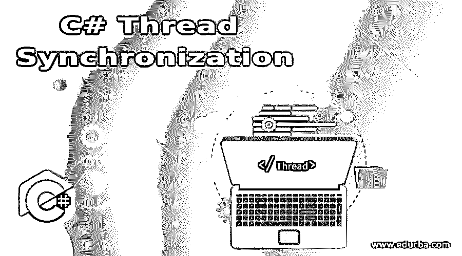

# C#线程同步

> 原文：<https://www.educba.com/c-sharp-thread-synchronization/>




## C#线程同步简介

在 C#中，一次只有一个线程可以使用资源，而不会中断任何其他线程，直到分配给当前线程的任务完成为止，这种技术称为同步。实际上，在多线程程序中，线程可以在所需的时间内访问任何资源，并且资源由线程异步共享和执行，这是一项关键任务，可能会导致系统停止，因此线程必须同步执行，通过线程的同步，我们可以保持线程的一致性，并确保在一个线程的执行期间没有其他线程干扰。

### C#线程同步的语法

下面是 C #线程同步的语法如下:

<small>网页开发、编程语言、软件测试&其他</small>

```
Thread thread_name = new Thread(method_name);
thread_name.Start();
thread_name.Join();
```

或者

```
Thread thread_name = new Thread(method_name);
thread_name.Start();
method_name()
{
lock(this)
{
//thread_name thread is executed
}
}
```

其中，线程名称是线程的名称，方法名称是从线程名称开始由该线程单独访问的方法的名称。Start()被调用，thread_name。Join()通过停止所有其他线程的执行来等待该线程完成。

方法中的 Lock 关键字，method_name 锁定线程的执行，这样，在当前线程完成之前，没有其他线程可以访问该方法。

### C#线程同步的功能

*   在多线程程序中，线程可以在所需的时间内访问任何资源，但是如果几个线程试图访问同一个资源，那么几个线程同时或异步共享资源就成了一项关键任务，系统可能会停止执行。
*   为了克服这个问题，线程的同步是必要的。通过线程的同步，只有该特定线程可以在一定时间内访问资源，而不受其他线程的任何干扰。
*   线程的同步可以使用 join 关键字和 lock 关键字来完成。
*   当在线程上使用 join 关键字时，该线程被允许在不中断任何其他线程的情况下完成其执行。
*   当使用 lock 关键字时，线程正在其上执行的资源被锁定一段时间，直到线程完成执行。

### 实现 C#线程同步的示例

下面是 C#线程同步的例子:

#### 示例#1

使用 join 关键字演示线程同步的 C#程序。

**代码:**

```
using System;
using System.Threading;
//a namespace called program is created
namespace program
{
//a class called check is defined
class check
{
//main method is called
static void Main(string[] args)
{
//an instance of the thread class is created which operates on a method
Thread firstthread = new Thread(secondfunction);
//start method is used to begin the execution of the thread
firstthread.Start();
//join method stops all other threads while the current thread is executing
firstthread.Join();
Thread secondthread = new Thread(firstfunction);
secondthread.Start();
secondthread.Join();
}
private static void firstfunction(object obj)
{
for(inti=1;i<3;i++)
{
Console.WriteLine("First function is executed two times in a row because join method is called on the second thread operating on this method.");
}
}
private static void secondfunction(object obj)
{
for(inti=1;i<3;i++)
{
Console.WriteLine("Second function is executed two times in a row because join method is called on the first thread operating on this method.");
}
}
}
}
```

**输出:**


**说明:**在上面的程序中，创建了一个名为 program 的命名空间。然后定义一个名为 check 的类，在这个类中调用 main 方法。然后，创建一个线程实例来操作一个方法，这是使用 Start()方法开始的，join()方法用在同一个线程上，以确保它的执行不会被其他线程中断。因此，输出同步显示在一行中。程序的输出显示在上面的快照中。

#### 实施例 2

使用 lock 关键字演示线程同步的 C#程序。

**代码:**

```
using System;
using System.Threading;
//a class called create is created
class create
{
public void func()
{
//lock is called on this method
lock (this)
{
for (inti = 1; i<= 2; i++)
{
Console.WriteLine("The thread is executing");
}
}
}
}
class check
{
public static void Main(string[] args)
{
//an instance of the create class is created
create c = new create();
//an instance of the thread class is created which operates on the method in another class
Thread firstthread = new Thread(c.func);
firstthread.Start();
Thread secondthread = new Thread(c.func);
secondthread.Start();
}
}
```

**输出:**


**解释:**在上面的程序中，创建了一个名为 create 的类，用它定义了方法，我们使用了 lock 关键字，意思是操作这个方法的线程为自己锁定这个方法，直到它完成执行，不允许其他线程访问这个方法。这样线程可以同步执行。程序的输出显示在上面的快照中。

### 结论

在本教程中，我们通过编程示例及其输出来了解 C#中线程同步的定义、语法和工作原理。

### 推荐文章

这是一个 C#线程同步指南。在这里，我们讨论了 C#线程同步的介绍及其工作原理，并给出了示例和代码实现。您也可以浏览我们推荐的其他文章，了解更多信息——

1.  [c#中的随机数生成器](https://www.educba.com/random-number-generator-in-sharp/)
2.  [Java 中的静态构造函数](https://www.educba.com/static-constructor-in-java/)
3.  [c#中的 text writer](https://www.educba.com/textwriter-in-c-sharp/)
4.  [c#中的静态构造函数](https://www.educba.com/static-constructor-in-c-sharp/)


