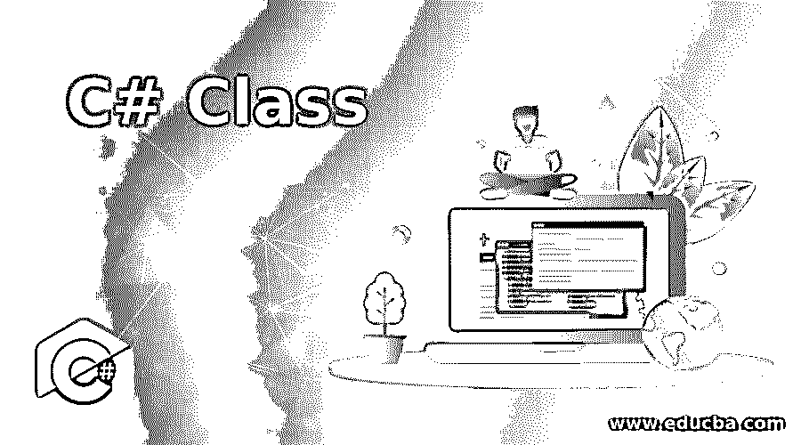
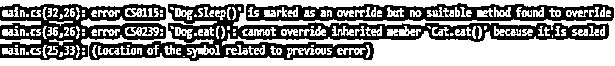

# C#类

> 原文：<https://www.educba.com/c-sharp-class/>




## C#类简介

在这篇文章中，我们将学习 C#类。类是所创建对象的蓝图。在实时场景中，让我们假设 Car 是一个类。所以赛车有一定的特征，比如形状、速度、内饰、颜色等等。所以很多公司生产符合这些要求的汽车。比如马鲁蒂、现代的每辆车都有这些物件。我们可以定义一个名为 car 的类，并根据汽车的特征创建对象。类似地，在面向对象程序中，一个类有许多属性，如事件、方法、字段等。类使程序员能够根据自己的需求创建自定义类型的对象。

**语法:**

<small>网页开发、编程语言、软件测试&其他</small>

我们可以用名为 class 的关键字定义这个类，后跟我们将要确定的类的名称，并用一对花括号括起来。

```
Class Test {  }
```

### 实现 C#类的示例

下面的例子展示了它是如何实现的

#### 示例#1

抽象类

**代码:**

```
using System;
using System.Collections.Generic;
using System.Linq;
using System.Text;
using System.Threading.Tasks;
public abstract class Animals
{
public abstract void aml ();      // abstract class method
}
public class Cat : Animals     // inheritance
{
public override void aml()
{
Console.WriteLine("This is first animal");
}
}
public class Dog : Animals   // another class inheritance
{
public override void aml()
{
Console.WriteLine("This is second animal");
}
}
public class main_method
{
public static void Main()      // main method
{
Animals a;
a = new Cat();
a.aml();
a = new Dog();
a.aml();
Console.ReadLine();
}
}
```

**解释:**上面的例子中，有一个抽象类 Animals，抽象方法为 aml()。动物类是子类'猫'和另一个子类'狗'所固有。在 main 方法中，“a”是不能实例化的动物类的对象。抽象类在包含构造函数和析构函数的继承时使用。Override 关键字必须在用于继承子类的抽象方法之前。

**输出:**


#### 实施例 2

密封类

**代码:**

```
using System;
using System.Collections.Generic;
using System.Linq;
using System.Text;
using System.Threading.Tasks;
public class Animal
{
public virtual void sleep()
{
Console.WriteLine("Animals are sleeping");
}
public virtual void eat()
{
Console.WriteLine("Animals are eating");
}
}
public class Cat : Animal    // inheritance
{
public override void sleep()
{
Console.WriteLine("Cat is sleeping");
}
public sealed override void eat()  // sealed method
{
Console.WriteLine("Cat is eating");
}
}
public class Dog : Cat  // inheritance
{
public override void Sleep()
{
Console.WriteLine("Sleeping");
}
public override void eat()
{
Console.WriteLine("Eating");
}
}
public class TestSealed
{
public static void Main()    // main method
{
Dog d = new Dog();
d.eat();
d.fly();
}
}
```

**解释:**在上面的例子中，有一个密封的方法，用来防止其他类被继承。因此，在这种情况下，当我们试图继承密封类，编译器读取密封关键字，并会给出一个错误。因此它不能被覆盖。

**输出:**




#### 实施例 3

静态类

**代码:**

```
using System;
using System.Collections.Generic;
using System.Linq;
using System.Text;
using System.Threading.Tasks;
class Office
{
public static string Name;          // static fields
public static string Location;
static Office()        // constructor
{
Name = "Microsoft";
Location = "Hyderabad";
}
}
class Program
{
static void Main(string[] args)
{
Console.WriteLine(Office.Name);
Console.WriteLine(Office.Location);
Console.Read();
}
}
```

**解释:**在上面的例子中，有一个静态类，静态类使用了一个 static 关键字，使得这个类不可实例化。它由静态成员的名称和位置组成。在 main 方法中，我们访问类 office 的静态数据成员。无法创建静态类的对象。静态类不能从任何其他类继承。

**输出:**


#### 实施例 4

部分类别

**代码:**

```
using System;
using System.Collections.Generic;
using System.Linq;
using System.Text;
using System.Threading.Tasks;
// partial class1.cs
public partial class Class1
{
private string EmpName;
private int EmpId;
public Class1(string a, int t)
{
this.EmpName = a;
this.EmpId = t;
}
}
// partial class2.cs
public partial class Class1
{
public void Display()
{
Console.WriteLine("Employee name is : " + EmpName);
Console.WriteLine("Employee Id is : " + EmpId);
}
}
public class Class
{
private string EmpName;
private int EmpId;
public Class(string a, int t)
{
this.EmpName = a;
this.EmpId = t;
}
public void Display()
{
Console.WriteLine("Employees name is : " + EmpName);
Console.WriteLine("Employee Id is : " + EmpId);
}
}
```

**说明:**上面的例子中，实现了分部类。当我们有一节很长的课的时候，它可以被使用。所以为了简化代码，我们可以定义多个文件。Partial 是用于这些类型的类的关键字。所以它可以被分割成多个文件，这些文件由一个使用 partial 关键字的方法组成。在这个部分 class1.cs 和部分 class2.cs 被编译器合并成一个文件。

**输出:**


**Notes:** Access specifiers helps to access the member as well as the class itself.

### 结论

为了访问任何类成员，我们应该使用点操作符。点运算符有助于将对象的名称链接到成员的名称。我们可以在类中定义方法、构造函数和析构函数。

### 推荐文章

这是一个 C#类的指南。这里我们讨论 C#类的语法，用四个不同的例子来实现正确的代码和输出。您也可以浏览我们的其他相关文章，了解更多信息——

1.  [C#文字量](https://www.educba.com/c-sharp-literals/)
2.  [c#中的 text writer](https://www.educba.com/textwriter-in-c-sharp/)
3.  [c#中的日期时间](https://www.educba.com/datetime-in-c-sharp/)
4.  [C#输出参数](https://www.educba.com/c-sharp-out-parameter/)


