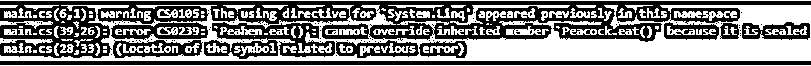

# 用 C#密封

> 原文：<https://www.educba.com/sealed-in-c-sharp/>


## C#中的密封介绍

在 C#中，sealed 关键字用于防止其他类继承它。我们还可以对属性或方法的修饰符使用 sealed 关键字，这些修饰符重写父类或基类的属性。所以基本上，当我们需要做限制来继承类时，就会用到它。编译器读取关键字 sealed 并理解它不能被扩展。密封类不能是基类，因为它不能被任何其他类继承。如果一个类试图驱动一个密封的类，C#编译器会产生一个错误信息。

**语法:**

<small>网页开发、编程语言、软件测试&其他</small>

我们可以使用下面的关键字 sealed

```
classX {}
sealedclassY : X {}
```

我们也可以为该方法使用关键字 sealed。如果任何方法是密封的，那么我们不能重写该方法，但是方法只能在继承的类中密封。密封类并不总是需要有密封方法。

但是，如果我们试图从密封类继承一个类，那么我们将会得到错误，即“我们不能从密封类派生”。下面的示例展示了一个密封类。

```
using System;
class Test1 {
}
// Creating a sealed class
sealed class Test : Test {
}
// Inheriting the Sealed Class
class Example : Test1 {
}
// Driver Class
class Test1 {
// Main Method
static void Main()
{
}
}
```

这个程序将抛出一个错误，因为在代码中我们试图扩展密封类。

### 在 C#中密封的用法

下面是 C#中密封的一些用法:

1.  我们不能从密封类中扩展或驱动任何其他类。
2.  我们也可以将它用于方法，这样其他类就不能修改或实现它。所以这主要是用于安全目的。
3.  它通常在我们有静态成员时使用。例如 system.cricket 名称空间的 bat 和 ball 类。球代表标准颜色的球。这个球类只有静态成员。像球一样。白色代表白色的球。类似地，蝙蝠类只代表标准蝙蝠。所以当我们在设计任何一个类的时候，我们想要限制它，这样开发者就不能进一步扩展它，那么就可以使用 sealed 关键字。
4.  密封方法总是子类的重写方法。
5.  我们不能再次覆盖密封的方法。
6.  密封方法仅在[方法覆盖](https://www.educba.com/method-overriding-in-java/)时可用。
7.  sealed 关键字不可用于隐藏方法。
8.  Sealed 与 override 方法一起使用。
9.  我们不能把一个正常的方法作为密封。

### 用 C#实现密封的示例

下面的几个例子展示了我们如何用 C#实现 sealed。

#### 示例#1

**代码:**

```
using System;
using System.Collections.Generic;
using System.Linq;
using System.Text;
using System.Threading.Tasks;
sealed class Example
{
public int Sum(int i, int j)
{
return i + j;
}
}
class Program
{
// Main Method
static void Main(string[] args)
{
Example ex = new Example();         // object of sealed class
int cal = ex.Sum(21, 4);  // calculate the sum
Console.WriteLine("Total = " + cal.ToString());
Console.ReadLine();
}
}
```

在上面的示例中，创建了密封类示例，调用了密封类的对象，并显示了整数的和。

**输出:**


#### 实施例 2

**代码:**

```
using System;
using System.Collections.Generic;
using System.Linq;
using System.Text;
using System.Threading.Tasks;
class Example1
{
}
sealed class Example2 : Example1    // sealed class
{
}
class Example3 : Example2          // Inheriting the Sealed Class
{
}
class Program
{
// Main Method
static void Main()
{
}
}
```

在上面的例子中，有多个类，但是当一个类试图继承一个密封类时，那么就会给出“Example3 不能从密封类型 Example2 派生”的错误。

**输出:**


#### 实施例 3

**代码:**

```
using System;
using System.Collections.Generic;
using System.Linq;
using System.Text;
using System.Threading.Tasks;
sealed public class Bird       // sealed class
{
public void eat()
{
Console.WriteLine("Birds are eating...");
}
}
public class Peacock : Bird      // class inherits sealed type
{
public void fly()
{
Console.WriteLine("Peacock is flying...");
}
}
public class TestSealed
{
public static void Main()      //main method
{
Peacock p = new Peacock();
p.eat();
p.fly();
}
}
```

上面的例子表明，密封类不能由任何其他类派生。这个程序将抛出错误，因为我们不能派生密封的父类。

**输出:**


#### 实施例 4

**代码:**

```
using System;
using System.Collections.Generic;
using System.Linq;
using System.Text;
using System.Threading.Tasks;
using System.Linq;
public class Bird
{
public virtual void fly()
{
Console.WriteLine("Birds are flying...");
}
public virtual void eat()
{
Console.WriteLine("Birds are eating...");
}
}
public class Peacock : Bird    // inheritance
{
public override void fly()
{
Console.WriteLine("Peacock is flying…….");
}
public sealed override void eat()  // sealed method
{
Console.WriteLine("Peacock is eating..........");
}
}
public class Peahen : Peacock  // inheritance
{
public override void fly()
{
Console.WriteLine("Flying...");
}
public override void eat()
{
Console.WriteLine("eating....");
}
}
public class TestSealed
{
public static void Main()    // main method
{
Peahen p = new Peahen();
p.eat();
p.fly();
}
}
```

在上面的例子中，有一个不能被覆盖的密封方法。因此它会给出一个错误。

**输出:**




### 结论

最后，我们可以说，当我们不想向派生类公开功能时，或者当我们希望限制代码以使开发人员无法扩展它时，密封类或密封方法非常有用。密封类不能由任何其他类派生，密封方法不能被重写。因此，避免继承是一种限制。

### 推荐文章

这是一个用 C#封装的指南。在这里，我们讨论一个 C#中的 Sealed 及其代码实现的例子的简要概述。您也可以浏览我们推荐的其他文章，了解更多信息——

1.  [c#中的方法重载](https://www.educba.com/method-overloading-in-c-sharp/)
2.  [c#中的静态构造函数](https://www.educba.com/static-constructor-in-c-sharp/)
3.  [c#中的多态性](https://www.educba.com/polymorphism-in-c-sharp/)
4.  [c#中的私有](https://www.educba.com/private-in-c-sharp/)


