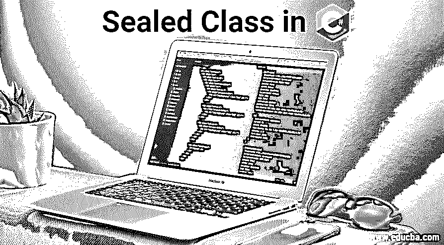

# C#中的密封类

> 原文：<https://www.educba.com/sealed-class-in-c-sharp/>




## C#中的密封类是什么？

密封类是不允许继承的类，这意味着密封类将限制用户继承一个类。使用 Sealed 关键字定义的密封类，该关键字通知编译器所定义的类是密封的，因此它不能被扩展，也没有机会继承特定的类。密封类限制从密封类派生的类。密封类的主要目的是停止从其他类继承特定的类。在 C#中，为了代码的安全性，我们使用了一个密封的类，在这个类中，我们可以根据自己的条件来保护重写的特定方法或属性。密封类是我们不能派生或创建新类的类。换句话说，密封类不能被其他类继承，通过使用密封修饰符，我们还可以定义一个被声明为密封类的类。

**语法**

<small>网页开发、编程语言、软件测试&其他</small>

```
sealed class _className
{
//data members
//methods
}
```

**代码:**

```
sealed class Demo1 {}
class Demo2 : Demo1{} //invalid
```

要将任何类创建为密封类，我们必须使用关键字 sealed。

### C#中的密封类是如何工作的？

一般来说，在继承的帮助下创建一个类时，我们继承了任何一个类中的所有方法和属性。通过使用密封类，我们可以在密封关键字的帮助下限制对类及其成员的访问，还可以避免从其他类继承已定义的类。在 C#中，密封类是一个不能被另一个类继承的类，但是它可以被实例化。密封类通常用于安全目的，防止不需要的用户访问派生类。密封类在很大程度上是为了限制类的可扩展性。

使用密封类时有几个要点，它们是:

*   密封类[与抽象类](https://www.educba.com/abstract-class-in-c-sharp/)完全不同。
*   抽象方法不能在密封类中使用。
*   在继承层次结构中，它必须是最底层的类。
*   特意用来避免继承的密封类。
*   用于方法、类、属性和实例的 sealed 关键字。

我们来看看密封类的工作流程:

**代码:**

```
using System;
public class DemoClass
{
public static void Main (string[] args)
{
SealedDemo _sealedObject=new SealedDemo();
int result=_sealedObject.Addition(5,5);
Console.WriteLine("Total Value="+result.ToString());
}
} //sealedClass starts here
sealed class SealedDemo
{
public int Addition(int x, int y)
{
return x+y;
}
}
```

**输出:**


当类被定义为密封的，那么这个类就不能被继承，密封的类也不能被用作基类。密封类主要用于限制 OOP 的继承方面。

### C#中的密封方法

密封方法被定义为该方法是父类，并且该方法不能在子类下被重写。当方法在类中声明为虚拟时，任何子类都可以重写方法:

#### 示例#1

**代码:**

```
using System;
public class Sample_Employee
{
protected int Emp_id, Emp_age;
protected string Emp_name, Emp_address;
public virtual void GetEmployeeDetails()
{
Console.WriteLine("EMPLOYEE DETAILS");
Console.WriteLine("EMPLOYEE ID");
Emp_id = int.Parse(Console.ReadLine());
Console.WriteLine("EMPLOYEE NAME");
Emp_name = Console.ReadLine();
Console.WriteLine("EMPLOYEE ADDRESS");
Emp_address = Console.ReadLine();
Console.WriteLine("EMPLOYEE AGE");
Emp_age = int.Parse(Console.ReadLine());
}
public virtual void DisplayEmployeeDetails()
{
Console.WriteLine("\nEMPLOEE DETAILS:");
Console.WriteLine("EMPLOYEE ID : " + Emp_id);
Console.WriteLine("EMPLOYEE NAME : " + Emp_name);
Console.WriteLine("EMPLOYEE ADDRESS :" + Emp_address);
Console.WriteLine("EMPLOYEE AGE : " + Emp_age);
}
}
public sealed class Emp_Manager : Sample_Employee
{
double Bonus, CA;
public override void GetEmployeeDetails()
{
Console.WriteLine("ENTER MANAGER DETAILS:");
Console.WriteLine("ENTER THE ID");
Emp_id = int.Parse(Console.ReadLine());
Console.WriteLine("ENTER THE NAME");
Emp_name = Console.ReadLine();
Console.WriteLine("ENTER THE BONUS");
Bonus = double.Parse(Console.ReadLine());
Console.WriteLine("ENTER THE CA");
CA = Convert.ToDouble(Console.ReadLine());
}
public override void DisplayEmployeeDetails()
{
Console.WriteLine("MANAGER DETAILS");
Console.WriteLine("EMPLOYEE ID: " + Emp_id);
Console.WriteLine("EMPLOYEE NAME: " + Emp_name);
Console.WriteLine("MANAGER BONUS: " + Bonus);
Console.WriteLine("MANAGER CA : " + CA);
}
}
class Program
{
static void Main(string[] args)
{
Emp_Manager m1 = new Emp_Manager ();
m1.GetEmployeeDetails();
m1.DisplayEmployeeDetails();
Console.ReadKey();
}
}
```

**输出:**


我们可以在重写基类中的虚方法的属性或方法上使用密封修饰符，这使我们能够允许类从类派生，并保护使用类的开发人员不重写特定的虚属性或方法。有几点是我们必须定义密封类的:

*   我们从不希望在子类中覆盖一个类的所有属性或方法
*   没有必要扩展我们的类功能。

#### 实施例 2

使用密封类的主要目的是保护[类](https://www.educba.com/inheritance-in-python/)的继承；我们不需要任何类来扩展一个类的功能。让我们看看密封类的示例程序:

**代码:**

```
using System;
using System.Text;
namespace test_SealedClass
{
public class SampleProgram1
{
public sealed class TestBaseClass
{
public static void TestDisplay()
{
Console.WriteLine("Here the SealedClass cannot be inherited");
}
}
public class TestDerived : TestBaseClass
{
// here Derived class cannot be inherited because it's a sealed class
}
static void Main(string[] args)
{
TestBaseClass _object = new TestBaseClass();
_object.TestDisplay();
Console.ReadLine();
}
}
}
```

当您试图从密封类派生一个类时，编译器会抛出一个 fault 错误。TestDerived:无法从密封类型 TestBaseClass 派生。

### 密封类的优势

让我们来看看以下几点关于 c#语言中的 sealed 关键字我们需要考虑的要点:

*   出于安全目的，如果一个类被声明为密封类，则该类会限制继承。
*   对于类和方法，C#在使用密封关键字时会应用限制。
*   在 C# 中局部变量没有被[密封](https://www.educba.com/sealed-in-c-sharp/)
*   当对属性或方法的 sealed 关键字使用 override 时，它总是适用的。
*   密封的修饰符避免了类被继承。

### 结论

本文将让您更好地了解密封类和密封方法，并用几个例子解释了 C#中的密封类和密封方法。希望这篇文章对你的需求有所帮助。

### 推荐文章

这是一个 C#中密封类的指南。这里我们讨论 c#中的密封类是如何工作的，以及密封类中的方法的优点。您也可以浏览我们的其他相关文章，了解更多信息——

1.  [C#交错数组](https://www.educba.com/c-sharp-jagged-arrays/)
2.  [c#中的回文](https://www.educba.com/palindrome-in-c-sharp/)
3.  [c#中的继承](https://www.educba.com/inheritance-in-csharp/)
4.  [Java 中的 Break 语句](https://www.educba.com/break-statement-in-java/)


