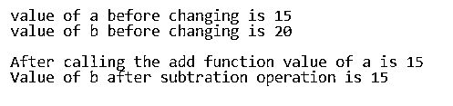
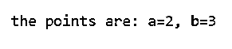
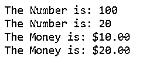

# C#引用

> 原文：<https://www.educba.com/c-sharp-references/>


## C#参考简介

在 C#中，变量的内存位置可以通过使用称为 reference parameter 的参数来引用，它们不同于称为 value parameterss 的参数，在 value parameter 中，值作为参数传递，并且为这些值创建新的内存位置，而在 reference parameter 中，没有为这些参数分配内存位置，因为只传递这些参数的引用，并且引用参数可以通过使用关键字 ref 来声明。

**C #中声明引用参数的语法如下:**

<small>网页开发、编程语言、软件测试&其他</small>

```
return type Method name(ref arg1, ref arg2)
Declare local variables, for example a, b
Calling the method,
Method name(ref a, ref b)
```

上述语法表示在 C#中声明引用参数。引用参数可以使用关键字 ref 来声明，也可以使用关键字 ref 来访问。

### C#中参考参数的工作

考虑下面的程序，它由两个方法 add 和 subtract 组成。add 方法接受通过值传递的参数，subtract 方法接受作为引用传递的参数。最初，声明两个变量并用两个值初始化。然后通过将值作为参数传递来调用 add 方法。即使该方法应该对作为参数传递的值执行操作，值也不会发生变化，因为这是按值传递的。调用下一个 subtract 方法，并向其传递引用参数。subtract 方法中定义的操作是对作为引用传递的值执行的，并且它被更新。

**代码:**

```
using System;
namespace refer {
public class check {
// Calling the main method
public void Main(string[] args)
{
// The values of a and b are initialized
int a = 15, b = 20;
// The values of a and b are displayed before making changes to the values
Console.WriteLine("value of a before changing is {0}", a);
Console.WriteLine("value of b before changing is {0}", b);
Console.WriteLine();
// The add method is called by passing the value
add(a);
// After calling the method by value, the changes value is displyed
Console.WriteLine("After calling the add function"+
" value of a is {0}", a);
// The sub method is called by passing the reference
subtract(ref b);
// Display modified value of b
Console.WriteLine("Value of b after "+
"subtration operation is {0}", b);
}
// Defining the add method which accepts value as parameters
public static void add(int a)
{
a += 5;
}
// Defining the subtract method which accepts reference as parameters
public static void subtract(ref int b)
{
b -= 5;
}
}
}
```

**输出:**




### C#中的引用类型

以下是 C#中的引用类型

#### 1.班级

类是 C#引用类型之一，可以使用关键字 Class 来声明它们。用 C#声明类的语法如下所示:

```
Class classname
{
}
```

该类支持继承。也就是说一个类可以继承基类的实现。类可以是公共的、私有的、受保护的。下面的程序演示了类的创建。

**代码:**

```
using System;
namespace check
{
class children
{
private int height;
private string names;
// This is the consturctor class which is default
public children()
{
names = "nobody";
}
// Defining a constructor with arguments
public children(string names, int height)
{
this.names = names;
this.height = height;
}
// The method to print the values
public void Print()
{
Console.WriteLine("{0} is {1} inches tall.", names, height);
}
}
class Test
{
static void Main()
{
// New operator is used to create the objects on the class
children child1 = new children("Shobha", 5);
children child2 = new children("Ravi", 6);
// An object is created using default constructor
children child3 = new children();
// The results are displayed
Console.Write("The first child: ");
child1.Print();
Console.Write("The second child: ");
child2.Print();
Console.Write("The third child: ");
child3.Print();
}
}
}
```

**输出:**


#### 2.连接

契约是使用接口定义的。任何类的成员都有接口提供的明确实现。下面的程序演示了接口的创建和实现。

**代码:**

```
using System;
//An interface is defined
interface Point
{
int A
{
get;
set;
}
int B
{
get;
set;
}
double Dist
{
get;
}
}
//A class is implementing the interface
class Pointed : Point
{
// Constructor of the class
public Pointed(int a, int b)
{
A = a;
B = b;
}
public int A { get; set; }
public int B { get; set; }
public double Dist =>
Math.Sqrt(A * A + B * B);
}
class Maincl
{
static void PrintPointed(Point r)
{
Console.WriteLine("a={0}, b={1}", r.A, r.B);
}
static void Main()
{
Point r = new Pointed(2, 3);
Console.Write("the points are: ");
PrintPointed(r);
}
}
```

**输出:**




#### 3.代表

委托类型的声明类似于方法的声明。它返回一个值，并且可以接受任意数量的任意类型的参数作为参数。它基本上用于封装方法，作为指向函数的指针。可以使用 delegate 关键字声明委托。声明委托的语法如下:

```
<access modifier> delegate <return type> <delegate_name>(<parameters>)
```

考虑下面演示委托创建的程序

**代码:**

```
using System;
class Program
{
// Creating delegates
public delegate void Printdel(int values);
static void Main(string[] args)
{
// We are printing a number using delegates
Printdel print = PrintNum;
print(100);
print(20);
//We are printing money using printmon delegate
print = PrintMon;
print(10);
print(20);
}
public static void PrintNum(int number)
{
Console.WriteLine("The Number is: {0,-12:N0}",number);
}
public static void PrintMon(int mon)
{
Console.WriteLine("The Money is: {0:C}", mon);
}
}
```

**输出:**




### 结论

在本教程中，我们通过定义了解 C#中引用的概念，然后通过示例程序了解 C#中引用的语法和类型。

### 推荐文章

这是 C#参考指南。这里我们讨论 C#中的引用类型以及引用参数的语法和工作方式。您也可以看看以下文章，了解更多信息–

1.  [C#三元运算符](https://www.educba.com/c-sharp-ternary-operators/)
2.  [C#输出参数](https://www.educba.com/c-sharp-out-parameter/)
3.  [c#中的条件运算符](https://www.educba.com/conditional-operators-in-c-sharp/)
4.  [C#螺纹连接](https://www.educba.com/c-sharp-thread-join/)


