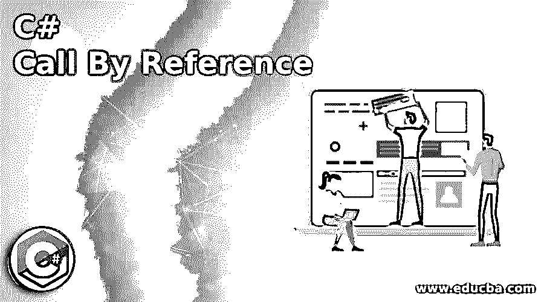
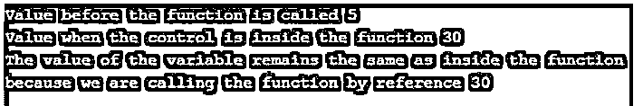
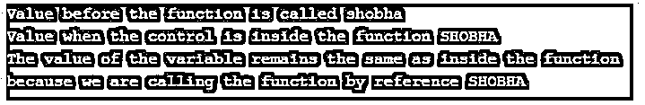

# C#通过引用调用

> 原文：<https://www.educba.com/c-sharp-call-by-reference/>




## C#引用调用简介

变量在内存中的位置是通过使用一个称为引用参数的参数来引用的。这些参数不同于携带需要新存储位置的值的参数，因为相同的内存位置由引用参数表示，就像作为参数传递给方法的原始参数一样。我们使用关键字 ref 来声明参数，每当引用实参作为参数传递给任何函数时，传递的是对内存位置的引用，而不是原始值，如果我们通过引用调用任何变量，则在 C#中它被称为 call by reference。

**c#引用调用的语法:**

<small>网页开发、编程语言、软件测试&其他</small>

```
ref data_typevariable_name
```

其中，数据类型是变量名称为的变量的数据类型。

### 通过引用调用 C#的工作方式

*   每当需要调用一个接受参数的函数时，如果我们想将变量在内存中的引用地址作为参数传递给函数，我们就使用 C#中的引用调用。
*   作为变量在内存位置的引用地址传递的参数称为引用参数。
*   通过使用引用调用，只传递对变量的存储位置的引用，而不创建变量的副本，从而节省了存储位置空间。
*   关键字 ref 用于声明 C#中的引用参数。

### 通过引用调用 C#的示例

下面是提到的例子:

#### 示例#1

演示引用调用的 C#程序，其中我们计算一个数的平方，并在引用调用函数之前和调用函数之后显示值。

**代码:**

```
using System;
//a namespace called program1 is defined
namespace program1
{
//a class called check is defined
class check
{
//a function is defined which takes reference variable as an argument
public void displaypower(ref double value)
{
//the square of the passed value is found using pow method
double power = Math.Pow(value,2);
//The resulting value is added to the value passed as reference
value = value + power;
Console.WriteLine("Value when the control is inside the function "+value);
}
//main method is called
static void Main(string[] args)
{
//a double variable is defined
double value = 5;
//an instance of the check class is defined which consists of the function taking reference parameter as an argument
check check1 = new check();
Console.WriteLine("Value before the function is called "+value);
//a function is called by reference
check1.displaypower(ref value);
Console.WriteLine("The value of the variable remains the same as inside the function because we are calling the function by reference " + value);
}
}
}
```

**输出:**




**说明:**

*   在上面的程序中，定义了一个名为 program1 的名称空间。然后定义了一个名为 check 的类，在这个类中定义了一个以引用变量作为参数的函数。该函数将传递的值作为引用，计算该值的平方，并与实际值相加，然后显示结果值。
*   然后调用 main 方法，在该方法中定义一个 double 变量，通过创建 check 类的一个实例，将该变量的引用传递给 check 类中定义的函数，然后显示调用该函数后变量的值，该值与被调用函数中的值保持相同，因为我们是通过引用 check 类中的函数来传递该值的。

#### 实施例 2

C#程序演示了通过引用调用，其中我们通过引用调用函数并将小写字母的字符串作为引用参数传递，从而将小写字母的给定字符串转换为大写字母。

**代码:**

```
using System;
//a namespace called program1 is defined
namespace program1
{
//a class called check is defined
class check
{
//a function is defined which takes reference variable as an argument
public void displayupper(ref string value)
{
//ToUpper method is used to convert the string from small letters to capital letters
value = value.ToUpper();
Console.WriteLine("Value when the control is inside the function "+value);
}
//main method is called
static void Main(string[] args)
{
//a double variable is defined
string value = "shobha";
//an instance of the check class is defined which consists of the function taking reference parameter as an argument
check check1 = new check();
Console.WriteLine("Value before the function is called "+value);
//a function is called by reference
check1.displayupper(ref value);
Console.WriteLine("The value of the variable remains the same as inside the function because we are calling the function by reference " + value);
}
}
}
```

**输出:**




**说明:**

*   在上面的程序中，定义了一个名为 program1 的名称空间。然后定义了一个名为 check 的类，在这个类中定义了一个以引用变量作为参数的函数。该函数将传递的值作为引用，并使用 ToUpper()方法将小写字母的给定字符串转换为大写字母。
*   然后调用 main 方法，在该方法中定义一个字符串变量，通过创建 check 类的一个实例将该变量的引用传递给 check 类中定义的函数，然后显示调用该函数后变量的值，该值与被调用的函数中的值相同，因为我们是通过引用 check 类中的函数来传递该值的。

### 推荐文章

这是一个 C#调用的参考指南。在这里，我们通过引用工作和编程示例来讨论 C#调用的介绍。您也可以看看以下文章，了解更多信息–

1.  [C#字典](https://www.educba.com/c-sharp-dictionary/)
2.  [DataReader C#](https://www.educba.com/datareader-c-sharp/)
3.  [IEnumerable C#](https://www.educba.com/ienumerable-c-sharp/)
4.  [C#系统。IO](https://www.educba.com/c-sharp-system-dot-io/)


