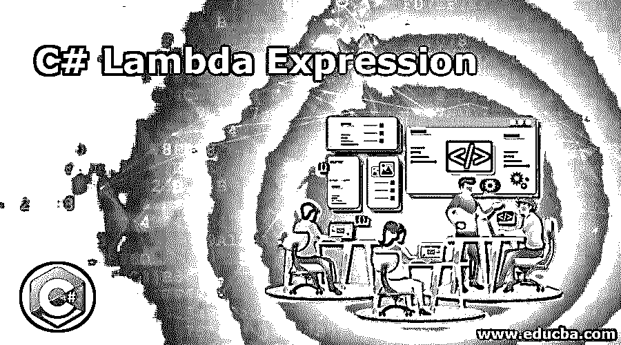

# C# Lambda 表达式

> 原文：<https://www.educba.com/c-sharp-lambda-expression/>




## C# Lambda 表达式简介

C#中的 Lambda 表达式是一个匿名函数，它包含一个表达式或一组语句，用于实现 Lambda 表达式的运算符是“= >”。Lambda 表达式由两部分组成，左边部分是输入，右边部分是表达式。一个简单的 lambda 表达式接受一个参数并返回一个值，使用 Lambda 表达式最常见的场景之一是列表。

### 句法

既然我们已经理解了什么是 C#中的 Lambda 表达式，那么让我们来理解实现该表达式的标准语法。对于 Lambda 表达式，我们有两种类型的两种语法:

<small>网页开发、编程语言、软件测试&其他</small>

*   **表达式 Lambda:** 这包含一个输入和一个表达式。

**语法:**

```
input => expression;
```

*   **语句 Lambda:** 这只是包含输入和一些要执行的语句中的一个。

**语法:**

```
input => { statements };
```

基于这种情况，开发者可以自由选择适合他们需要的。

### Lambda 表达式在 C#中是如何工作的？

当我们实现一个 Lambda 表达式时，我们有两个边，中间是 Lambda 符号=>。左侧接受任何类型的输入，而右侧接受表达式或语句。在 C#中，Lambda Expression 实现了一个特性，它允许我们的编译器根据变量所在的上下文来推断变量的类型。这个特性被称为类型推断特性。我们可以将函数作为参数传递给方法调用。

每个 lambda 表达式都在内部映射到一个接口。现在，当我们用 Lambda 表达式执行一个程序时，编译器会根据表达式的上下文来决定分配给哪个接口，这一切都发生在编译时。这些表达式是匿名方法，意思是没有名字的方法，用函数接口实现。

示例:现在让我们从 lambda 表达式的实现开始。对于我们的第一个程序，我们将以简单的形式实现 lambda 表达式，其中我们使用用户定义的类，我们的第二个例子将非常简单，我们将在列表中找到奇数的第一次出现。那么，我们开始吧。

**代码:**

```
using System;
using System.Collections.Generic;
using System.Linq;
class City_Details {
public int cityCode {
get;
set;
}
public string cityName {
get;
set;
}
}
class det {
public static void Main(string[] args) {
List<City_Details> details = new List<City_Details>() {
new City_Details{ cityCode = 1, cityName = "Mumbai" },
new City_Details{ cityCode = 2, cityName = "Chennai" },
new City_Details{ cityCode = 3, cityName = "Pune" },
new City_Details{ cityCode = 4, cityName = "Ahmedabad" },
new City_Details{ cityCode = 5, cityName = "Delhi" }
};
var newDetails = details.OrderBy(x => x.cityName);
foreach(var value in newDetails) {
Console.WriteLine(value.cityCode + " " + value.cityName);
}
}
}
```

**代码解释:**导入系统文件后，我们创建一个类，有城市代码和城市名称两个属性。然后我们有我们的类 det，有 main 和其他函数。在这里，我们调用第一个类，并以列表的形式分配城市代码和名称。然后我们使用 OrderBy 按顺序列出我们的细节列表，这里我们实现了 lambda 表达式。既然我们已经将数据列在了一个按城市名排列的列表中，我们就进入一个 foreach 循环并打印出下一行。如果执行时没有任何错误，这段代码将打印列表，但不同的是，以 A 开头的 Ahmedabad 将首先打印，Pune 将排在最后。参考下面附加的输出截图:


如您所见，我们的输出与预期的一样，按字母顺序排列。现在，继续我们的第二个例子，我们有一个简单的数字列表，由奇数和偶数组成。那么让我们来理解并执行我们的第二个程序。

**代码:**

```
using System;
using System.Collections.Generic;
class ExampleTwo {
static void Main() {
List<int> newList = new List<int>() { 10, 21, 31, 40 };
int oddNumber = newList.FindIndex(x => x % 2 != 0);
Console.WriteLine( "\n " + oddNumber);
}
}
```

**代码解释:**这是我们最简单的 Lambda 表达式实现的例子，这里我们简单的使用了一个列表和 Lambda 表达式。首先是我们的系统文件，然后是我们的类 ExampleTwo 和 main。然后我们初始化我们的整数列表，在我们的列表中，有四个数字。这是两个奇数和两个偶数。接下来，我们有整数变量，这里我们使用 FindIndex，这里我们使用 Lambda 表达式。在 FindIndex 中，我们有一个 x 作为输入，我们的输出将是一个不能被 2 整除的数。在这个数学之后，我们将有奇数的索引。最后我们有输出语句，它将返回奇数第一次出现的索引号。参考下面附加的输出截图:


正如我们在代码解释中所理解的，我们的输出将是奇数的索引号，而不是奇数本身。这里，我们有 1，它是 21 的索引。

### 优势

既然我们已经了解了 C#中 Lambda 表达式的几乎所有内容，我们需要理解使用它的好处。其中一个主要的优势是能够重用代码，这样我们就有了更好的可读性。由于没有指定输入的类型，这是最灵活的功能之一。

其中一个好处是能够为 lambda 表达式编写一个方法，只要我们想使用它。当我们只需要创建和使用一次方法时，这是最好的。这种方式节省了我们大量的精力，我们不必声明和编写一个单独的方法。

### 结论

任何编程语言中的 Lambda 表达式都有很大用处。在 C#中，Lambda Expression 作为一个匿名表达式工作，左边是输入，右边是表达式或语句列表。λ表达式用“= >”表示。拥有各种输入的灵活性使得它对开发人员非常有用。

### 推荐文章

这是一个 C# Lambda 表达式的指南。这里我们讨论 Lambda 表达式如何在 C#中工作，以及代码、输出和优点。您也可以阅读以下文章，了解更多信息——

1.  [AWSλ层](https://www.educba.com/aws-lambda-layers/)
2.  [C# StringWriter](https://www.educba.com/c-sharp-stringwriter/)
3.  [C#委托人](https://www.educba.com/c-sharp-delegates/)
4.  [C#类](https://www.educba.com/c-sharp-class/)


