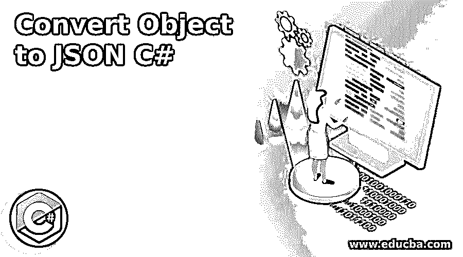
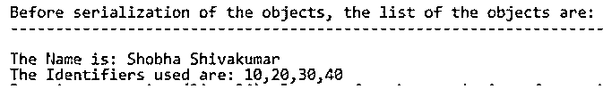
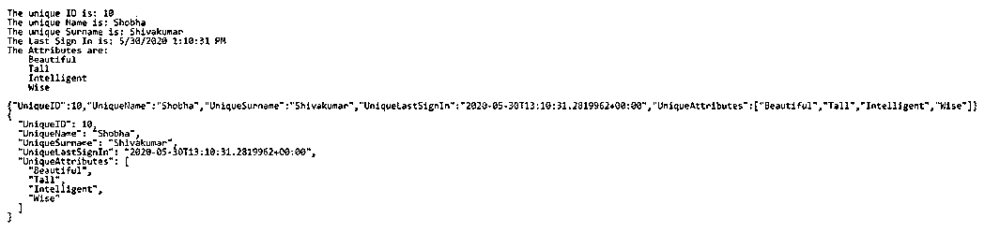

# 将对象转换为 JSON C#

> 原文：<https://www.educba.com/convert-object-to-json-c-sharp/>




## 将对象转换为 JSON C#简介

必须获得对象的当前状态以存储它或在以后检索它，这应该在编码时考虑，添加自定义代码以输出对象的状态，这在 C#中称为将对象转换为 Json 字符串，并且必须根据我们对对象类型的了解类型对对象的每个属性进行编码。当对象类型的定义发生变化时，代码必须随之改变，我们利用 Newtonsoft 的 Json.NET 库将对象转换为 C#中的 Json，这为我们提供了使用单行代码编写的对象字符串的完整表示。

**语法:**

<small>网页开发、编程语言、软件测试&其他</small>

```
Variable variable_name =Newtonsoft.Json.JsonConvert.SerializeObject(parameter);
```

### C#中对象到 JSON 字符串的转换

*   让我们看看如何使用 NewtonsoftJson 实现对象的序列化，也就是在 C#中将对象转换为 Json 字符串。
*   作为将对象转换为 Json 字符串的第一步，创建一个新的 visual studio 项目。
*   NewtonsoftJson 是使用 Nuget 安装的。
*   创建一个示例类来序列化，它只不过是将对象转换成 Json 字符串。
*   然后创建方法将对象转换成 Json 字符串或用 C#序列化对象。
*   最后，执行程序来序列化 C#中的对象，这不过是将对象转换为 C#中的 Json 字符串。

### 将对象转换为 JSON C#的示例

下面是提到的例子:

#### 示例#1

一个 C#程序，演示了对象到 Json 字符串的转换，这只不过是 C#中对象的序列化。

**代码:**

```
using Newtonsoft.Json;
using System;
using System.Collections.Generic;
using System.IO;
//a namespace called Serial is defined
namespace Serial
{
//a class called Data is defined
public class Data
{
//a string variable is defined which can be set or retrieved using get or set method
public string Name1 { get; set; }
//a list is defined which can be set or retrieved using get or set method
public List<int> Ids { get; set; }
//a method called Print is defined in which the name and the list is printed
public void Print()
{
Console.WriteLine("The Name is: " + Name1);
Console.WriteLine("The Identifiers used are: " + string.Join<int>(",", Ids));
Console.WriteLine();
Console.WriteLine();
}
}
//a class called check is defined
public class Check
{
//a file path is defined and stored in a string variable
const string fPath = @"d:\ex.txt";
//Serialize method is defined in which instances of Json writer and Stream writer classes are defined to write into the file
public static void Serialize(object ob)
{
varserialise = new JsonSerializer();
using (var ns = new StreamWriter(fPath))
using (JsonWriter writer1 = new JsonTextWriter(ns))
{
serialise.Serialize(writer1, ob);
}
}
//Deserialize method is defined in which instances of Json text reader and Stream reader classes are defined to read from the file
public static object Deserialize(string pa)
{
varserialise = new JsonSerializer();
using (var ns = new StreamReader(pa))
using (var reader1 = new JsonTextReader(ns))
{
return serialise.Deserialize(reader1);
}
}
//main method is called
public static void Main(string[] args)
{
vardat = new Data
{
Name1 = "ShobhaShivakumar",
Ids = new List<int>{ 10, 20, 30, 40 }
};
Console.WriteLine("Before serialization of the objects, the list of the objects are:");
Console.WriteLine("-------------------------------------------------------------------");
Console.WriteLine();
dat.Print();
Serialize(dat);
vardeserialise = Deserialize(fPath);
Console.WriteLine("After de-serialization of the object, the objects are:");
Console.WriteLine("---------------------------");
Console.WriteLine();
Console.WriteLine(deserialise);
}
}
}
```

**输出:**




**说明:**

*   在上面的程序中，定义了一个名为 Serial 的名称空间。然后定义了一个名为 Data 的类。然后定义一个字符串变量，可以使用 get 或 set 方法设置或检索该变量。然后定义一个列表，可以使用 get 或 set 方法设置或检索该列表。然后定义一个名为 Print 的方法，在其中打印姓名和列表。然后定义了一个名为 check 的类。然后定义一个文件路径并存储在一个字符串变量中。
*   然后定义 Serialize 方法，其中 Jsonwriter 和 Streamwriter 类的实例被定义为写入文件。然后定义 De serialize 方法，其中定义 Jsontext reader 和 Streamreader 类的实例来从文件中读取。然后调用 main 方法，该方法调用方法以在序列化对象之前显示输出。

#### 实施例 2

C#程序来演示程序中手动序列化和 Json 序列化的区别。

**代码:**

```
using System;
using System.Text;
using System.Collections.Generic;
//a class called check is defined
public class Check
{
//main method is called
public static void Main()
{
//an instance of the Create request1 class and string builder class is created
var request = CreateRequest1();
var output1 = new StringBuilder();
//Since we are using manual serialization here, we have to output the properties manually
output1.AppendFormat("The unique ID is: {0}\n", request.UniqueID);
output1.AppendFormat("The unique Name is: {0}\n", request.UniqueName);
output1.AppendFormat("The unique Surname is: {0}\n", request.UniqueSurname);
output1.AppendFormat("The Last Sign In is: {0}\n", request.UniqueLastSignIn);
//We need to make use of for loop to output the nested attributes in case of manual serialization
output1.AppendFormat("The Attributes are:\n");
foreach (varsh in request.UniqueAttributes)
{
output1.AppendFormat("    {0}\n", sh);
}
Console.WriteLine(output1.ToString());
Console.WriteLine(Newtonsoft.Json.JsonConvert.SerializeObject(request);
//We are using Json serialization to improve the readability
Console.WriteLine(Newtonsoft.Json.JsonConvert.SerializeObject(request, Newtonsoft.Json.Formatting.Indented));
}
//a method called Create request1 is defined
public static Req CreateRequest1()
{
return new Req
{
UniqueID = 10,
UniqueName = "Shobha",
UniqueSurname = "Shivakumar",
UniqueLastSignIn = DateTime.Now,
UniqueAttributes = new List<string>
{
"Beautiful",
"Tall",
"Intelligent",
"Wise",
}
};
}
//a class called req is created
public class Req
{
public intUniqueID {get;set;}
public string UniqueName {get;set;}
public string UniqueSurname {get;set;}
public DateTimeUniqueLastSignIn {get;set;}
public List<string>UniqueAttributes {get;set;}
}
}
```

**输出:**




**说明:**

*   在上面的程序中，定义了一个名为 check 的类。然后调用 main 方法。然后创建 Create request1 类和 string builder 类的一个实例。然后，由于我们在这里使用手动序列化，我们必须手动输出属性。然后，我们需要利用 for 循环来输出嵌套的属性，因为这是手动序列化的情况。
*   然后我们使用 Json 序列化来提高可读性。然后定义了一个名为 Create request1 的方法。然后创建一个名为 req 的类，其中所有的属性都使用 get 或 set 方法进行设置和检索。

### 推荐文章

这是一个将 Object 转换成 JSON C#的指南。这里我们分别用 C#和例子讨论 object 到 JSON 字符串的转换。您也可以看看以下文章，了解更多信息–

1.  [C#序列化](https://www.educba.com/c-serialization/)
2.  [C# StringReader](https://www.educba.com/c-sharp-stringreader/)
3.  [C#创建 JSON 对象](https://www.educba.com/c-sharp-create-json-object/)
4.  [c#中的反序列化](https://www.educba.com/deserialization-in-c-sharp/)


