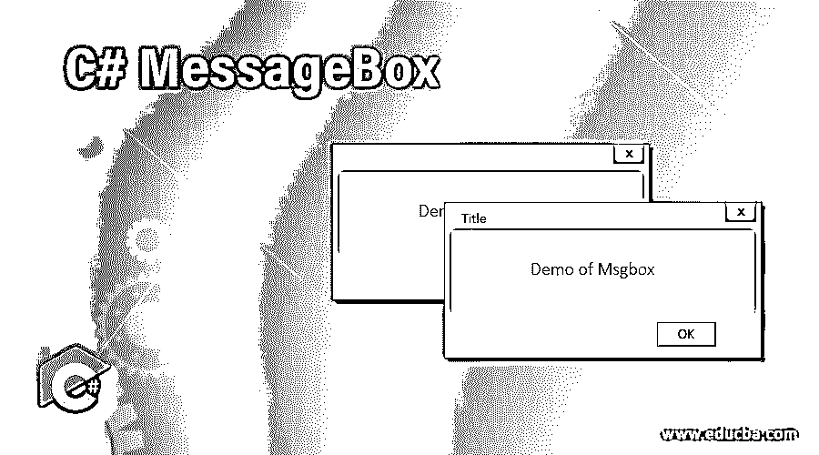
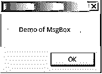

# C# MessageBox

> 原文：<https://www.educba.com/c-sharp-messagebox/>




## C# MessageBox 简介

在当今的应用中，总是需要向用户显示消息作为信息或确认的标志，以便用户知道他所执行的操作的状态。该消息可以是从“支付成功”到类似“您想继续吗”等警告类型的任何内容。这是在 C#中借助消息框实现的。消息框可以被认为是用户和应用程序之间的接口。它只不过是一个窗口，有文本、图像或符号来引导或传达给用户一些东西。在执行适当的操作并关闭消息框之前，它不允许执行其他操作。

**语法:**

<small>网页开发、编程语言、软件测试&其他</small>

消息框是“系统”中的一个类。Windows.Forms”命名空间，它可用的程序集是“System .Windows.Forms.dll。类中可用的 show 方法用于显示消息和操作按钮。动作按钮可以是从“是”到“否”、“确定”到“取消”的任何按钮。

**举例:**

下面的代码将创建一个只有 OK 按钮的简单消息框。

```
string msg = "Test";
MessageBox.Show(msg);
```

### 展示方法的类型

以下是显示方法的类型:

| **语法** | **使用** |
| MessageBox.Show(String) | 它将只显示传递了字符串的消息框。还提供了一个“确定”按钮来关闭对话框。
举例:

```
Messagebox.Show("Test")
```

 |
| MessageBox。显示(字符串，字符串) | 它将只显示带有作为第一个参数传递的字符串的消息框。第二个参数是消息框的标题。还提供了一个“确定”按钮来关闭对话框。
举例:

```
MessageBox.Show( “Message”, ”Title”).
```

 |
| MessageBox.Show( String,String, MessageBoxButtons) | 它将显示消息框，其中包含提供的文本、标题和要在消息框上显示的相应按钮。
例如，下面将显示是和否按钮。

```
MessageBox.Show( "Message”, "Title", MessageBoxButtons.YesNo);
```

 |
| Show(String, String, MessageBoxButtons, MessageBoxIcon) | 它将显示消息框，其中包含提供的文本、标题和要在消息框上显示的相应按钮。它还将显示在文本前指定的图标。
例如，下面将显示“是”和“否”按钮，在消息前面有一个问号。

```
MessageBox.Show( "Message”, "Title", MessageBoxButtons.YesNo, MessageBoxIcon.Question);
```

 |
| Show(String, String, MessageBoxButtons, MessageBoxIcon, MessageBoxDefaulButton) | 它将显示消息框，其中包含提供的文本、标题和要在消息框上显示的相应按钮。它还将显示在文本前指定的图标。最后一个参数表示加载时默认情况下必须选择哪个按钮。
例如，下面将显示“是”和“否”按钮，在消息前面有一个问号。

```
MessageBox.Show( "Message”, "Title", MessageBoxButtons.YesNo, MessageBoxIcon.Question, MessageBoxDefaultButton.Button2);
```

 |
| Show(String, String, MessageBoxButtons, MessageBoxIcon, MessageBoxDefaulButton, MessageBoxOptions) | 它将显示消息框，其中包含所提供的文本、标题以及要在消息框上显示的相应按钮。它还将显示在文本前指定的图标。最后一个参数表示加载时默认必须选择哪个按钮，messagebox 的内容将右对齐。
例如，下面将显示“是”和“否”按钮，在消息前面有一个问号。

```
MessageBox.Show( "Message”, "Title", MessageBoxButtons.YesNo, MessageBoxIcon.Question, MessageBoxDefaultButton.Button2, MesageBoxOptions.RightAlign, true);
```

 |

### MessageBox 按钮的类型

以下是 MessageBox 中可用的按钮类型。Show()方法。他们是

*   **OK:** 定义为 MessageBoxButtons。好
*   **确定并取消:**定义为 MessageBoxButtons.OkCancel。
*   **中止重试忽略:**定义为 messagebox buttons . abortretryignore。
*   **是否和取消:**定义为 MessageBoxButtons.YesNoCancel。
*   **是与否:**定义为 MessageBoxButtons.YesNo。
*   **重试取消:**定义为 MessageBoxButtons.RetryCancel。

### 消息框图标的类型

下面是消息框图标的类型方法有:

*   **无:**消息框中不显示图标。
*   **手:**显示一个手图标。它被定义为 MessageBoxIcon.Hand。
*   **问题:**显示一个问号。它被定义为 MessageBoxIcon.Question。
*   **感叹号:**显示一个感叹号。它被定义为 MessageBoxIcon .感叹号。
*   **星号:**显示星号符号。它被定义为 MessageBoxIcon.Asterisk。
*   **停止:**显示停止图标。它被定义为 MessageBoxIcon.Stop。
*   **错误:**显示错误图标。它被定义为 MessageBoxIcon.Error。
*   **警告:**显示警告图标。它被定义为 MessageBoxIcon.Warning。
*   **信息:**显示一个信息符号。它被定义为 MessageBoxIcon.Information。

### MessageBox 选项的类型

以下是各种可用的消息框选项。

*   **ServiceNotification:** 定义为 messagebox options . service notification，用于在当前活动桌面显示消息框。即使没有用户登录到桌面，消息框也会显示。
*   **DefaultDesktopOnly:** 它被定义为 messagebox options . DefaultDesktopOnly .这也显示在当前活动的桌面上。这与服务通知的区别在于，此处消息显示在交互式窗口上。
*   **RightAlign** :定义为 MessageBoxOptions.RightAlign，用于将消息格式化为右对齐。
*   **RtlReading:** 定义为 MessageBoxOptions.RtlReading，表示消息从右向左显示。

### C# MessageBox 的示例

下面是 c#消息框的例子:

**输入:**

```
using System;
using System.Collections.Generic;
using System.ComponentModel;
using System.Data;
using System.Drawing;
using System.Linq;
using System.Text;
using System.Windows.Forms;
namespace test
{
public partial class testform : Form
{
public testform()
{
InitializeComponent();
}
private void testform_Load(object sender, EventArgs e)
{
MessageBox.Show("Demo of MsgBox");
MessageBox.Show("Demo of MsgBox", "Title");
MessageBox.Show("Demo of Msgbox","Title",MessageBoxButtons.YesNo);
MessageBox.Show("Demo of Msgbox","Title",MessageBoxButtons.YesNoCancel);
MessageBox.Show("Demo of Msgbox","Title",MessageBoxButtons.OkCancel);
MessageBox.Show("Demo of Msgbox","Title",MessageBoxButtons.RetryCancel);
MessageBox.Show("Demo of Msgbox","Title",MessageBoxButtons.OK);
MessageBox.Show("Demo of Msgbox","Title",MessageBoxButtons.AbortRetryIgnore);
MessageBox.Show("Demo of Msgbox","Title",MessageBoxButtons.YesNoCancel,MessageBoxIcon.Question);
MessageBox.Show("Demo of Msgbox","Title",MessageBoxButtons.YesNoCancel,MessageBoxIcon.Hand);
MessageBox.Show("Demo of Msgbox","Title",MessageBoxButtons.YesNoCancel,MessageBoxIcon.Exclamation);
MessageBox.Show("Demo of Msgbox","Title",MessageBoxButtons.YesNoCancel,MessageBoxIcon.Asterisk);
MessageBox.Show("Demo of Msgbox","Title",MessageBoxButtons.YesNoCancel,MessageBoxIcon.Stop);
MessageBox.Show("Demo of Msgbox","Title",MessageBoxButtons.YesNoCancel,MessageBoxIcon.Error);
MessageBox.Show("Demo of Msgbox","Title",MessageBoxButtons.YesNoCancel,MessageBoxIcon.Warning);MessageBox.Show("Demo of Msgbox","Title",MessageBoxButtons.YesNoCancel,MessageBoxIcon.Information);MessageBox.Show("Demo of Msgbox","Title",MessageBoxButtons.YesNoCancel,MessageBoxIcon.Question,MessageBoxDefaultButton.Button2);
MessageBox.Show("Demo of Msgbox","Title",MessageBoxButtons.OK,MessageBoxIcon.Exclamation,MessageBoxDefaultButton.Button1);
}
}
}
```

**输出:**




### 结论–C # MessageBox

因此，文章详细介绍了关于 c#中消息框类的详细内容。它解释了关于消息框的各种可用的显示方法，每个方法的各种参数，并用一个例子进行了演示。本文还详细介绍了各种消息框选项、消息框按钮和消息框图标及其用法。要了解更多细节，建议编写示例程序并实践它们。

### 推荐文章

这是一个 C# MessageBox 的指南。在这里，我们还将讨论 show 方法的介绍和类型，以及一个示例及其代码实现。您也可以看看以下文章，了解更多信息–

1.  [在 C#中断言](https://www.educba.com/assert-in-c-sharp/)
2.  [C#列表与数组](https://www.educba.com/c-sharp-list-vs-array/)
3.  [ASP.NET 复选框](https://www.educba.com/asp-dot-net-checkbox/)
4.  [C#二进制阅读器](https://www.educba.com/c-sharp-binaryreader/)


