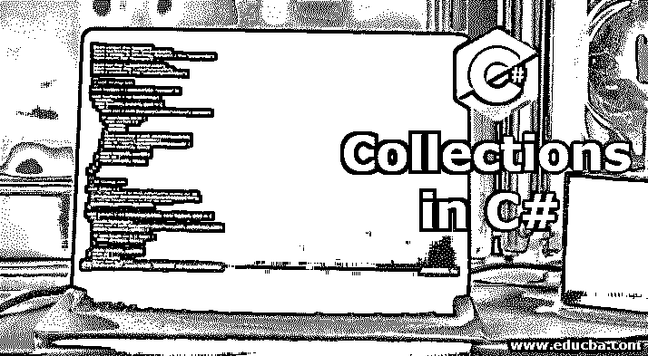
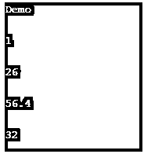
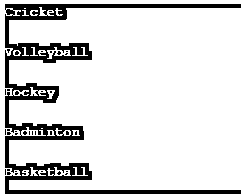
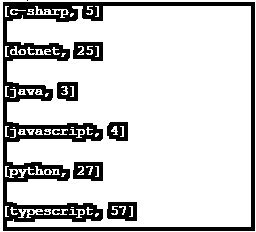
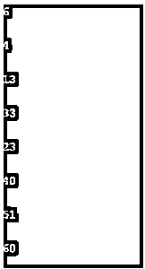
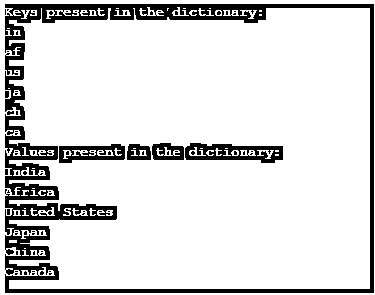
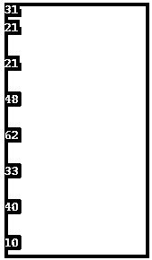

# C#中的集合

> 原文：<https://www.educba.com/collections-in-c-sharp/>




## C#中集合的概述

集合可以定义为 C#中用于动态内存分配的一类类型，用于存储和获取类的内容，并可用于执行多种操作。在 C#中，集合以“系统”的形式工作。“Collections . Generic classes”、“System . collections . Concurrent class”和“System .集合类。就存储模式而言，集合复制了数组的数据结构，唯一的区别是，与数组不同，集合不需要定义所需的大小。

有以下三种使用集合的方式

<small>网页开发、编程语言、软件测试&其他</small>

*   系统。集合.泛型类
*   系统。集合。并发类
*   系统。集合类

### C#中的集合示例

下面是 C#中不同类型集合的一些例子

#### 示例# 1–数组列表

它是一个 System.Collections 的集合。它允许保存多种数据类型的数据，并且随着数据的添加，它会自动扩展。

**代码:**

```
using System;
using System.Collections;
using System.Collections.Generic;
using System.Linq;
using System.Text;
using System.Threading.Tasks;
namespace ArrayListExample
{
class Program
{
static void Main(string[] args)
{
var data = new ArrayList();   //arraylist collection
data.Add("Demo");             // add element
data.Add(1);
data.Add(5);
data.Add(26);
data.Add(56.4);
data.Add(32);
data.Remove(5);              // remove element
foreach (object obj in data)   // iteration
{
Console.WriteLine(obj);
Console.ReadLine();
}
}
}
}
```

在上面的例子中，有一个 ArrayList 类型的集合。数组列表中有一些元素。Add()和 Remove()分别是用于在集合中添加和移除元素的方法。foreach 用于迭代并显示值。

**输出:**




#### 例 2–我们将在这里使用列表操作

它是系统的集合。集合。通用命名空间。

**代码:**

```
using System;
using System.Collections;
using System.Collections.Generic;
using System.Linq;
using System.Text;
using System.Threading.Tasks;
namespace Collections
{
class Program
{
static void Main(string[] args)
{
var value = new List<string>();       // list collection
value.Add("Cricket");                       // add element
value.Add("Football");
value.Add("Volleyball");
value.Add("Hockey");
value.Add("Basketball");
value.Add("Tennis");
value.Remove("Football");              // remove element
value.Remove("Tennis");
value.Insert(3, "Badminton");         // insert element
foreach (string st in value)
{
Console.WriteLine(st);
Console.ReadLine();
}
}
}
}
```

在上面的例子中，集合是列表类型的。Add()和 Remove()方法分别用于在列表中添加或移除元素。Insert()还用于将元素插入列表中已定义的索引处。Foreach 用于迭代和显示值。

**输出:**




#### 示例 3:排序列表

它由集合中的键和值组成。

**代码:**

```
using System;
using System.Collections;
using System.Collections.Generic;
using System.Linq;
using System.Text;
using System.Threading.Tasks;
namespace Collections
{
class Program
{
static void Main(string[] args)
{
var value = new SortedList<string, int>();            // sortedlist collection
value.Add("java", 3);                                               // add element
value.Add("javascript", 4);
value.Add("c-sharp", 5);
value.Add("dotnet", 25);
value.Add("python", 27);
value.Add("typescript", 57);
foreach (var pair in value)
{
Console.WriteLine(pair);
Console.ReadLine();
}
}
}
}
```

在上面的示例中，集合属于 sortedlist 类型。列表中有多对键和值。它基本上代表了键和值的排序对。

**输出:**




#### 例子# 4:链表

它基本上允许元素的顺序访问。

**代码:**

```
using System;
using System.Collections;
using System.Collections.Generic;
using System.Linq;
using System.Text;
using System.Threading.Tasks;
namespace Collections
{
class Program
{
static void Main(string[] args)
{
var value = new LinkedList<int>();             // linkedlist collection
value.AddLast(13);          // add element
value.AddLast(33);
value.AddLast(23);
value.AddLast(51);
value.AddLast(60);
value.AddFirst(4);
value.AddFirst(6);
LinkedListNode<int> node = value.Find(51);         // find the node
value.AddBefore(node, 40);
foreach (int num in value)
{
Console.WriteLine(num);
Console.ReadLine();
}
}
}
}
```

在上面的示例中，集合属于 Linkedlist 类型。AddLast()用于将元素放在最后一个位置，而 AddFirst()用于将元素放在列表的第一个位置。Linkedlist 由一个节点组成。Find()用于查找值并将值放在它的前面。

**输出:**




#### 示例 5–字典

它由唯一的一对键和值组成。

```
using System;
using System.Collections;
using System.Collections.Generic;
using System.Linq;
using System.Text;
using System.Threading.Tasks;
namespace Collections
{
class Program
{
static void Main(string[] args)
{
var pair = new Dictionary<string, string>();           // dictionary collection
pair.Add("in", "India");                                                // add keys and values
pair.Add("af", "Africa");
pair.Add("us", "United States");
pair.Add("ja", "Japan");
pair.Add("ch", "China");
pair.Add("ca", "Canada");
Console.WriteLine("Keys present in the dictionary:");
var key = new List<string>(pair.Keys);
foreach (string k in key)
{
Console.WriteLine("{0}", k);
}
Console.WriteLine("Values present in the dictionary:");
var value = new List<string>(pair.Values);
foreach (string val in value)
{
Console.WriteLine("{0}", val);
}
Console.ReadLine();
}
}
}
```

在上面的例子中，集合是 dictionary 类型的，它包含键和它们的值。Foreach 用于键和值的迭代。

**输出**




#### 示例 6–堆栈

它是基于后进先出的结构。队列的最后一个元素是第一个被删除的。

**代码:**

```
using System;
using System.Collections;
using System.Collections.Generic;
using System.Linq;
using System.Text;
using System.Threading.Tasks;
namespace Collections
{
class Program
{
static void Main(string[] args)
{
var value = new Stack<int>();                          // stack collection
value.Push(10);                                                    // adding the element
value.Push(40);
value.Push(33);
value.Push(62);
value.Push(48);
value.Push(21);
value.Push(31);
Console.WriteLine(value.Pop());
Console.WriteLine(value.Peek());
Console.WriteLine();
foreach (int item in value)
{
Console.WriteLine(item);
Console.ReadLine();
}
}
}
}
```

在上面的例子中，集合的类型是 stack。Push()用于在顶部插入元素。Pop()用于移除和返回元素，Peek()用于返回堆栈的顶部元素。

**输出:**




#### 示例# 7–队列

它基于先进先出的结构。队列的第一个元素是第一个被删除的元素。

**代码:**

```
using System;
using System.Collections;
using System.Collections.Generic;
using System.Linq;
using System.Text;
using System.Threading.Tasks;
namespace Collections
{
class Program
{static void Main(string[] args)
{
var value = new Queue<string>();                // queue collection
value.Enqueue("Item 1");                               // add element
value.Enqueue("Item 2");
value.Enqueue("Item 3");
value.Enqueue("Item 4");
value.Enqueue("Item 5");
value.Enqueue("Item 6");
value.Enqueue("Item 7");
Console.WriteLine(value.Dequeue());
Console.WriteLine(value.Peek());
Console.WriteLine();
foreach (string num in value)
{
Console.WriteLine(num);
Console.ReadLine();
}
}
}
}
```

在上面的例子中；集合属于队列类型。Enqueue()用于在队列末尾插入元素。Dequeue()用于从队列**的开头删除元素。** Peek()用于退货。

**输出:**


所以我们有很多方法可以利用这些收藏品。集合类似于数组。与数组不同，这里我们不需要预先定义大小。

### 推荐文章

这是 C#中的集合指南。这里我们讨论 C#中集合的概述和不同的例子，以及代码实现和输出。您也可以看看以下文章，了解更多信息–

1.  [c#中的排序](https://www.educba.com/sorting-in-c-sharp/)
2.  [c#中的迭代器](https://www.educba.com/iterators-in-c-sharp/)
3.  [c#中的模式](https://www.educba.com/patterns-in-c-sharp/)
4.  [c#中的 text writer](https://www.educba.com/textwriter-in-c-sharp/)


