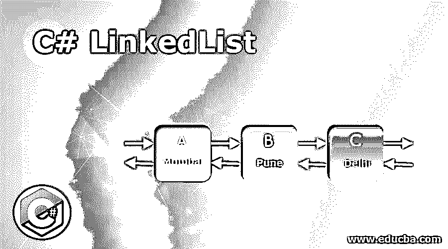
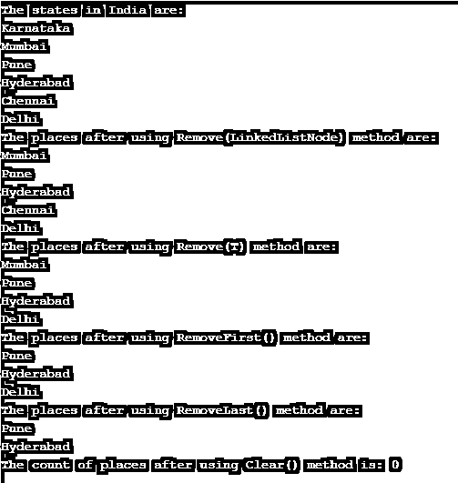

# C#链接表

> 原文：<https://www.educba.com/c-sharp-linkedlist/>




## C# LinkedList 简介

用于以不连续的方式存储元素的线性数据结构被称为 LinkedList，其中指针被用于将链表中的元素彼此链接以及与系统链接。Collections.Generic namespace 由 C#中的 LinkedList <t>类组成，可以以非常快速的方式从该类中删除或插入元素，实现了经典的链表，并且每个对象的分配在链表中是独立的，没有必要复制整个集合来对链表执行某些操作。</t>

**语法:**

<small>网页开发、编程语言、软件测试&其他</small>

C#中 LinkedList 类的语法如下:

```
LinkedList<Type> linkedlist_name = new LinkedList <Type>();
其中 Type 表示链表的类型。
在 C#中使用 LinkedList 类

```

*   链表中存在节点，每个节点由两部分组成，即数据字段和到链表中下一个节点的链接。
*   链表中每个节点的类型都是 LinkedListNode <t>类型。</t>
*   可以从链表中移除一个节点，并且可以将其插回到同一个链表中，或者可以将其插入到另一个链表中，因此在堆上没有额外的分配。
*   将元素插入到链表中，从链表中移除元素，以及获得由喜欢的列表维护的内部属性 count 的属性都是 O(1)操作。
*   链表类支持枚举器，因为它是一个通用的链表。
*   链表不支持任何使链表不一致的东西。
*   如果链表是双向链表，那么每个节点有两个指针，一个指向链表中的上一个节点，另一个指向链表中的下一个节点。

### LinkedList 类的构造函数

C#中的 LinkedList 类中有几个构造函数。它们是:

*   **LinkedList():** 链表类的一个新实例初始化为空。
*   **LinkedList(IEnumerable):** 初始化链表类的新实例，该实例取自 IEnumerable 的指定实现，其容量足以累积所有复制的元素。
*   **linked list(SerializationInfo，StreamingContext):** 初始化链表类的一个新实例，它可以用指定为参数的 serialization info 和 StreamingContext 进行序列化。

### C#中 LinkedList 类的方法

C#中的 LinkedList 类中有几个方法。它们是:

*   **AddAfter:** 使用 AddAfter 方法在链表中已经存在的节点后添加一个值或新节点。
*   **AddFirst:** 使用 AddFirst 方法在链表的开头添加一个值或新节点。
*   **AddBefore:** 使用 AddBefore 方法在链表中已经存在的节点之前添加一个值或新节点。
*   **AddLast:** 使用 AddLast 方法在链表的末尾添加一个值或新节点。
*   **Remove(LinkedListNode):** 使用 Remove(LinkedListNode)方法将被指定为参数的节点从链表中移除。
*   **RemoveFirst():** 使用 RemoveFirst()方法将链表开头的节点从链表中移除。
*   **Remove(T):** 使用 Remove(T)方法将链表中第一次出现的指定为参数的值删除。
*   **RemoveLast():** 链表末尾的节点将使用 RemoveLast()方法从链表中移除。
*   **Clear():** 使用 Clear()方法将移除链表中的所有节点。
*   **Find(T):** 将使用 Find(T)方法识别第一个节点中的参数值。
*   **Contains(T):** 我们可以使用 Contains(T)方法来确定一个值是否出现在链表中。
*   **ToString():** 使用 ToString()方法返回表示当前对象的字符串。
*   **CopyTo(T[]，Int32):** 使用 CopyTo(T[]，Int32)方法将整个链表复制到一个与链表兼容的一维数组中，链表从要复制到的数组中指定的索引开始。
*   **onde serialization(Object):**反序列化完成后，引发反序列化事件，使用 onde serializable(Object)方法实现 ISerializable 接口。
*   **Equals(Object):** 使用 Equals(Object)方法识别参数指定的对象是否等于当前对象。
*   **FindLast(T):** 指定为最后一个节点中存在的参数的值将通过使用 FindLast(T)方法来标识。
*   **memberwisecolone():**使用 MemeberwiseClone()方法创建当前对象的浅层副本。
*   **GetEnumerator():** 使用 GetEnumerator()方法返回一个枚举数，返回的枚举数在链表中循环。
*   **GetType():** 使用 GetType()方法返回当前实例的类型。
*   **get hashcode():**get hashcode()方法默认为 hash 函数。
*   **get object data(serialization info，StreamingContext):** 通过使用 get object data(serialization info，StreamingContext)方法以及实现 ISerializable 接口，返回使链表可序列化所必需的数据。

### C#中 LinkedList 类的示例

C#程序演示链表类中的 AddLast()方法、Remove(LinkedListNode)方法、Remove(T)方法、RemoveFirst()方法、RemoveLast()方法和 Clear()方法:

**代码:**

```
using System;

using System.Collections.Generic;

//a class called program is defined

public class program

{

// Main Method is called

static public void Main()

{

//a new linked list is created

LinkedList<String> list = new LinkedList<String>();

//AddLast() method is used to add the elements to the newly created linked list

list.AddLast("Karnataka");

list.AddLast("Mumbai");

list.AddLast("Pune");

list.AddLast("Hyderabad");

list.AddLast("Chennai");

list.AddLast("Delhi");

Console.WriteLine("The states in India are:");

//Using foreach loop to display the elements of the newly created linked list

foreach(string places in list)

{

Console.WriteLine(places);

}

Console.WriteLine("The places after using Remove(LinkedListNode) method are:");

//using Remove(LinkedListNode) method to remove a node from the linked list

list.Remove(list.First);

foreach(string place in list)

{

Console.WriteLine(place);

}

Console.WriteLine("The places after using Remove(T) method are:");

//using Remove(T) method to remove a node from the linked list

list.Remove("Chennai");

foreach(string plac in list)

{

Console.WriteLine(plac);

}

Console.WriteLine("The places after using RemoveFirst() method are:");

//using RemoveFirst() method to remove the first node from the linked list

list.RemoveFirst();

foreach(string pla in list)

{

Console.WriteLine(pla);

}

Console.WriteLine("The places after using RemoveLast() method are:");

//using RemoveLast() method to remove the last node from the linked list

list.RemoveLast();

foreach(string pl in list)

{

Console.WriteLine(pl);

}

//using Clear() method to remove all the nodes from the linked list

list.Clear();

Console.WriteLine("The count of places after using Clear() method is: {0}",

list.Count);

}

}
上述程序的输出如下面的快照所示:




在上面的程序中，定义了一个名为 program 的类。然后调用 main 方法。然后创建一个新的链表。然后使用 AddLast()方法将元素添加到新创建的链表中。然后使用 foreach 循环来显示新创建的链表的元素。然后使用 Remove(LinkedListNode)方法从链表中删除一个节点。然后使用 Remove(T)方法从链表中删除一个节点。然后使用 RemoveFirst()方法从链表中移除第一个节点。然后使用 RemoveLast()方法从链表中移除最后一个节点。然后使用 Clear()方法从链表中删除所有节点。程序的输出显示在上面的快照中。

### 推荐文章

这是一个 C# LinkedList 的指南。在这里，我们通过定义、语法、工作、构造函数和它们的方法，通过编程示例和它们的输出来讨论 C#中 LinkedList 类的概念。您也可以浏览我们的其他相关文章，了解更多信息——

1.  [C#线程](https://www.educba.com/c-sharp-thread/)

2.  [C#序列化](https://www.educba.com/c-serialization/)

3.  [C# StringReader](https://www.educba.com/c-sharp-stringreader/) 

4.  [C# StringWriter](https://www.educba.com/c-sharp-stringwriter/) 


```