# Listbox in C#

> 原文：<https://www.educba.com/listbox-in-c-sharp/>

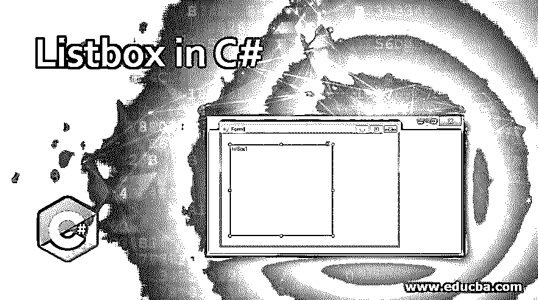


## C#中的 Listbox 简介

C#中的 ListBox 定义为在 ListBox 中添加一个元素列表，对单个或多个元素进行操作。下拉框和列表框的区别在于下拉框一次只能选择一个元素，而在列表框中，我们可以一次选择一个或多个元素。列表框用于提供不同类型的方法、属性和事件。此列表框在系统下指定。窗户。表单包(命名空间)。

ListBox 类再次包含 C#中 3 种不同类型的集合。他们是

<small>网页开发、编程语言、软件测试&其他</small>

1.  **列表框。ObjectCollection:** 这个集合类保存 ListBox 控件的所有元素。
2.  **列表框。SelectedObjectCollection:** 这个集合类保存列表框控件中选定项的集合。
3.  **列表框。SelectedIndexCollection:** 这个集合类保存了所选索引的集合，这些元素是 ListBox 的索引的子集。ObjectCollection 和 ListBox 控件中特别选择的索引。

### C#中列表框的类型？

1.  **单个选中列表框:**列表框只能从列表中选择单个元素。
2.  **多选列表框:**列表框能够从列表中选择多个元素。

**c#中 ListBox 的先决条件:**

*   .Net 库必须安装在您的 PC 上
*   Visual Studio 安装

### 如何用 C#创建 ListBox？

列表框可以通过两种方式创建:

*   设计时
*   运行时间

#### 1.设计时

最初不需要任何代码就可以非常容易地创建。创建项目的步骤

**步骤 1:** 打开 Visual Studio

单击 File=>New=>Project

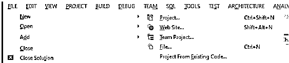


选择=>Windows 窗体应用程序，然后

为了更好地理解项目结构，请参见下图:

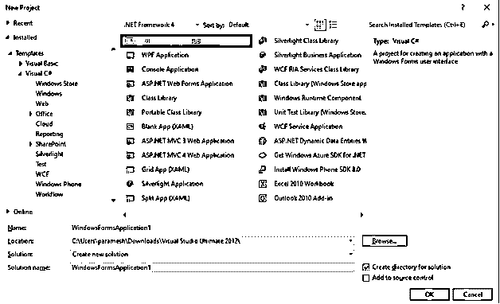


命名项目，然后单击确定，然后你会得到 Form1.cs(设计)标签如下

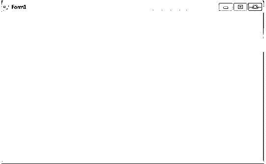


**第二步:**在 visual studio 的左侧或从视图中选择工具箱，然后将所需的元素拖放到 Form1.cs(Design)上，如上图所示。

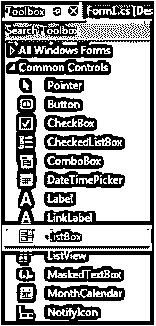


**第三步:**拖放之后，从 Visual studio 的右侧选择属性，并给 Text 属性起一个名字。这用于在第二个<sup>和第三个</sup>方法运行时**中编写代码。**

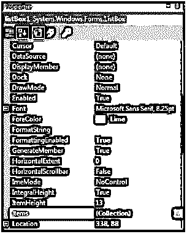


**输出:**

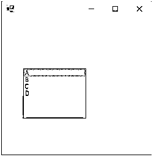


#### 2.运行时间

这不是按照上面的方法直接做的。我们写了一些程序来创建列表框。这非常简单，首先拖放所有需要的元素，如列表框、标签、文本框、按钮等。如果你双击任何拖放的元素，我们得到一些 C#代码，元素动作方法，我们必须写我们的逻辑，我们想做什么与这些元素。创建运行时项目代码以创建列表框的步骤

**Step1:** 使用 ListBox()构造函数创建 ListBox 控件。

**语法:**

```
ListBox listBox = new ListBox();
```

**第二步:**创建 ListBox 属性后，如果我们要设置 ListBox 的属性如字体、字体。元素的大小、颜色等。

**语法:**

```
listBox.Location = new Point(200, 100);
listBox.Size = new Size(100, 90);
listBox.ForeColor = Color.Red;
```

第三步:将元素添加到列表框中。

**语法:**

```
listBox.Items.Add("A");
listBox.Items.Add("B");
listBox.Items.Add("C");
listBox.Items.Add("D");
```

步骤 4: 将这个列表框添加到表单中。

**语法:**

```
this.Controls.Add(listBox);
```

### C#中的列表框示例

下面举几个例子

#### 示例# 1–创建列表框并添加元素

**代码:**

```
//importing C# required libraries
using System;
using System.Collections.Generic;
using System.ComponentModel;
using System.Data;
using System.Drawing;
using System.Linq;
using System.Text;
using System.Windows.Forms;
//namespace is project name
namespace WindowsFormsApplication26
{
//creating class extends from Form class
public partial class Form1 : Form
{
//constrcutor
public Form1()
{
//initializing components
InitializeComponent();
//Creating list box and add some properties and values to the List Box
listBox2.ForeColor = Color.Red;
listBox2.Items.Add("Java");
listBox2.Items.Add("Python");
listBox2.Items.Add("C++");
listBox2.Items.Add("C");
listBox2.Items.Add("C#");
listBox2.Items.Add("Spring");
listBox2.Items.Add("JavaFX");
listBox2.SelectionMode = SelectionMode.MultiSimple;
}
//method for selectedIndex change operation
private void listBox2_SelectedIndexChanged(object sender, EventArgs e)
{
}
}
}
```

**输出:**

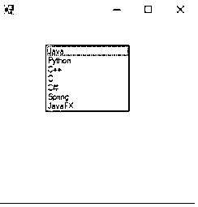


#### 示例 2–用户通过点击按钮输入值并将其添加到列表框中

**代码:**

```
//importing C# required libraries
using System;
using System.Collections.Generic;
using System.ComponentModel;
using System.Data;
using System.Drawing;
using System.Linq;
using System.Text;
using System.Windows.Forms;
//namespace is project name
namespace WindowsFormsApp25
{
//creating class extends from Form class
public partial class Form1 : Form
{
//constrcutor
public Form1()
{
//initializing components
InitializeComponent();
}
//saving the enter values into List box
private void buttonSave_Click(object sender, EventArgs e)
{
//If user enter any values then if block executes
if (this.textBoxName.Text != "")
{
NameList.Items.Add(this.textBoxName.Text);
this.textBoxName.Focus();
this.textBoxName.Clear();
}
//If user did not enter any values then else block executes
else
{
MessageBox.Show("Please enter a name to add..","Error",MessageBoxButtons.OK,MessageBoxIcon.Information);
this.textBoxName.Focus();
}
}
}
}
```

**输出:**

输入值之前:

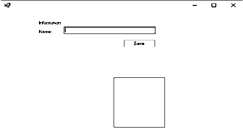


不输入任何值，尝试单击保存按钮:

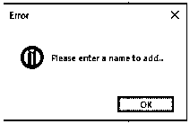


输入值后:

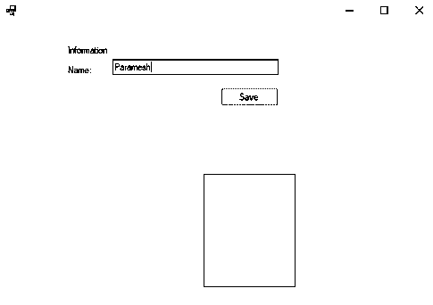


输入一个值并点击保存按钮后:

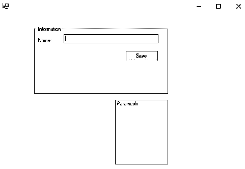


#### 示例 3–删除、更改列表框值的字体

**代码:**

```
//importing C# required libraries
using System;
using System.Collections.Generic;
using System.ComponentModel;
using System.Data;
using System.Drawing;
using System.Linq;
using System.Text;
using System.Windows.Forms;
//namespace is project name
namespace WindowsFormsApp25
{
//creating class extends from Form class
public partial class Form1 : Form
{
//constrcutor
public Form1()
{
//initializing components
InitializeComponent();
}
//saving the enter values into List box
private void buttonSave_Click(object sender, EventArgs e)
{
//If user enter any values then if block executes
if (this.textBoxName.Text != "")
{
NameList.Items.Add(this.textBoxName.Text);
this.textBoxName.Focus();
this.textBoxName.Clear();
}
//If user did not enter any values then else block executes
else
{
MessageBox.Show("Please enter a name to add..","Error",MessageBoxButtons.OK,MessageBoxIcon.Information);
this.textBoxName.Focus();
}
}
//Removing the selected elements
private void button2_Click(object sender, EventArgs e)
{
if (this.NameList.SelectedIndex >= 0)
{
this.NameList.Items.RemoveAt(this.NameList.SelectedIndex);
}
}
//Setting List box selected values font
private void button3_Click(object sender, EventArgs e)
{
if (fontDialog1.ShowDialog() == DialogResult.OK)
{
NameList.Font = fontDialog1.Font;
}
}
}
}
```

**输出:**

添加 3 个名称后:

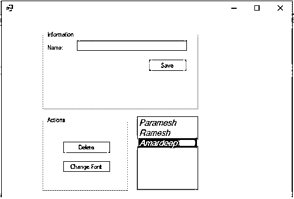


删除所选元素:

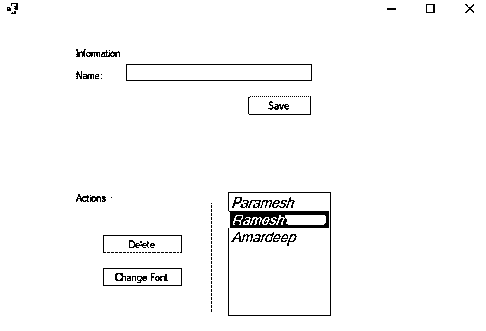


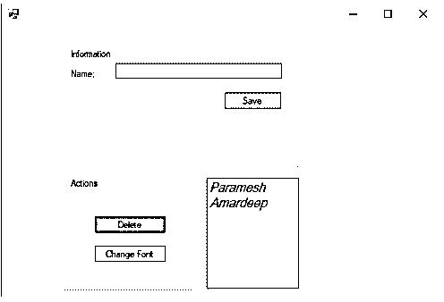


更改值的字体:

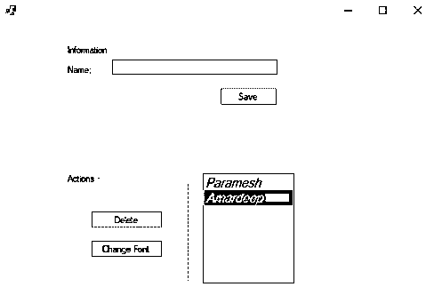


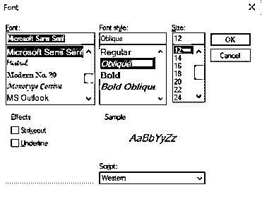


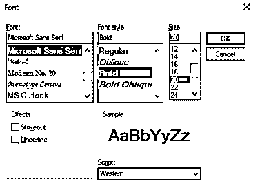


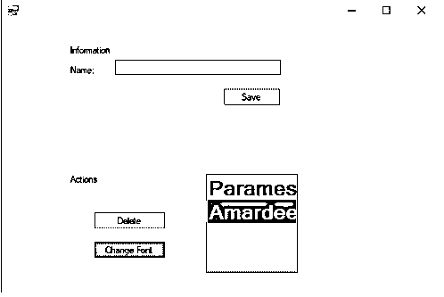


### 结论

C#列表框用于添加多个元素来执行任何特定的操作。列表框用于一次选择单个值或多个值。在 C#中，列表框可以使用设计时和运行时方法创建。

### 推荐文章

这是一个 C#列表框的指南。为了更好地理解，我们在这里讨论如何用 C#创建带有类型和示例的列表框。您也可以浏览我们推荐的其他文章，了解更多信息——

1.  [c#中的静态关键字](https://www.educba.com/static-keyword-in-c-sharp/)
2.  [C#三元运算符](https://www.educba.com/c-sharp-ternary-operators/)
3.  [C#可空](https://www.educba.com/c-sharp-nullable/)
4.  [C#二进制阅读器](https://www.educba.com/c-sharp-binaryreader/)


