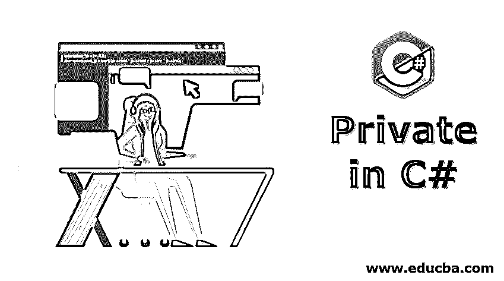
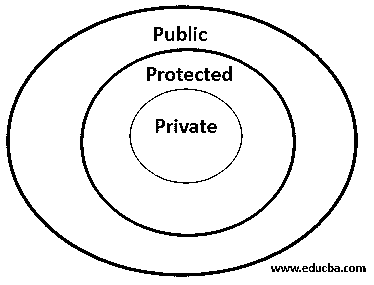
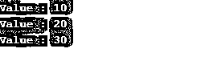

# C#中的私有

> 原文：<https://www.educba.com/private-in-c-sharp/>




## C#中的 Private 简介

在本文中，我们将学习 C#中的 Private。关键字 private 是一种访问修饰符，用于在使用的类或成员之外访问时纠正编译时错误。理想情况下，它用于对其他成员类隐藏函数和变量，但是同一个类的函数可以访问其中的私有成员。从技术上和习惯上来说，private 关键字被称为访问说明符和修饰符，它要么附加到属性或方法上。因此，当 private 关键字在属性或方法的成员中使用时，它们不能被程序外部干扰或访问。让我们看看 private 关键字在#编程语言中是如何工作和使用的。




<small>网页开发、编程语言、软件测试&其他</small>

**语法:**

语法或格式特定的关键字或运算符必须如何与约束和注释一起使用才能包含在程序中，它不同于程序和编程语言。

**代码:**

```
class PrivateAccess
{
private:   //private Accsess specifier
int X;     //Data Member declaration
void display(); // Member Function Declaration
}
```

### Private 关键字作为访问修饰符在 C#中是如何工作的？

有了语法和程序，它是如何在 C#程序中使用的:

**代码:**

```
class circle
{
private:
double radius;    //Private Data Member
public:
void set Radius(double r);    //Public Member Function
double getDiameter();
double getArea();
double getCircumference();
}
```

**对上面代码的解释:**从上一节来看，这个类是关于形状圆的，程序写的是圆的半径、直径、面积、周长的计算。请记住，在使用私有关键字而不是公共关键字的情况下，用私有关键字命名的数据成员大约是双半径的，并且只能在类 radius 内访问。公共修饰符必须是双半径的。

用于计算的数据必须在输出端调用，存储并显示在数据成员 double radius 下，其中 double radius 的值不能从其他程序的其他类或成员中调用或访问，或者使用相同的类访问。如果在相同的程序中使用私有访问说明符提到该类，则该类不能干扰相同程序中的其他类，在这种情况下，它们是一个或多个类的程序。

三个不同的函数指定了访问修饰符:

*   私有、公共、受保护的访问修饰符可以是类成员函数。
*   公共和受保护的访问修饰符可以用作派生类。
*   公共访问修饰符只能在类之外，不能派生。

### 如何在 C#中实现 Private？

下面是用 c#实现 private 的程序:

**代码:**

```
using System;
using System.Collections;
namespace ConsoleApplication1
{
class Sample
{
private int X;
public Sample()
{
X = 0;
}
public void Set(int v)
{
X = v;
}
public static Sample operator +(Sample S1, Sample S2)
{
Sample temp = new Sample();
temp.X = S1.X + S2.X;
return temp;
}
public void printValue()
{
Console.WriteLine("Value : {0}", X);
}
}
class Program
{
static void Main()
{
Sample S1 = new Sample();
Sample S2 = new Sample();
Sample S3 = new Sample();
S1.Set(10);
S2.Set(20);
S3 = S1 + S2;
S1.printValue();
S2.printValue();
S3.printValue();
}
}
}
```

**输出:**




### 在 C#中实现 Private

*   正如我们在前面的定义和语法部分所讨论的，在这里的实现中，我们可以把我们的想法画得更清楚，它们是如何被类函数使用和调用的。
*   访问说明符私有、公共、受保护也称为标签或可见性标签。它们被声明为 private，只能在类中访问，而 C#编程中的数据是使用 private 隐藏的。
*   来自类和声明 public 和 protected 的编程语言对类中或其他类的访问限制较少，但有些程序会私下写入和读取数据，以便隐藏数据并对其进行分类，以便为公共使用的另一种算法进行计算或读取，其中声明 private 的程序比声明 public 或 protected 的程序对访问它所声明的类或成员中的数据或其他类的数据限制更多。
*   默认情况下，如果没有提到任何修饰符或说明符，成员函数或变量就是私有的。在访问私有成员的情况下，会出现编译错误。让我们看一下有数据的短程序，在这里调用了语法。

**代码:**

```
class PrivateAccess
{
private:  //Private Access Specifier
int X;   //Data Member Declaration
void display();  //Member Function Declaration
}
```

**对上面代码的解释:**上面的程序有一个用 private 修饰符指定的类成员，数据再次用关键字 private 提到，这里作为类名提到的 private 不算是 private 修饰符，而是指定 private:使用的是一个访问修饰符，在这里调用它来存储和隐藏程序集内部或外部的数据。使用函数中的 does not take 参数显示相同的数据。

### 在 C#中使用 Private 的优势

以下几点解释了在 C#中使用 Private 的优点:

*   该访问说明符用于创建和隐藏数据
*   其中私有修饰符的概念比公共和受保护的访问修饰符更先进和安全。
*   在异常情况下，它们可以从友元类函数中调用，并且与编程中使用的算法或数据的连续性相关。
*   与在类中使用 public 或 protect 访问修饰符相比，它是设置数据的唯一修饰符，并且是算法的新值。
*   使用列表并通过 void 函数获取值的私有修饰符可以在没有任何函数参数的情况下调用。
*   私有字段是主键，由于其默认的可访问性，易于测试和维护。

### C#中私有的规则和规定

以下几点解释了 C#中 private 的规则和规定:

*   使用驼色外壳和
*   以单个下划线(_)字符作为前缀。
*   ex:private string _ name；
*   避免大写和小写的名字
*   不要声明相同的类型
*   任何访问修饰符的大小写都不同
*   它不是以数字字符开头的
*   数字用作标识符名称的后缀
*   应该使用有意义和具体的名称
*   使用 moodier 或在程序中避免使用符号——例如:strName 或 iCount。
*   不要使用缩写，如果已知并被接受，就使用缩写
*   不接受与框架冲突
*   标识符用于修饰语或整个程序，但不与无意义的前缀和后缀一起使用。
*   访问修饰符，正如将要适当提到的，省略修饰符对于任何类或程序来说都不会被整个算法读取。
*   当使用 private 时，应该相应地提到属性，有时在同一个类或友元类中给出 public、protected 或 internal 修饰符。
*   公共 API 应该支持私有修饰符的类型和成员。

### 结论

上面讨论的内容是关于 C#中的 private，其中 private 通常是关键字，但是它们如何标识为访问修饰符并相应地使用，对这个词有意义，并在具有 C#标准的编程语言中实现。因此，程序继承了访问修饰符 private 的重要性，以创建和隐藏来自其他函数或类的数据，但为了将列表中的参数值保存到成员类或结构中，使用了它。

### 推荐文章

这是一个在 C#中私有的指南。这里我们讨论 private 关键字是如何工作的，用 c#编程实现 private 的优点。您也可以浏览我们的其他相关文章，了解更多信息——

1.  [c#中的 Yield 关键字](https://www.educba.com/yield-keyword-in-c-sharp/)
2.  [c#中的构造函数](https://www.educba.com/constructor-in-c-sharp/)
3.  [c#中的方法重载](https://www.educba.com/method-overloading-in-c-sharp/)
4.  [Java 私有](https://www.educba.com/private-in-java/)


