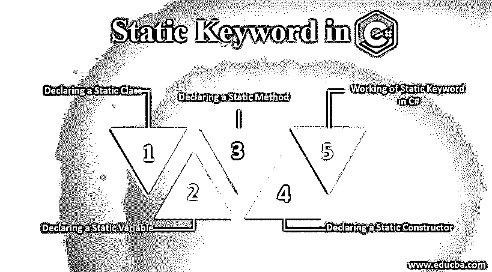
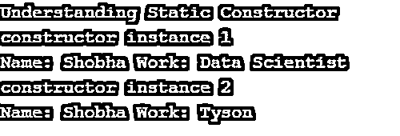

# C#中的静态关键字

> 原文：<https://www.educba.com/static-keyword-in-c-sharp/>




## C#中静态关键字介绍

Static 是 C#中的一个关键字，使用它不能实例化一个项，这意味着使用 static 关键字的项变得不可实例化，它可以应用于类、变量、方法和构造函数，这将创建静态类、静态变量、静态方法、静态构造函数和静态成员。可以在成员的声明中使用关键字 static 来创建，不属于特定类型的对象；而是属于类型本身。

### C#中的静态关键字及示例

通过在成员声明之前使用关键字 static，可以将任何成员声明为 static。让我们了解如何声明静态类、静态变量、静态方法和静态构造函数。

<small>网页开发、编程语言、软件测试&其他</small>

#### 1.声明静态类

可以使用关键字 static 将类声明为静态类。静态类中只能包含静态数据成员、静态方法和静态构造函数。无法创建静态类的对象。静态类中不能执行继承。

##### 例子

让我们通过下面的程序来声明和理解静态类:

**代码:**

```
using System;
//A static class is created using the keyword static
static class example
{
// Creating a string variable and declaring it as static using static keyword
public static string demo = "Welcome to C#";
}
//Creating a public class
public class check
{
// Calling the static main method
static public void Main()
{
//The static member of the tutorial class which is static is called
Console.WriteLine("Understanding static keyword : {0} ", example.demo);
}
}
```

上面程序的输出显示在下面的快照中:

**输出:**


#### 2.声明静态变量

可以使用关键字 static 将变量声明为静态变量。当我们将一个变量声明为静态变量并与所有类对象共享它时，就创建了该变量的一个副本。我们使用类名来访问静态变量；访问静态变量不需要对象。

##### 例子

让我们通过下面的程序来声明和理解静态变量:

**代码:**

```
using System;
//A static class is created using the keyword static
class check {
// Creating a string variable and declaring it as static using static keyword
public static string learn = "Python";
}
//Creating a public class
public class checkvar {
// Calling the static main method
static public void Main()
{
//The static member of the check class which is static is called
Console.WriteLine("I want to learn  : {0} ",
check.learn);
}
}
```

上面程序的输出显示在下面的快照中:

**输出:**


#### 3.声明静态方法

通过使用关键字 static，可以将方法[声明为静态方法](https://www.educba.com/static-method-in-python/)。我们使用类名来访问静态方法；静态和非静态字段都可以使用静态方法来访问。访问静态字段不需要对象或类名，而访问非静态字段需要对象。

##### 例子

让我们通过下面的程序来声明和理解静态方法:

**代码:**

```
using System;
//A static class is created using the keyword static
class students
{
// Creating a string variable and declaring it as static using static keyword
static public int number = 100;
//Creating a method and declaring it as static using static keyword
public static void count()
{
Console.WriteLine("Number of students"+
" learning python is :{0}", number);
}
}
//Creating a public class
public class display {
// Calling the static main method
static public void Main()
{
//class name is used to access the number of students
students.count();
}
}
```

上面程序的输出显示在下面的快照中:

**输出:**


#### 4.声明静态构造函数

通过使用关键字 static，可以将构造函数声明为静态构造函数。静态构造函数在运行构造函数的实例之前自动调用，并且在程序中引用的类 id 之前，只在类中调用一次。类名必须与构造函数名相同。

##### 例子

让我们通过下面的程序来声明和理解静态构造函数:

**代码:**

```
using System;
//A public class is created
public class constructor {
//A static constructor is defined whose name is same as the name of the class
static constructor()
{
//This statement is displayed as the first line of the output and it is executed only      once
Console.WriteLine("Understanding Static Constructor");
}
// The constructor instance is created
public constructor(int a)
{
Console.WriteLine("constructor instance " + a);
}
// A public method is defined
public string details(string name, string work)
{
return "Name: " + name + " Work: " + work;
}
// Calling the public main method
public static void Main()
{
// Invoking all the constructors defined before
constructor con = new constructor(1);
Console.WriteLine(con.details("Shobha", "Data Scientist"));
//Again Invoking all the constructors defined before
constructor co = new constructor(2);
Console.WriteLine(co.details("Shobha", "Tyson"));
}
}
```

上面程序的输出显示在下面的快照中:

**输出:**




#### 5.C#中静态关键字的使用

静态类类似于非静态类，但是不能创建静态类的实例；也就是说，我们不能使用 new 操作符创建静态类的变量或对象，静态类的成员是使用类名本身来访问的。例如，考虑。NET 框架；它由执行数学运算所需的方法组成，无需创建 math 类的实例。

##### **例子**

C#程序来说明静态类、静态变量、静态方法和静态构造函数。

**代码:**

```
using System;
//A public static class is created
public static class check
{
//A public static variable is created
public static int height;
//A static constructor is created
static check()
{
// Method is called by the constructor
height = distance(20);
}
//A static method is created
static int distance(int number)
{
return Environment.TickCount * number;
}
}
//A public class is created
public class Program
{
public static void Main()
{
//Accessing the constructor and its object
Console.WriteLine("Bird can fly upto: {0}", check.height);
}
}
```

上面程序的输出显示在下面的快照中:

**输出:**


### 推荐文章

这是一个 C#中静态关键字的指南。这里我们讨论 C#中静态关键字的概念，包括静态关键字的声明和工作，以及不同的例子和代码实现。您也可以看看以下文章，了解更多信息–

1.  [c#中的集合](https://www.educba.com/collections-in-c-sharp/)
2.  [c#中异常的类型](https://www.educba.com/types-of-exception-in-c-sharp/)
3.  [IEnumerable C#](https://www.educba.com/ienumerable-c-sharp/)
4.  [C# MessageBox](https://www.educba.com/c-sharp-messagebox/)


