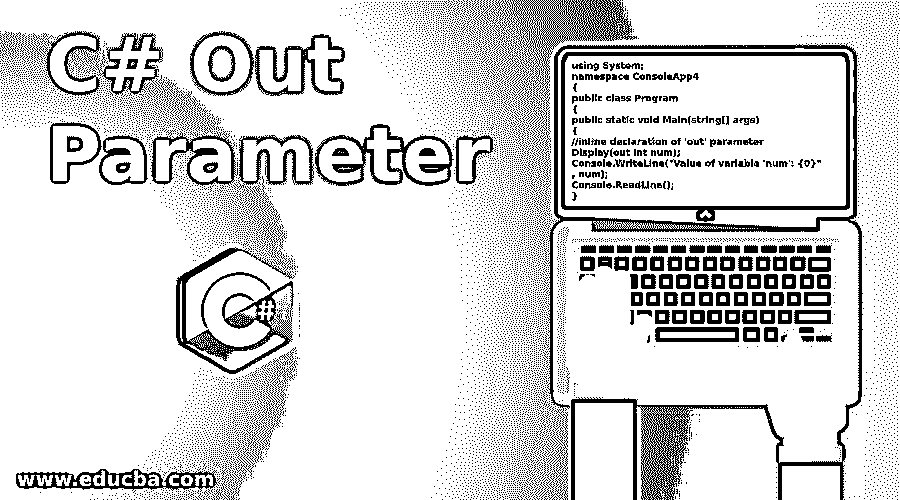
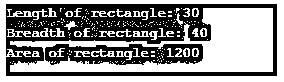

# C# Out 参数

> 原文：<https://www.educba.com/c-sharp-out-parameter/>




## C# Out 参数简介

“out”是 C#中的关键字，用于将参数作为引用类型传递给方法。作为 out 参数传递给方法的变量在传递给方法调用之前不需要声明或初始化。在控件离开被调用方法之前以及被调用方法向调用方法返回任何值之前，被调用方法需要为 out 参数的变量赋值。可以向一个方法传递多个 out 参数，并且该方法返回多个值。

**带解释的语法:**

<small>网页开发、编程语言、软件测试&其他</small>

使用 out 参数调用该方法时，语法如下:

```
Method_name(out data_type variable_name);
```

这里，Method_name 是任何用户定义的方法名称，“out”是用于表示传递给方法的变量是 out 参数的关键字，data_type 可以是变量的任何数据类型，variable_name 是变量的用户定义名称。

要调用的方法的语法如下:

```
access_specifier return_type Method_name(out data_type variable_name);
```

这里，access_specifier 可以是 C#支持的五个访问说明符中的任何访问说明符，比如 public 或 private。那么，return_type 就是这个方法返回的数据类型，后面跟着方法名和‘out’参数列表。

### “out”参数在 C#中如何工作？

在 C#中,“out”关键字的作用类似于“ref”和“In”关键字。“out”和“ref”参数之间的区别在于，“out”参数变量在传递给方法之前不需要初始化，用户可以在方法的参数列表中声明“out”参数变量，而不是单独声明它，这称为“out”参数的内联声明，而“ref”参数变量需要在传递给方法之前初始化。可以在同一代码块中访问内联声明的“out”参数。

#### 示例#1

**代码:**

```
using System;
namespace ConsoleApp4
{
public class Program
{
public static void Main(string[] args)
{
//inline declaration of 'out' parameter
Display(out int num);
Console.WriteLine("Value of variable 'num': {0}", num);
Console.ReadLine();
}
public static void Display(out int a)
{
//need to assign value
a = 10;
a += a;
}
}
}
```

**输出:**


*   “out”和“in”关键字之间的区别在于，“out”参数值可以在被调用的方法内部修改，而“in”参数值不能在被调用的方法内部修改。
*   一个方法可以有多个“out”参数，例如:Display(out x，out y)；
*   要使用“out”参数，用户需要在方法定义和调用方法中显式使用“out”关键字。同时，在方法定义和调用中赋予“out”参数的名称不必相同。
*   “out”参数是通过引用方法传递的，因此它们不会在内存中创建新的存储位置，而是使用方法调用中变量实参占用的相同存储位置。由于使用“out”参数的方法可以返回多个值，这有助于用户从被调用的方法中获得多个已处理的值。但是在方法向调用方法返回任何值之前，必须在方法中为“out”参数赋值。
*   我们不能在所有类型的方法中使用“out”参数，就像我们不能在使用“async”修饰符定义的异步方法中使用“out”参数一样，我们也不能在由“yield return”或“yield break”语句组成的“iterator”方法中使用“out”参数。由于属性不是变量，因此，我们不能将它们作为“out”参数传递给方法。
*   可以使用泛型类型定义“out”参数，以指示类型参数是协变的。与此同时,“out”参数用于 C#中不同数据类型的 TryParse()方法中。TryParse()方法返回一个指定成功或失败的布尔值，如果成功，结果由“out”参数给出。

#### 实施例 2

**代码:**

```
using System;
namespace ConsoleApp4
{
public class Program
{
public static void Main(string[] args)
{
string str = "123456";
int num;
//if ‘canParse’ is true; the result of conversion will be stored in ‘num’
bool canParse = Int32.TryParse(str, out num);
if (canParse)
Console.WriteLine(num);
else
Console.WriteLine("Could not be parsed.");
Console.ReadLine();
}
}
}
```

**输出:**


### C# Out 参数的示例

下面给出了 C# Out 参数的示例:

#### 示例#1

该示例显示了将多个“out”参数传递给一个方法，然后该方法返回多个值。

**代码:**

```
using System;
namespace ConsoleApp4
{
public class Program
{
public static void Main()
{
//declaring variables without assigning values
float area, perimeter;
//passing multiple variables to a method using 'out' keyword
Calculate(5, 10, out area, out perimeter);
//displaying the result
Console.WriteLine("The area of rectangle is: {0}", area);
Console.WriteLine("The perimeter of rectangle is: {0}", perimeter);
Console.ReadLine();
}
//method taking length & breadth & it will return area and perimeter of rectangle
public static void Calculate(int length, int breadth, out float area, out float
perimeter)
{
area = length * breadth;
perimeter = 2 * (length + breadth);
}
}
}
```

**输出:**


#### 实施例 2

显示“out”参数的内联声明的示例。

**代码:**

```
using System;
namespace ConsoleApp4
{
public class Program
{
public static void Main()
{
//in-line declaration of variables without assigning values
Calculate(out int length, out int breadth, out float area);
//displaying the values of length, breadth, and area
Console.WriteLine("Length of rectangle: " + length);
Console.WriteLine("Breadth of rectangle: " + breadth);
Console.WriteLine("Area of rectangle: " + area);
Console.ReadLine();
}
//method taking 'out' parameters and it returns multiple values
public static void Calculate(out int l, out int b, out float a)
{
l = 30;
b = 40;
a = l * b;
}
}
}
```

**输出:**




### 结论

C#中的“out”参数允许用户通过引用方法来传递参数。用作“out”参数的变量在传递给方法之前不需要初始化。被调用的方法应该在返回值之前给 out 参数赋值。

### 推荐文章

这是一个 C#输出参数的指南。这里我们讨论 C#中的简介、例子和‘out’参数是如何工作的？您也可以看看以下文章，了解更多信息–

1.  [c#中的重载和重写](https://www.educba.com/overloading-and-overriding-in-c/)
2.  [c#中的构造函数](https://www.educba.com/constructor-in-c-sharp/)
3.  [c#中的多态性](https://www.educba.com/polymorphism-in-c-sharp/)
4.  [c#中的数学函数](https://www.educba.com/math-functions-in-c-sharp/)


