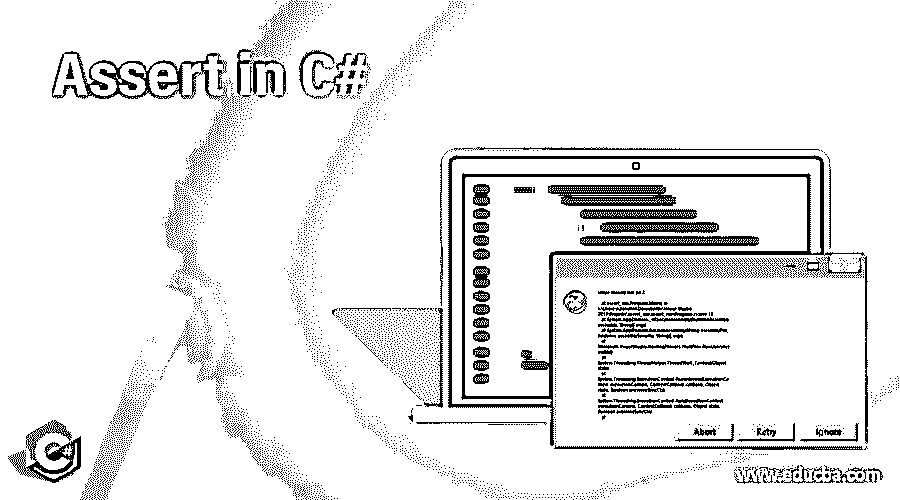
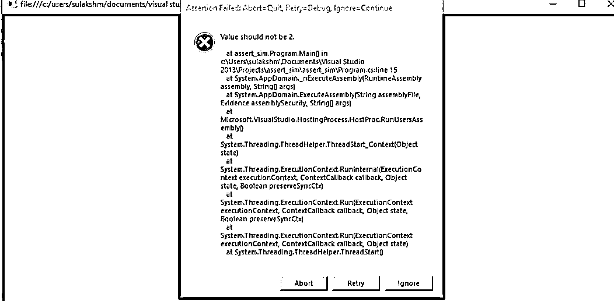
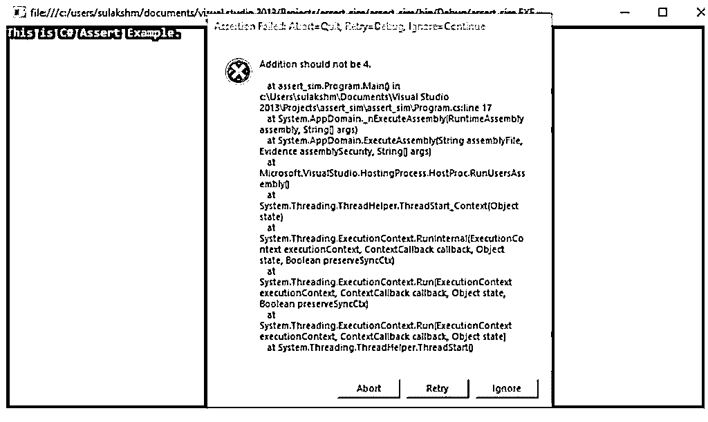

# 在 C#中断言

> 原文：<https://www.educba.com/assert-in-c-sharp/>




## C#中断言的介绍

以下文章概述了 C#中的断言。assert 方法是在运行时检测逻辑错误的最有效的方法之一，它使得在生产级别纠正错误变得很容易。assert 方法通常有两个参数:一个是布尔表达式，另一个是要显示的消息。虽然 assert 方法有两个参数，但是在 assert 方法中不能有一个单独的函数，并且无论如何都不能对程序的外部有任何影响。assert 方法便于在大型程序中实现，它允许程序员轻松地检测和清除错误。

**语法:**

<small>网页开发、编程语言、软件测试&其他</small>

```
Debug.Assert();
```

上面的 debug.assert 方法是系统的一部分。诊断类，并提供了一种快速实现该函数的方法。调试类与跟踪类不同，跟踪类只包含在调试版本中，而跟踪类包含在调试和发布版本中。建议在程序的任何部分都不要在这个 assert 方法中使用任何特定的函数调用。重要的是要理解内部函数不会对输出产生任何影响。

### 在 C#中 Assert 是如何工作的？

在定义 assert 方法时，我们必须传递两个参数，一个是布尔值，另一个是必须显示的消息。Assert 方法适用于 True 或 False:

*   定义 assert 方法时，重要的是指定当它为 false 时显示什么。
*   当条件为真时，必须有一个布尔表达式。

当程序遇到 assert 方法时，它将检查条件。程序将被中断，并通知您条件不满足。如果条件为假，将显示消息形式的第二个参数。如果条件为真，程序将继续运行。

基本上，当我们在程序中的任意一点插入了一个 assert，如果发现条件为假，就会中断程序的正常执行，并显示一个对话框，里面有详细信息。

### C#中的断言示例

下面给出了所提到的例子:

#### 示例#1

一种简单整数任意特定函数的断言方法。

**代码:**

```
using System;
using System.Diagnostics;
namespace assert_sim {
static class Program {
public static void Main() {
int val = 2;
Debug.Assert(val != 2, " Value should not be 2.");
}
}
}
```

**代码解释:**

*   我们有两个导入类，System。诊断很重要，因为它可以加速程序中后期断言函数的实现。
*   我们有我们的类和 main 方法，后面的整数值用 2 作为值。
*   调试。Assert 实现断言语句并检查条件。如代码中所述，如果值不等于(！idspnonenote)。=) 2，代码将继续执行，没有任何中断。但是如果分配的值是 2，那么将显示一个消息框，提示“值决不能是 2”。在遇到断言后，程序将按要求执行。

**输出:**

如前所述，当值为 2 时，对话框显示消息“值不得为 2”以及错误的详细信息。消息将显示它捕获 assert 方法的行号。




#### 实施例 2

两个数相加，并将传递给条件的 assert 方法。

**代码:**

```
using System;
using System.Diagnostics;
namespace assert_sim {
static class Program {
public static void Main() {
int x = 2;
int y = 2;
int q = x + y;
Console.WriteLine("This is C# Assert Example.");
Debug.Assert(q != 4, "Addition should not be 4.");
Console.WriteLine("\n This is after assert method.");
Console.ReadLine();
}
}
}
```

**代码解释:**

*   一切都类似于程序 1。在我们的第二个程序中，我们已经声明了 3 个整型变量，并分配了各自的值。
*   后来，我们有了简单的加法函数，加法的输出将被送到 assert 方法去求值。
*   接下来是我们的 print 语句，它简单地打印了一行“这是 C# Assert 示例”
*   然后我们的程序进入断言方法，条件是 check。我们相加的结果是 4，条件是不加。由于我们的程序加法将导致 4，消息将打印在一个对话框上，“加法不应该是 4。”在 assert 方法之后，程序将按照指示执行，并打印下一条语句。

**输出:**




点击忽略按钮，对话框消失，最后一行打印出来。

### C# Assert 的优势

对于编程语言中的每一个特定的方法或函数，我们都有多重优势，就像下面是在 c#中使用 assert 方法的优势一样:

*   最大的优势之一是能够发现程序中可能没有被注意到的错误。
*   除了发现错误之外，assert 方法的实现可以更快地检测到这些错误，从而更快地解决问题。
*   始终为真:使用 assert 方法，您有一个解释特定代码的影响的语句，这肯定是真的。
*   assert 方法确保程序员有足够的时间来检测、理解和解决错误。

### 结论

Assert 方法只是用来识别运行时的错误。Assert 方法有两个参数，第一个是布尔表达式，用于检查条件，第二个是基于条件结果显示的消息。我们演示了两个例子来理解 assert 方法的工作原理。Assert 的一个最佳应用是用一个相当大的程序来实现它，因为它使定位和快速删除错误的过程变得容易。

### 推荐文章

这是一个在 C#中断言的指南。在这里，我们讨论介绍，它是如何工作的，以及优势。您也可以看看以下文章，了解更多信息–

1.  [C#螺纹连接](https://www.educba.com/c-sharp-thread-join/)
2.  [c#中的静态关键字](https://www.educba.com/static-keyword-in-c-sharp/)
3.  [c#中的元数据](https://www.educba.com/metadata-in-c-sharp/)
4.  [在 Python 中断言](https://www.educba.com/assert-in-python/)


