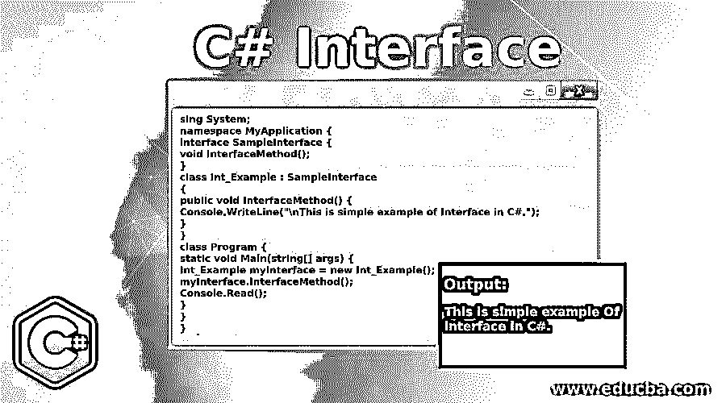
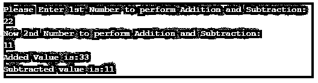

# C#接口

> 原文：<https://www.educba.com/c-sharp-interface/>




## C#接口介绍

接口，在 C#中是一个关键字，它包含一组抽象方法和属性，这些方法和属性将由一个抽象或非抽象类来实现或使用。默认情况下，定义方法是接口内的属性，使它们成为公共的和抽象的。

最简单地说，接口就像一个契约，主体中包含的每个成员或组件都必须遵循该契约，它定义了必须做什么。该接口不包含任何字段，并且总是通过使用关键字“接口”来定义。

<small>网页开发、编程语言、软件测试&其他</small>

**语法:**

语法以 interface 关键字开始，后面是接口的名称，然后是正文。

```
interface <name_for_interface>
{
//abstract methods
//abstract properties.
}
```

正如你所看到的，我们在 C#中有标准的接口语法，以“Interface”关键字开始，然后是接口的名称，最后是主体中的抽象方法和属性。在 C#中，可以在一个类或结构中实现和使用多个接口。这些接口可以包含各种方法、索引器、属性以及事件作为成员。

### 为什么我们需要 C#接口？

基本上我们已经理解了接口内部没有特定的功能，如果是这样，那么我们为什么需要接口呢？

**什么时候使用界面？**

*   **安全性:**当我们不得不简单地隐藏一些功能，并在以后使用这些功能时。有必要隐藏一些细节，而只显示对用户重要的细节。
*   **多重继承:**在 c#中，一个类可以从一个简单的父类继承，继承它的所有特性。C#不支持多重继承，原因很简单，就是不让 C#变得复杂。但是通过使用一个接口，可以将多个接口实现到一个类中。

### C#接口示例

既然我们已经理解了什么是接口及其需求。让我们演示一个带有接口实现的简单 C#代码示例。

#### 示例#1

程序实现接口并打印一个简单的语句。

**代码:**

```
using System;
namespace MyApplication {
interface SampleInterface {
void InterfaceMethod();
}
class Int_Example : SampleInterface
{
public void InterfaceMethod() {
Console.WriteLine("\nThis is simple example of Interface in C#.");
}
}
class Program {
static void Main(string[] args) {
Int_Example myInterface = new Int_Example();
myInterface.InterfaceMethod();
Console.Read();
}
}
}
```

**代码解释:**从使用和命名空间开始，生成一个基本接口作为 SampleInterface，它的主体中有一个方法。接口中的这个方法没有任何特定的主体。然后我们有了新的类来实现我们创建的接口。用 class 关键字后跟类名创建，然后用冒号符号后跟接口名实现接口。在我们的类 Int_Example 中，我们有我们早先创建的接口方法，那时它还是无形的，现在我们添加了[简单的打印语句](https://www.educba.com/print-statement-in-python/)，它说，“这是 C#中接口的一个简单例子。”

然后用静态 void main 语句开始我们的邮件类，即 Program。在我们的主类中，我们为继承了 interface 的 Int_Example 类创建了一个新对象。新对象被创建，到下一行，我们之前创建的方法被调用。最后，我们新创建的对象将调用先前创建的方法，该方法中的主体将在这里执行。带控制台。read()；程序将在退出前等待用户输入。

**输出:**


在成功编译和执行后，程序必须简单地打印如下语句:“这是一个简单的 C#接口示例。”

#### 实施例 2

使用接口的算术运算。

**代码:**

```
using System;
namespace arth_interface {
public interface SampleInterface {
void sam_add(int a, int b);
void sam_sub(int a, int b);
void display();
}
class interface_class : SampleInterface {
int x, y;
public void sam_add(int a, int b) {
int m, n;
m = a;
n = b;
x = m + n;
}
public void sam_sub(int a, int b) {
int m, n;
m = a;
n = b;
y = a - b;
}
public void display() {
Console.WriteLine("Added Value is:" + x);
Console.WriteLine("Subtracted value is:" + y);
}
}
class arth_interface {
static void Main(string[] args) {
interface_class obj_interface_class = new interface_class();
int fnumber, snumber;
Console.WriteLine("Please Enter 1st Number to perform Addition and Subtraction:");
fnumber = Convert.ToInt16(Console.ReadLine());
Console.WriteLine("Now 2nd Number to perform Addition and Subtraction:");
snumber = Convert.ToInt16(Console.ReadLine());
obj_interface_class.sam_add(fnumber, snumber);
obj_interface_class.sam_sub(fnumber, snumber);
obj_interface_class.display();
Console.ReadKey();
}
}
}
```

**代码解释:**类似于我们的第一个例子，我们已经使用了和命名空间语句，后面是接口和它的体 with 方法。我们有两个以 void 为返回类型的基本的加法和减法方法，每个方法中分别有两个整数。接下来，我们有实现接口的类。

我们已经声明了两个整数，然后我们有了第一个计算加法的方法。这是加法需要完成的操作，减法也是如此。然后我们有我们的显示方法，它由两个 print 语句组成，打印传递的数字的加法和减法值。

最后，我们有一个包含 main 方法的类，我们最初为我们的接口创建了一个对象。然后程序打印“请输入第一个数字进行加减运算:”用户输入第一个数字，然后输入第二个数字，以便进行计算。使用前面创建的对象，程序从接口调用 add 和子方法，并完成相同的操作。最后，我们有了我们的显示方法，它显示我们在显示方法和 ReadKey()中定义的结果；方法会暂停我们的程序，直到按下任何键。

**输出:**




### C#接口的优势

以下是给出的一些优点。

*   C#中接口的主要优势之一是实现多重继承的更好选择。
*   该接口支持即插即用方法。
*   完整的抽象可以通过接口的实现来实现。
*   除了使我们的代码易于维护之外，还可以实现松散耦合的概念。

### 结论

我们已经了解了 C#中的接口是什么。接口的正确语法以及解释。总而言之，C#中的接口是一种填补语言中多重继承空白的方式。后来，我们了解了为什么我们实际上需要 C#中的接口，以及后面的例子来演示对接口的理解。第一个示例演示了接口的简单使用，而第二个示例实现了算术运算，随后是代码解释和输出截图。

### 推荐文章

这是一个 C#接口指南。这里我们讨论一下入门，各种例子，优点以及为什么需要 C#接口？您也可以看看以下文章，了解更多信息–

1.  [克隆 C#中的()](https://www.educba.com/clone-in-c-sharp/)
2.  [c#中的多线程](https://www.educba.com/multithreading-in-c-sharp/)
3.  [c#中的访问修饰符](https://www.educba.com/access-modifiers-in-c-sharp/)
4.  [C#类](https://www.educba.com/c-sharp-class/)


