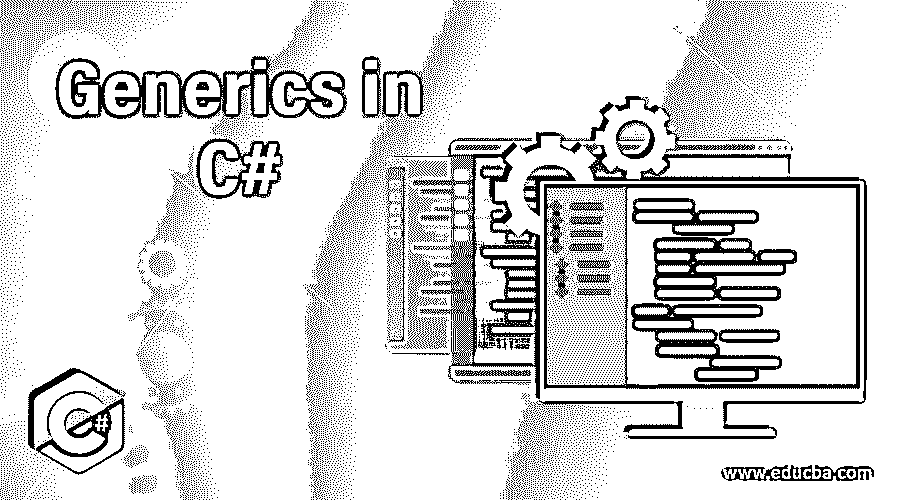
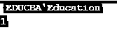
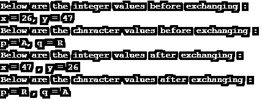

# C#中的泛型

> 原文：<https://www.educba.com/generics-in-c-sharp/>




## C#中的泛型介绍

C#中的泛型是重要的特性，它允许用户编写一个可以轻松处理任何数据类型的类或函数，或者我们可以说是一个与任何其他数据类型兼容的泛型类或函数。我们要做的就是用一个占位符来定义它。简而言之，我们必须编写一组带有数据类型参数的方法或类。因此，每当构造函数遇到编译器时，它都会生成给定的代码来处理指定的数据类型，而不会产生混淆。

**语法:**

<small>网页开发、编程语言、软件测试&其他</small>

下面是用 C#声明任何泛型类的语法:

```
public class GenericList < G > // Generic Class Declaration
{
public void Test1 ( G input ) { }
}
class DemoGenericList
{
private class ExampleClass { }
static void Main()
{ // Integer type list
GenericList < int > l1 = new GenericList < int > () ;
l1.Test1 ( 1 ) ;
// String type list
GenericList < string > l2 = new GenericList < string > () ;
l2.Test1 ( " " ) ;
// Declaring a list for ExampleClass type
GenericList < ExampleClass > l3 = new GenericList < ExampleClass > () ;
l3.Test1 ( new ExampleClass () ) ;
}
}
```

**解释:**你可以看到代码，所有的东西都是用适当的解释声明的。首先，我们定义了一个泛型类，然后定义了一个带有私有类的泛型列表，在 main 方法中，我们创建了一个整型和一个字符串类型的列表，名为 list1，list2。

### 在 C#中实现泛型的示例

现在我们将通过编程实例简要说明它是如何实时工作的。

#### 示例#1

演示泛型的工作原理

**代码:**

```
using System ;
public class EDUCBA<P> {
private P data ;
public P value
{
get
{
return this.data ;
}
set
{
this.data = value ;
}
}
}
class Demo {
static void Main(string[] args)
{
EDUCBA<string> name = new EDUCBA<string>() ;
name.value = " EDUCBA Education " ;
EDUCBA<float> version = new EDUCBA<float>() ;
version.value = 1.0F ;
Console.WriteLine(name.value) ;
Console.WriteLine(version.value) ;
}
}
```

**输出:**




**解释:**正如你在上面的代码中看到的，我们定义了名为 EDUCBA 的泛型类，并且我们使用< >来指定参数的类型。之后，我们声明数据和值的私有成员。为了使用该功能，我们使用 get 方法来返回数据和值。之后，我们将创建一个名为“demo”的演示类，在该类中，我们将为 EDUCBA 类创建 string 类型的实例，并在其中设置值和名称。对于浮点类型，该值属于浮点数据类型。最后，为了在用户屏幕上显示输出，我们调用了控制台。writeline 方法。

除了详细理解 C#中泛型如何工作的代码之外，我们还定义了一个名为“EDUCBA”的泛型类，它也使用了一个名为“P”的泛型参数。之后，在 main 方法中，我们用 string 和 float 数据类型创建了 EDUCBA 类的两个实例，它们将存储所有的 string 和 float 值。这就是 C#中泛型的工作方式。

#### 实施例 2

演示通用方法:

**代码:**

```
using System ;
using System.Collections.Generic ;
namespace DemoGenericMethods {
class Code {
static void Exchange<E>( ref E lhs , ref E rhs ) {
E temporary ;
temporary = lhs ;
lhs = rhs ;
rhs = temporary ;
}
static void Main(string[] args) {
int x, y ;
char p, q ;
x = 26 ;
y = 47 ;
p = 'A' ;
q = 'R' ;
Console.WriteLine( " Below are the integer values before exchanging : " ) ;
Console.WriteLine( " x = {0}, y = {1}", x, y ) ;
Console.WriteLine( " Below are the character values before exchanging : " ) ;
Console.WriteLine( " p = {0}, q = {1} " , p , q ) ;
Exchange <int> ( ref x , ref y ) ;
Exchange <char> ( ref p, ref q ) ;
Console.WriteLine( " Below are the integer values after exchanging : " ) ;
Console.WriteLine( " x = {0} , y = {1} " , x , y ) ;
Console.WriteLine( " Below are the character values after exchanging : " ) ;
Console.WriteLine( " p = {0} , q = {1} " , p , q ) ;
Console.ReadKey();
}
}
}
```

**输出:**




**说明:**在上面的代码中，我们将使用系统。以便我们可以在代码中使用和实现泛型方法。我们已经声明了一个名为“Code”的泛型类，其中我们创建了一个包含两个参数 LHS 和 RHS 的 void 类型的名称交换列表。我们将使用一个临时变量交换这两个值。现在在 main 方法中，我们声明了两个整数变量 x 和 y 以及两个字符变量 p 和 q。如果你注意到了，我们还分别给它们赋值。之后，为了显示交换前后的值，我们使用控制台。writeline 语句。因此，为了调用交换，我们使用带有引用类型和变量的交换语句。最后，在输出屏幕上，您将看到 p 和 q 以及 x 和 y 在交换前后的字符值。

### 结论

总之，泛型在诸如可重用性、性能和安全性等许多方面帮助编码人员即兴编写代码。因为您可以创建泛型类、接口、委托和方法。此外，这些通用数据类型比任何其他类型都安全得多，而且效率和性能都非常好。

### 推荐文章

这是 C#中泛型的指南。为了更好地理解，我们在这里讨论了 C#中泛型的语法和示例，并给出了简要的解释。您也可以浏览我们的其他相关文章，了解更多信息——

1.  [C#螺纹连接](https://www.educba.com/c-sharp-thread-join/)
2.  [c#中的文件处理](https://www.educba.com/file-handling-in-c-sharp/)
3.  [C#可空](https://www.educba.com/c-sharp-nullable/)
4.  [c#中的元数据](https://www.educba.com/metadata-in-c-sharp/)


