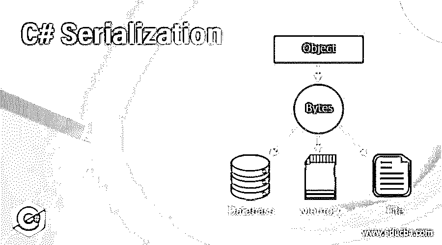

# C#序列化

> 原文：<https://www.educba.com/c-serialization/>




## C#序列化简介

以下文章提供了 C#序列化的概述。将对象实例转换成数据流的过程被称为串行化，并且对象实例的状态被转换成数据流，因为它可以在不同的网络上传输，并被保存在存储位置。这作为串行化的优点，以跨平台兼容的格式在不同的网络上传输转换后的数据流，并以持久或非持久对象状态将转换后的流数据保存到存储介质中，以便以后可以创建相同的副本。

### C#序列化对象的步骤

下面给出了 C#序列化对象的步骤:

<small>网页开发、编程语言、软件测试&其他</small>

*   创建一个流对象。
*   创建一个 BinaryFormatter 对象。
*   Serialize()方法被调用。

### C#序列化的工作原理

*   每当我们使用应用程序时，都有必要将数据存储在持久或非持久的介质中，以便以后可以检索相同的数据。这可以通过使用序列化的概念来实现。
*   将对象的实例转换为字节流并将对象的状态移动到文件的内存或数据库中的过程称为序列化。
*   序列化对于通过网络以兼容的格式跨平台传输对象至关重要。
*   对象的克隆也可以使用序列化来创建。
*   运行时。序列化命名空间必须包含在程序中，以便利用 C#中的序列化。
*   在 C#中,[ Serializable ]属性用于使类可序列化。

演示[ Serializable ]类的示例类:

**代码:**

```
[Serializable]
public class Check
{
public int code;
public string name;
}
```

*   类似地，如果我们想使类的任何成员不可序列化，我们可以使用[ NonSerialized() ]属性。

考虑下面的示例类来演示[ NonSerialized() ]属性:

**代码:**

```
[Serializable]
public class Check
{
public int code;
public string name;
[NonSerialized()]
Public double price;
}
```

*   C#支持以下类型的序列化。

下面给出了 C#支持的序列化类型:

#### 1.二进制序列化

*   所有序列化技术中最快的是二进制序列化。
*   可以使用二进制序列化将对象序列化为二进制流。
*   当使用二进制序列化将对象序列化为输出流时，对象的标识将被保留。
*   系统。运行时。系列化。格式化程序。二进制命名空间必须包含在程序中才能使用二进制序列化。

#### 2.SOAP 序列化

*   简单对象访问协议是 SOAP 的缩写。
*   如果我们必须将对象从一个应用程序转移到由异构体系结构组成的其他应用程序，我们就使用简单对象访问协议序列化。
*   可移植性是使用简单对象访问协议序列化的主要好处。
*   使用简单对象访问协议序列化，可以以简单对象访问协议的形式序列化对象。
*   系统。运行时。系列化。格式化程序。Soap 命名空间必须包含在程序中，以便利用简单对象访问协议序列化。

#### 3.XML 序列化

*   可以使用 XML 序列化将类实例的公共成员序列化为 XML 流。
*   与二进制序列化的速度相比，XML 序列化的速度非常慢。
*   跨平台支持是通过使用 XML 序列化提供的。
*   XML 序列化是基于文本的。
*   XML 序列化易于阅读。
*   XML 序列化很容易编辑。
*   可以在 XmlAttribute 上设置属性，以便使用 XML 序列化来序列化该属性。

考虑下面的代码来演示 XmlAttribute 的用法:

**代码:**

```
[XmlAttribute("Name")]
public string Name
{
get
{
return Name;
}
set
{
Name = val;
}
}
```

*   我们利用 XmlSerializer 通过 XML 序列化来序列化对象。

请考虑下面的代码来演示 XmlSerializer 的用法:

**代码:**

```
XmlSerializer Serializer = new XmlSerializer(typeof(Prod));
using (TextWriter Writer = new StreamWriter(@"C:\Prod.xml"))
{
xmlSerializer.Serialize(Writer, prodObject);
}
```

#### 4.自定义序列化

*   为了控制一类实例的序列化和反序列化，我们使用了自定义序列化。
*   自定义序列化可以通过 ISerializable 接口的实现来实现。
*   GetObjectData()方法由 ISerializable 接口声明。

考虑下面的代码，通过实现 ISerializable 接口来演示自定义序列化:

**代码:**

```
[Serializable]
public class Prod : ISerializable
{
public void GetObjectData(SerializationInfo information, StreamingContext cont)
{
//Usual code
}
}
```

### 例子

下面是 C#序列化的示例:

C#程序来演示序列化的概念。

**代码:**

```
using System;
using System.IO;
using System.Linq;
using System.Runtime.Serialization;
using System.Runtime.Serialization.Formatters.Binary;
using System.Text;
using System.Threading.Tasks;
//a namespace called demo is created
namespace Demo
{
//Serializable attribute is declared
[Serializable]
//a class check is defined which will be used for serialization
class Check
{
public int identity;
public String nam;
static void Main(string[] args)
{
//an object of the check class is created to serialize it to the file Example.txt
Check ob = new Check();
ob.identity = 10;
ob.nam = "Shobha";
//a file stream is created
IFormatter format = new BinaryFormatter();
Stream stream1 = new FileStream(@"E:\Example.txt",FileMode.Create,FileAccess.Write);
//serialization of the object of the class check is done
format.Serialize(stream1, ob);
stream1.Close();
//a file stream is created
stream1 = new FileStream(@"E:\Example.txt",FileMode.Open,FileAccess.Read);
//the object of the class check is deserialized
Check ob1 = (Check)format.Deserialize(stream1);
//the data is written to the console
Console.WriteLine(ob1.identity);
Console.WriteLine(ob1.nam);
Console.ReadKey();
}
}
}
```

**输出:**


在上面的程序中，定义了一个名为 demo 的名称空间。然后定义一个可序列化的属性。定义了一个类检查来演示使用该类进行序列化的概念。identity 和 nam 这两个属性是在类中定义的，它们分别被赋值为 10 和 Shobha。然后创建 check 类的对象，将其序列化为 Example.txt 文件。然后定义格式化程序类，将 check 类的对象转换为二进制流。

然后创建一个文件流对象，以写模式打开 Example.txt 文件，将 identity 和 nam 属性的值写入其中。然后使用 serialize 方法将二进制数据转换为文本文件。最后，我们使用 deserialize 方法反序列化文本文件 Example.txt 的内容，数据被写入控制台，如上面的输出快照所示。

### 推荐文章

这是一个 C#序列化的指南。这里我们讨论 C#序列化对象的介绍、步骤、工作和例子。您也可以看看以下文章，了解更多信息–

1.  [c#中的反序列化](https://www.educba.com/deserialization-in-c-sharp/)
2.  [c#中的 binary writer](https://www.educba.com/binarywriter-in-c-sharp/)
3.  [C#创建 JSON 对象](https://www.educba.com/c-sharp-create-json-object/)
4.  [在 C#中将字符串转换为双精度值](https://www.educba.com/convert-string-to-double-in-c-sharp/)


