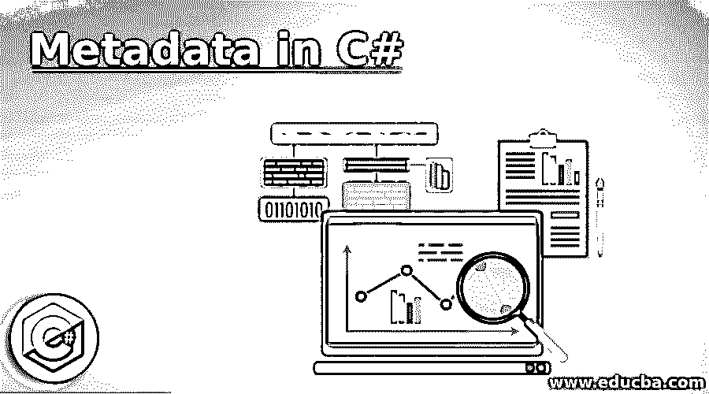
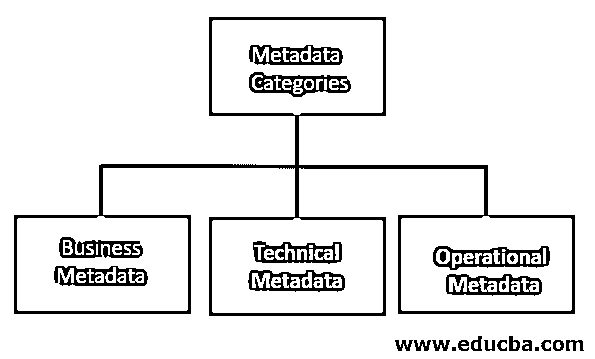
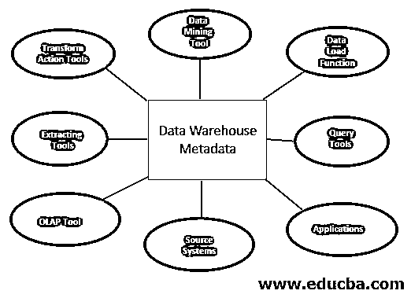
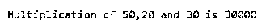
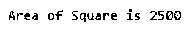
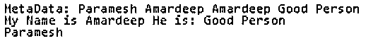

# C#中的元数据

> 原文：<https://www.educba.com/metadata-in-c-sharp/>




## C#中的元数据简介

元数据中的 C#被定义为描述我们程序的二进制信息，这些信息存储在公共语言运行时可移植可执行文件或内存中。如果您从可移植的可执行文件编译代码，那么元数据被插入到文件的另一个区域部分，并且所有这些代码现在将被转换成 MSIL 格式(微软中间语言),然后代码被移动到文件的另一个分区部分。在程序集中定义和引用的所有数据类型和数据成员都放在元数据中。当我们在运行时执行 C#代码时，它从内存中加载元数据。C#元数据的主要目的是了解关于类、数据成员、继承和数据类型等的信息。全班第一。文件中的元数据由表和堆数据结构组成。

### 元数据的使用

下面给出了元数据的用途:

<small>网页开发、编程语言、软件测试&其他</small>

*   它提供了关于程序集数据类型的描述，如名称、可见性、基类和接口等。
*   它提供了数据成员，如方法、字段、属性、事件和嵌套类型。
*   它还提供了修改类型和成员的元素的附加说明。
*   它有名称、版本、公钥等身份。
*   这是简单编程模型的关键，它将消除 IDL(接口定义语言)文件、头文件的必要性。

### 元数据的类型

下面是元数据类型图:




### 元数据的角色

下面给出了元数据的作用:




### C#中元数据是如何工作的？

C#元数据知道关于数据的数据。

**语法:**

```
using packageName;//used for insert the packages in C#
public class MyApp
{
public static int Main()
{
//data types
Console.WriteLine("Required Message");
}
//user defined methods for other logics
}
```

### C#中的元数据示例

下面是 C#中的元数据示例:

#### 示例#1

3 个数的乘法

**代码:** **乘法. cs**

```
using System; //Used for declaring the package or used for importing existed packege
public class Multiplication//declaring the class
{
public static int Main ()// main method for displaying the output
{
//declaring and defining the varaiables
int x = 50;
int y = 20;
int z=30;
//Printing the output of the multiplication of 2 numbers
Console.WriteLine ("Multiplication of {0},{1} and {2} is {3}",x,y,z,multiplication(x,y,z));
return 0;
}
public static int multiplication(int x, int y, int z)// multiplication() method implemention
{
return (x * y*z);// return multiplication of 3 numbers
}
}
```

**输出:**




**说明:**

*   正如你在“关于你可以看到的实际数据”中看到的，如果我们想要元数据或二进制数据，我们可以看到编译器内部机器生成的代码，那总是加密的，人类无法理解它。

#### 实施例 2

正方形的面积

**代码:SquareOfArea.cs**

```
using System; //Used for declaring the package or used for importing existed packege
public class SquareArea//declaring the class
{
public static int Main ()// main method for displaying the output
{
//declaring and defining the varaiables
int x = 50;
//Printing the output of the areaOfSquare
Console.WriteLine ("Area of Square is {0}",areaOfSquare(x));
return 0;
}
public static int areaOfSquare(int x)// multiplication() method implemention
{
return (x*x);// return area Of Square
}
}
```

**输出:**




**说明:**

*   正如你在“关于你可以看到的实际数据”中看到的，如果我们想要元数据或二进制数据，我们可以看到编译器内部机器生成的代码，那总是加密的，人类无法理解它。

#### 实施例 3

有数据的多个类

**代号:MultiData.net**

```
using System; //Used for declaring the package or used for importing existed packege
using System.Collections.Generic; //Used for declaring the package or used for importing existed packege
public class Entity {//declaring the class
//setters and getters for set and get the data
public string Name {get;set;}
public string Uses {get;set;}
//toString method to overide predefined String data
public override string ToString() {
string output1=string.Format("My Name is {0}", Name);
string output2=string.Format(" He is: {0}", Uses);
return output1+output2;
}
}
//declaring interface with reference class extention
public interface IMeta<T> where T: class {
//setters and getter for set and get the data
T Inner {get;set;}
stringMetaData {get;set;}
}
//declaring interface with reference class extention
public interface IStorage<T> where T: class {
//method definition for save the data
T Save();
}
//declaring the class by extending Imeta and IStorage interfaces
public class Meta<T> : IMeta<T>, IStorage<T>
where T: class
{
//creating a generic dictionary variable
private static Dictionary<T, Meta<T>> _stash = new Dictionary<T, Meta<T>>();
//constructor for the class
public Meta(T item) {
Inner = item;
}
//setters and getters for set and get the data
public T Inner {get;set;}
public string MetaData {get;set;}
//method implementation for operator
public static implicit operator T(Meta<T> meta) {
if (! _stash.ContainsKey(meta.Inner))
_stash.Add(meta.Inner, meta);
returnmeta.Inner;
}
public static implicit operator Meta<T>(T item) {
try {
return _stash[item];
} catch {
return null;
}
}
//save the data to repository
public T Save() {
return this;
}
}
//declaring the class
public static class MetaHelper {
//method definition for return the data
public static IMeta<T>GetMeta<T>(T item) where T: class {
return (Meta<T>)item;
}
//method definition for store the data
public static IStorage<T>GetStorage<T>(T item) where T: class {
return (Meta<T>)item;
}
}
//declaring the class
public class Program
{
//Entity type for createEntity method definition with 2 arguments
public static Entity CreateEntity(string name, string uses) {
//creating a variable
var result = new Meta<Entity>(new Entity(){ Name = name, Uses = uses });
//adding data to the variable that is metadata
result.MetaData = "Paramesh";
return  result;
}
//test method to test the data
public static void Main()
{
//Passing the values to createEntity method
varent = CreateEntity("Amardeep", "Good Person");
//types casting ent into Meta class
Meta<Entity> meta = (Meta<Entity>)ent;
//creating variables
varimeta = MetaHelper.GetMeta<Entity>(ent);
varistore = MetaHelper.GetStorage<Entity>(ent);
var stored = istore.Save();
//Displaying output
Console.WriteLine("MetaData: {0} {1} {2} {3}", imeta.MetaData, imeta.Inner.Name, stored.Name, stored.Uses);
Console.WriteLine(ent);
if (meta != null) Console.WriteLine(meta.MetaData);
elseConsole.WriteLine("This is not a meta type");
}
}
```

**输出:**




**说明:**

*   正如你在“关于你可以看到的实际数据”中看到的，如果我们想要元数据或二进制数据，我们可以看到编译器内部机器生成的代码，那总是加密的，人类无法理解它。

### 结论

C#中的元数据用于了解关于数据的数据。这些都被加密成二进制格式，这不是人类可以理解的，这就是为什么我们把二进制代码转换成正常的代码，分析逻辑。

### 推荐文章

这是一个 C#元数据指南。在这里，我们讨论了介绍，元数据的使用，元数据在 C#中是如何工作的，以及一些例子。您也可以看看以下文章，了解更多信息–

1.  [c#中的反序列化](https://www.educba.com/deserialization-in-c-sharp/)
2.  [C# foreach 循环](https://www.educba.com/c-sharp-foreach-loop/)
3.  [c#中的定时器](https://www.educba.com/timer-in-c-sharp/)
4.  [SQL 中的元数据](https://www.educba.com/metadata-in-sql/)


