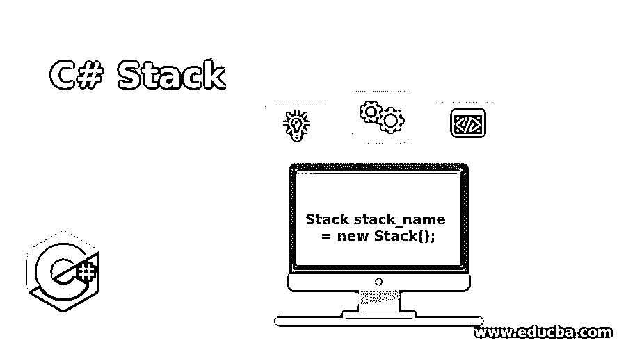
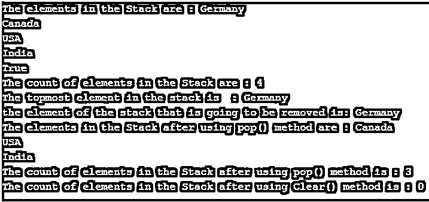
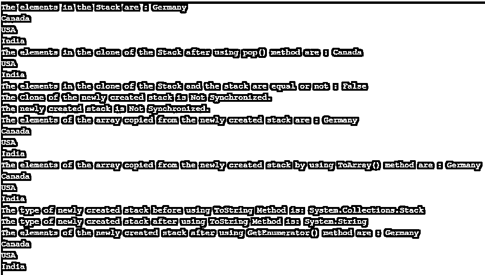

# C#堆栈

> 原文：<https://www.educba.com/c-sharp-stack/>




## C#堆栈简介

由后进先出表示的对象的集合被称为堆栈，并且它是根据程序的需要随着向堆栈添加元素而增加的集合， 因此，它是一个动态集合，相同类型和不同类型的元素都可以存储在堆栈中，将元素添加到堆栈中的过程称为将元素推入堆栈，从堆栈中移除元素的过程称为从堆栈中弹出元素，该堆栈属于 Systems。 集合命名空间。

**语法:**

<small>网页开发、编程语言、软件测试&其他</small>

C#堆栈的语法如下:

```
Stack stack_name = new Stack();
```

其中，堆栈名称是堆栈的名称

### C#中堆栈的功能

*   每当我们需要按后进先出的顺序访问堆栈中的元素时，我们就调用堆栈对象的集合。
*   将元素添加到堆栈中的过程称为将元素推入堆栈，从堆栈中移除元素的过程称为从堆栈中弹出元素。
*   堆栈是元素的动态集合，因为堆栈的大小会随着向堆栈中添加元素而增加。
*   一个堆栈可以容纳的元素数量称为堆栈的容量。由于堆栈的大小随着向堆栈添加元素而增加，堆栈的容量也通过重新分配而增加。
*   堆栈中可以有重复的元素。
*   堆栈接受 Null 作为类型引用的有效值。

C#中的堆栈中有几个构造函数。它们是:

*   Stack(): 初始化 Stack 类的一个新实例，该实例为空，其初始容量为默认值。
*   **Stack(I collection):**Stack 类的一个新实例被初始化，它由从作为参数指定的集合中取出的元素组成，并且初始容量与从作为参数指定的集合中取出的元素的数量相同。
*   **Stack(Int32):** 初始化 Stack 类的新实例，该实例为空，其初始容量为参数指定的初始容量或默认的初始容量。

### C#堆栈中的方法

C#中的堆栈有几种方法。它们是:

*   **Clear():** 使用 Clear()方法移除堆栈中的对象。
*   **Push(Object):** 使用 Push(Object)方法将指定为参数的对象插入堆栈顶部。
*   **Contains(Object):**Contains(Object)方法用于确定一个元素是否存在于堆栈中。
*   **Peek():** 返回堆栈顶部指定的对象，但不使用 Peek()方法移除。
*   **Pop():** 使用 Pop()方法返回并移除堆栈顶部指定的对象。

### 例子

以下是 c#堆栈的示例:

#### 示例#1

考虑下面的示例程序来演示 Push()方法、Pop()方法、Peek()方法、Contains()方法和 Clear()方法:

**代码:**

```
using System;
using System.Collections;
//a class called program is defined
class program
{
//main method is called
public static void Main()
{
//a new stack is created
Stack mystk = new Stack();
//Adding the elements to the newly created stack
mystk.Push("India");
mystk.Push("USA");
mystk.Push("Canada");
mystk.Push("Germany");
//displaying the elements of the stack using foreach loop
Console.Write("The elements in the Stack are : ");
foreach(varele in mystk)
{
Console.WriteLine(ele);
}
//using contains() method to check if an element is present in the stack or not
Console.WriteLine(mystk.Contains("Germany"));
// The count of the elements in the stack is displayed
Console.Write("The count of elements in the Stack are : ");
Console.WriteLine(mystk.Count);
// displaying the top most element of the stack using Peek() method
Console.WriteLine("The topmost element in the stack is  : " + mystk.Peek());
//Using pop() method to remove the top element in the stack
Console.WriteLine("the element of the stack that is going to be removed" + " is: {0}",mystk.Pop());
Console.Write("The elements in the Stack after using pop() method are : ");
foreach(var el in mystk)
{
Console.WriteLine(el);
}
Console.Write("The count of elements in the Stack after using pop() method is : ");
Console.WriteLine(mystk.Count);
//using Clear() method to remove all the elements in the stack
mystk.Clear();
Console.Write("The count of elements in the Stack after using Clear() method is : ");
Console.WriteLine(mystk.Count);
}
}
```

**输出:**




在上面的程序中，定义了一个名为 program 的类。然后调用 main 方法。然后创建一个新的堆栈。然后使用 Push()方法将元素添加到新创建的堆栈中。然后使用 foreach 循环显示新创建的堆栈的元素。然后使用 contains()方法检查堆栈中是否存在某个元素。然后使用 count()方法显示堆栈中元素的数量。然后使用 Peek()方法显示栈顶的元素。然后使用 Pop()方法移除栈顶元素。然后，在使用 Pop()方法之后，再次显示元素的计数和堆栈的元素。然后使用 Clear()方法删除堆栈中的所有元素。然后，在使用 Clear()方法之后，再次显示元素的计数和堆栈的元素。程序的输出显示在上面的快照中。

*   **Clone():** 使用 Clone()方法创建堆栈的浅层副本。
*   **Equals(Object):**Equals(Object)方法用于判断参数指定的对象是否等于当前对象。
*   **Synchronized(Stack):** 使用 Synchronized(Stack)方法返回堆栈的同步包装器。
*   **CopyTo(Array，Int32):** 堆栈被复制到一个数组中，该数组是一维的，其索引被指定为一个参数。
*   **ToArray():** 使用 ToArray()方法将堆栈复制到一个新数组中。
*   **GetType():** 使用 GetType()方法获取当前实例的类型。
*   **ToString():** 使用 ToString()方法返回表示当前对象的字符串。
*   **GetEnumerator():** 使用 GetEnumerator()方法返回堆栈的 IEnumerator。
*   **get hashcode():**get hashcode()方法默认为 hash 函数。
*   **memberwisecolone():**使用 memberwisecolone()方法创建当前对象的浅层副本。

#### 实施例 2

考虑下面的示例程序来演示 Clone()方法、Equals()方法、Synchronized()方法、CopyTo()方法、ToArray()方法、GetType()方法和 GetEnumerator()方法:

**代码:**

```
using System;
using System.Collections;
//a class called program is defined
class program
{
// Main Method is called
public static void Main(string[] args)
{
// creating a new stack
Stack mystk = new Stack();
mystk.Push("India");
mystk.Push("USA");
mystk.Push("Canada");
mystk.Push("Germany");
Console.Write("The elements in the Stack are : ");
foreach(varele in mystk)
{
Console.WriteLine(ele);
}
// a clone of the newly created stack is created
Stack mystk1 = (Stack)mystk.Clone();
// the top most element of the clone of the newly created stack is removed using pop() method
mystk1.Pop();
Console.Write("The elements in the clone of the Stack after using pop() method are : ");
//the elements of the clone of the newly created stack is displayed
foreach(Object ob in mystk1)
Console.WriteLine(ob);
//checking if the elements of the clone of the newly created stack and the newly created stack are equal or not
Console.Write("The elements in the clone of the Stack and the stack are equal or not : ");
Console.WriteLine(mystk.Equals(mystk1));
//Checking if the clone of the newly created stack and the newly created stack is synchronised or not
Console.WriteLine("The Clone of the newly created stack is {0}.", mystk1.IsSynchronized ? "Synchronized" : "Not Synchronized");
Console.WriteLine("The newly created stack is {0}.", mystk.IsSynchronized ? "Synchronized" : "Not Synchronized");
//a new array of strings is created and the newly created stack is assigned to this array
string[] arra = new string[mystk.Count];
// The elements of the newly created stack is copied to the array
mystk.CopyTo(arra, 0);
// the elements of the array are displayed
Console.Write("The elements of the array copied from the newly created stack are : ");
foreach(string st in arra)
{
Console.WriteLine(st);
}
//converting the elements of the newly created stack to array using toarray() method
Object[] ar1 = mystk.ToArray();
Console.Write("The elements of the array copied from the newly created stack by using ToArray() method are :");
//the elements of the array are displayed
foreach(Object st1 in ar1)
{
Console.WriteLine(st1);
}
Console.WriteLine("The type of newly created stack before using "+
"ToStringMethod is: "+mystk.GetType());
Console.WriteLine("The type of newly created stack after using "+
"ToString Method is: "+mystk.ToString().GetType());
Console.Write("The elements of the newly created stack after using GetEnumerator() method are : ");
//Getenumerator() method is used to obtain the enumerator of thestack
IEnumeratorenume = mystk.GetEnumerator();
while (enume.MoveNext())
{
Console.WriteLine(enume.Current);
}
}
}
```

**输出:**




在上面的程序中，定义了一个名为 program 的类。然后调用 main 方法。然后创建一个新的堆栈。然后，使用 clone()方法创建新创建的堆栈的克隆。然后，使用 pop()方法移除新创建的堆栈的克隆的最顶层元素。然后显示新创建的方法的克隆的元素。然后使用 Equals()方法检查新创建的堆栈和新创建堆栈的克隆是否相等。然后使用 synchronized()方法检查新创建的堆栈和新创建堆栈的克隆是否同步。然后使用 Copyto()方法将新创建的堆栈复制到一个数组中，并显示该数组的元素。然后使用 ToArray()方法将新创建的堆栈复制到另一个数组中，然后显示该数组的元素。然后使用 GetType()方法获取新创建的堆栈的类型。然后使用 ToString()方法将类型堆栈转换为字符串。然后使用 GetEnumerator()方法获取堆栈的 IEnumerator。程序的输出显示在上面的快照中。

### 推荐文章

这是一个 C#堆栈的指南。在这里，我们还讨论了 c#中堆栈的引入和工作，以及不同的例子和代码实现。您也可以看看以下文章，了解更多信息–

1.  [C#可空](https://www.educba.com/c-sharp-nullable/)
2.  [C#可空](https://www.educba.com/c-sharp-nullable/)
3.  [克隆 C#中的()](https://www.educba.com/clone-in-c-sharp/)
4.  [C#多维数组](https://www.educba.com/c-sharp-multidimensional-arrays/)


