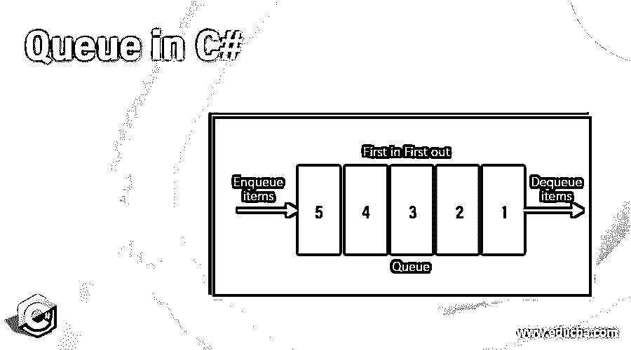
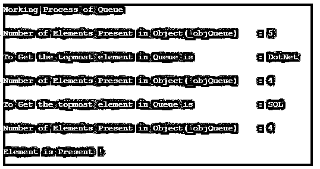

# C#中的队列

> 原文：<https://www.educba.com/queue-in-c-sharp/>




## C#中队列的介绍

队列是一个对象的集合，它以 FIFO(先进先出)顺序的形式表示。在命名空间 System.Collection 中的 C# queue 集合类中，最先添加的元素将首先出现。Queue 以 FIFO 顺序存储元素，我们可以以先进先出的方式访问元素。队列正好与栈集合相反，栈是 LIFO(后进先出)。队列集合允许大量的空值和重复值。Queue 使用两种方法 Enqueue()和 Dequeue()，分别用于添加和检索值。

**语法:**

<small>网页开发、编程语言、软件测试&其他</small>

队列是使用名为 queue 的数据类型创建的。这里“new”关键字用于创建一个队列对象。在队列集合中，为了添加一个项，我们使用 Enqueue 方法，而为了删除一个项，我们使用 Dequeue 方法。

```
Queue QueueObject = new Queue() // creation of Queue
```

```
QueueObject.Enqueue(element) // to add element to Queue
```

```
QueueObject.Dequeue() //to remove element to Queue
```

### C#中队列是如何工作的？

队列以 FIFO(先进先出)的形式存在，它是一个对象的集合，这个过程是在我们需要存取先进先出的项目时使用的。队列是非通用的，它使用系统中定义的集合类型。集合命名空间。通常，当我们以存储在队列集合中的方式使用信息时，队列是有用的。

队列通过名为 IEnumerable、ICloneable、ICollection 的接口实现。对于引用类型，它接受 null 有效值。在队列收集中，对于添加项目，我们使用 Enqueue 方法，对于删除项目，我们使用 Dequeue 方法。

**举例:**

```
using System;
using System.Collections;
public class QueueProgram {
static public void Main()
{
// to create a queue - using Queue class
Queue _objQueue = new Queue();
// to add an elements in Queue - using Enqueue() method
_objQueue.Enqueue("DotNet");
_objQueue.Enqueue("SQL");
_objQueue.Enqueue("Java");
_objQueue.Enqueue("PHP");
_objQueue.Enqueue("Android");
Console.WriteLine("Working Process of Queue\n");
Console.WriteLine("Number of Elements Present in Object(_objQueue)   : {0}", _objQueue.Count);
// to obtain the topmost element of _objQueue - using Dequeue method
Console.WriteLine("\nTo Get the topmost element in Queue" + " is            : {0}", _objQueue.Dequeue());
Console.WriteLine("\nNumber of Elements Present in Object(_objQueue)   : {0}", _objQueue.Count);
// to obtain the topmost element of _objQueue - using Peek method
Console.WriteLine("\nTo Get the topmost element in Queue is            : {0}", _objQueue.Peek());
Console.WriteLine("\nNumber of Elements Present in Object(_objQueue)   : {0}", _objQueue.Count);
// to check hether the element is present in the Queue
if (_objQueue.Contains("SQL") == true)
{
Console.WriteLine("\nElement is Present !");
}
else
{
Console.WriteLine("\nElement is not Present !");
}
}
}
```

在上面的程序中，我们将队列声明为 _ objQueue 来保存队列中的项目。对于添加新元素，我们使用 Enqueue()方法，对于删除元素，我们使用 Dequeue()方法。属性 Count 用于获取队列中元素的总数，该属性的返回值是一个数字。另一个方法 Contains()用于检查给定的值/元素是否存在，它返回 bool 值 true 或 false。Peek()用于获取队列集合中最顶端的值。

**输出:**




从上面的输出来看，它显示了队列中的项目。首先，它使用 Count()方法显示队列中的元素总数，然后使用 Peek()方法显示最顶端的元素。通过使用 Contains()方法，它检查队列集合中是否存在该元素。

### 构造器

在 Queue 类中，它由用于创建队列的构造函数组成。

*   **Queue()** :构造函数 Queue()用于创建队列类的实例，它有助于使用默认的增长因子。
*   **Queue(ICollection):** 此构造函数用于创建队列的实例，它包含从指定集合中复制的项目，并且具有与复制的项目数量相同的容量。它还使用默认的初始增长因子。
*   **Queue(Int32):** 该构造函数用于创建一个队列类实例，该实例为空，并指定了初始容量，使用默认的增长因子。
*   **Queue(Int32，Single):** 此构造函数用于创建一个队列类实例，该实例为空，并指定了初始容量，使用默认的增长因子。

### C#方法中的队列函数

让我们看看下面的函数列表，它是队列类的常用方法

*   **Enqueue()** : Enqueue 方法用于在队列中添加元素，它是一个非泛型集合，因此我们可以在该方法中添加任何数据类型的元素。用于此方法的签名是 void Enqueue(object obj)
*   **Dequeue():** Dequeue 方法用于访问队列，用于检索队列中最顶端的元素。通过用于删除的 FIFO 方法 Dequeue 及其返回队列集合中第一个元素的结果，只有当队列的总计数总是大于零时才调用 Dequeue()，否则将引发异常。这个方法使用的签名是 object Dequeue()
*   **Peek():** 该方法将总是返回队列集合中的第一个元素，而不会从队列中移除。如果调用空队列集合，它将引发异常。
*   用于此方法的签名是 object Peek()。
*   **Clear()** :该方法用于从队列集合中移除对象。用于此方法的签名是 void Clear()。
*   **Contains():** 该方法用于检查队列集合中是否存在某个元素。用于此方法的签名是 bool Contains(object obj)。
*   **Clone():** [Clone()方法用于](https://www.educba.com/clone-in-c-sharp/)创建队列集合的浅层副本。
*   **Equals(Object):** 该方法用于检查特定对象是否等于当前对象。
*   **Synchronized(Queue):** 这个方法返回一个新的队列，它包含了原来的队列。
*   **TrimToSize():** 该方法用于设置队列集合中项目的实际数量。

### 结论

在本文中，我们开始了解 C#中 Queue()的用法，它基于 FIFO 的概念，对于添加和删除队列，我们分别使用 Enqueue()和 Dequeue()方法。

### 推荐文章

这是 C#中的队列指南。在这里，我们讨论了 C#中队列的介绍、例子、构造函数和函数。您也可以看看以下文章，了解更多信息–

1.  [c#中的指针](https://www.educba.com/pointers-in-c-sharp/)
2.  [c#中的集合](https://www.educba.com/collections-in-c-sharp/)
3.  [c#中的类型转换](https://www.educba.com/type-casting-in-c-sharp/)
4.  [c#中的分部](https://www.educba.com/partial-in-c-sharp/)


