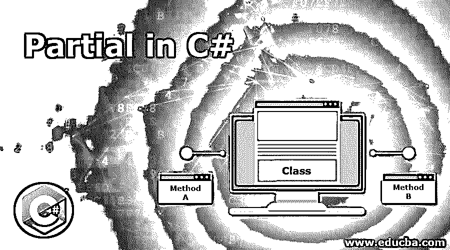

# C#中的分部

> 原文：<https://www.educba.com/partial-in-c-sharp/>




## C#中的分部函数简介

C#的一个特殊特性是分部类，使用该分部类可以将单个类的功能实现到多个文件中，这些文件随后在应用程序的编译过程中组合在一起形成单个类文件，并且分部关键字用于在 C#中创建分部类，并且该分部关键字还用于划分方法功能， 将接口功能或结构功能整合到多个文件中，所有这些文件必须在编译期间强制可用，以创建最终文件，用户也可以使用嵌套的部分类型。

**语法:**

<small>网页开发、编程语言、软件测试&其他</small>

```
public partial Class_name
{
// code
}
```

### C#中分部类的函数

为了使类成为分部类，必须在任何类名之前使用 partial 关键字。使用 partial 关键字可以将一个接口、结构或类分成多个部分。通过将类作为分部类，可以将单个类划分为多个文件。在编译部分代码期间，多个类或多个接口或结构被编译成单个类或单个接口或结构。使用 partial 关键字可以将设计的用户界面代码与业务逻辑代码分开，这使得工作和理解更加容易。

使用分部类，多个开发人员可以并行工作。框架可以通过使用分部类将定制的逻辑代码嵌入到自动生成的代码中。通过将较大的类划分为较小的类，可以很容易理解和维护它们。通过将接口分成多个代码，可以让多个开发人员共享，从而加快应用程序的开发。密封一个分部类会导致整个类被密封。这称为分部类的密封属性。使分部类成为抽象类会使整个类成为抽象类。这被称为分部类的抽象属性。具有相同名称的分部类只能在相同命名空间的范围内声明。

### 在 C#中实现分部的示例

考虑下面的例子来理解 C#中分部类的概念:

#### 示例#1

**代码:**

```
using System
public class Check
{
//main method is called
public static void Main()
{
//the same partuial class is defined at two places twice but during compilation it is executed as a single file
parclass pc=new parclass();
pc.firstmethod();
pc.secmethod();
}
//partial class is defined with the same class name
public partial class parclass
{
//a method is declared
public void firstmethod()
{
Console.WriteLine("The first method is called");
}
}
//another partial class is defined with the same name
public partial class parclass
{
//another method is declared
public void secmethod()
{
Console.WriteLine("The second method is called");
}
}
}
```

**输出:**


**说明:**在上面的程序中，定义了一个名为 check 的类，在这个类中调用 main 方法。这个主方法由稍后定义的分部类的实例组成，使用这些实例调用分部类的方法。定义了两个同名的分部类。它们包含不同的方法，这些方法在 main 方法中被调用。在编译期间，分部类将多个类组合成一个类，输出如上面的快照所示。

#### 实施例 2

C#程序演示了部分类，同时给变量赋值并使用两个不同的类打印它们。

**代码:**

```
using System;
public class Check
{
//main method is called
public static void Main()
{
//the same partial class is defined at two places twice but during compilation it is executed as a single file
rec r=new rec(5,10);
r.print();
Console.ReadLine();
}
//partial class is defined with the same class name
public partial class rec
{
private int a;
private int b;
//a method is declared
public rec(int a, int b)
{
this.a = a;
this.b = b;
}
}
//another partial class is defined with the same name
public partial class rec
{
//another method is declared
public void print()
{
Console.WriteLine("The value of a is "+ a);
Console.WriteLine("The value of b is "+ b);
}
}
}
```

**输出:**


**说明:**在上面的程序中，定义了一个名为 check 的类，在这个类中调用 main 方法。这个主方法由稍后定义的分部类的实例组成，使用这些实例调用分部类的方法。定义了两个同名 rec 的分部类。它们包含不同的方法，这些方法在 main 方法中被调用。在编译期间，分部类将多个类组合成一个类，输出如上面的快照所示。

#### 实施例 3

C#程序演示了部分类，同时给变量赋值并使用两个不同的类打印它们。

**代码:**

```
using System;
public class Check
{
//main method is called
public static void Main()
{
//the same partial class is defined at two places twice but during      compilation it is executed as a single file
stat r=new stat();
r.print1();
r.print2();
}
//partial class is defined with the same class name
public partial class stat
{
public void print1()
{
Console.WriteLine("Hello, welcome to Partial class one");
}
}
//another partial class is defined with the same name
public partial class stat
{
//another method is declared
public void print2()
{
Console.WriteLine("Hello, welcome to partial class two");
}
}
}
Output:
```


**说明:**在上面的程序中，定义了一个名为 check 的类，在这个类中调用 main 方法。这个主方法由稍后定义的分部类的实例组成，使用这些实例调用分部类的方法。定义了两个具有相同名称 stat 的分部类。它们包含不同的方法，这些方法在 main 方法中被调用。在编译期间，分部类将多个类组合成一个类，输出如上面的快照所示。

### 推荐文章

这是一个 C#中的分部分项指南。本文通过定义讨论了 C#中分部类的概念，通过实例讨论了 C#中分部类的语法，分部类在 C#中的工作及其输出。您也可以浏览我们推荐的其他文章，了解更多信息——

1.  [c#中的方法重载](https://www.educba.com/method-overloading-in-c-sharp/)
2.  [c#中的静态构造函数](https://www.educba.com/static-constructor-in-c-sharp/)
3.  [c#中的多态性](https://www.educba.com/polymorphism-in-c-sharp/)
4.  [c#中的私有](https://www.educba.com/private-in-c-sharp/)


