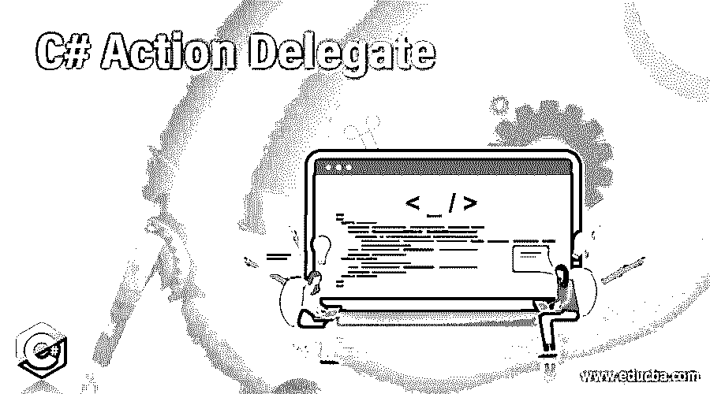

# C#操作委托

> 原文：<https://www.educba.com/c-sharp-action-delegate/>




## C#动作委托简介

在命名空间系统命名空间下定义的通用类型的内置委托，并且可以在不包含任何返回值的方法中使用，这意味着返回类型为 void 的方法被称为动作委托，并且动作委托中可以包含的输入参数的最小数量是 1，动作委托中可以包含的输入参数的最大数量是 16，并且所使用的参数的类型可以 可以是相同的数据类型，也可以是不同的数据类型，通过在程序中使用动作委托，程序变得更加优化，可读性更好。 在这个主题中，我们将学习 C#动作委托。

**C #中动作委托的语法如下:**

<small>网页开发、编程语言、软件测试&其他</small>

```
public delegate void Action < in input_parameter_type > (input_parameter_type   object);
public delegate void Action < in input_parameter_type1, in input_parameter_type2 >( input_parameter_type1 argument1, input_parameter_type2 argument2);
```

其中，输入参数类型、输入参数类型 1、输入参数类型 2 是输入参数的类型，参数 1、参数 2 是操作委托封装的方法中使用的参数。

### C#中动作委托的工作

*   每当需要使用动作委托时，可以在不包含任何返回值的方法中使用，这意味着返回类型为 void 的方法被称为动作委托。
*   操作委托是泛型类型，在命名空间 System 命名空间下定义。
*   动作委托中可以包含的输入参数的最小数量是 1，动作委托中可以包含的输入参数的最大数量是 16，并且所使用的参数的类型可以是相同的数据类型或不同的数据类型。
*   通过在程序中使用动作委托，程序变得更加优化和可读。

### C#动作委托的示例

下面举几个例子:

#### 示例#1

C#程序演示动作委托来连接给定的字符串，并在屏幕上输出该语句。

**代码:**

```
using System;
//a class called check is defined
class check
{
// a method called join is called which takes the parameter passed to the method and prints it as the output on the screen
public static void join(string str)
{
Console.WriteLine("Welcome to {0}", str);
}
// main method is called within which the join function is called by defining an action delegate
static public void Main()
{
//an action delegate is defined which takes one input parameter which is passed to the join method
Action<string> stringvalue = join;
stringvalue("C#");
}
}
```

**输出:**


在上面的程序中，定义了一个名为 check 的类。然后调用一个名为 join 的方法，该方法接受传递给该方法的参数，并将其作为输出打印在屏幕上。然后调用 main 方法，在该方法中通过定义动作委托来调用 join 函数。然后定义一个接受一个输入参数的动作委托。

#### 实施例 2

C#程序，演示动作委托计算给定数的幂。

**代码:**

```
using System;
//a class called check is defined
class check
{
// a method called power is defined which takes two parameters passed to the method and calculates the power of the given number and displays it on the screen
public static void power(double number1, double number2)
{
Console.WriteLine("The power of the given number is {0}", Math.Pow(number1, number2));
}
// main method is called within which the power function is called by defining an action delegate
static public void Main()
{
//an action delegate is defined which takes two input parameters which is passed to the power method
Action<double, double> doublevalue = power;
doublevalue(2,2);
}
}
```

**输出:**


在上面的程序中，定义了一个名为 check 的类。然后定义了一个名为 power 的方法，它接受传递给该方法的两个参数，计算给定数字的幂，并将其显示在屏幕上。然后调用 main 方法，在该方法中，通过定义动作委托来调用 power 函数。然后定义一个动作委托，它接受两个输入参数。

#### 实施例 3

C#程序，演示了一个动作委托来寻找给定数字的平方。

**代码:**

```
using System;
//a class called check is defined
class check
{
// a method called power is defined which takes two parameters passed to the method and calculates the power of the given number and displays it on the screen
public static void square(int number)
{
Console.WriteLine("The square of the given number is {0}", number * number);
}
// main method is called within which the power function is called by defining an action delegate
static public void Main()
{
//an action delegate is defined which takes one input parameter which is passed to the square method
Action<int> answer = square;
answer(3);
}
}
```

**输出:**


在上面的程序中，定义了一个名为 check 的类。然后定义了一个名为 power 的方法，它接受传递给该方法的两个参数，计算给定数字的幂，并将其显示在屏幕上。然后调用 main 方法，在该方法中，通过定义动作委托来调用 power 函数。然后定义一个动作委托，它接受两个输入参数。

### 结论

在本教程中，我们通过定义理解了 C#中动作委托的概念，动作委托的语法，并通过编程示例及其输出理解了 C#中动作委托的工作方式。

### 推荐文章

这是一个 C#动作委托指南。在这里，我们讨论 C#中动作委托的工作方式、示例以及代码和输出。您也可以阅读以下文章，了解更多信息——

1.  [C# FileInfo](https://www.educba.com/c-sharp-fileinfo/)
2.  [C#流写入器](https://www.educba.com/c-sharp-streamwriter/)
3.  [DataReader C#](https://www.educba.com/datareader-c-sharp/)
4.  [C#堆栈](https://www.educba.com/c-sharp-stack/)


