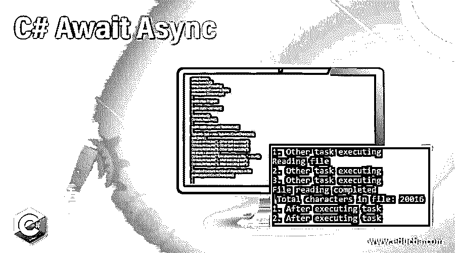
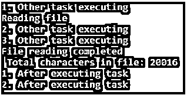
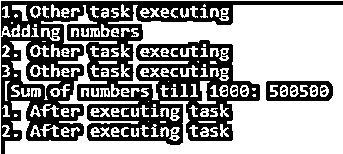

# C#等待异步

> 原文：<https://www.educba.com/c-sharp-await-async/>




## C# Await 异步简介

在 C#中，async 和 await 关键字用于异步编程。有时在我们的应用程序中，UI 会因为一些进程而被阻塞，比如在我们的应用程序中运行了一个长方法。当这个过程结束时，UI 变得有响应性。

如果我们希望我们的应用程序能够响应，而不考虑后台运行的任何进程，那么我们可以使用 async 和 await 关键字，这将使我们的代码异步，从而允许我们的应用程序在一个独立于其他代码的长方法正在执行时开始执行其他代码。

<small>网页开发、编程语言、软件测试&其他</small>

**语法:**

```
public asyncTask*MethodName*()
{
await Task.Run(
//user code
);
}
```

在上面的语句中，async 和 await 关键字指定此代码是异步代码。方法“MethodName”将异步执行，并将执行任务内部的代码。运行()而不阻塞应用程序。

### 在 C#中，Await 和 Async 是如何工作的？

在顺序和同步编程中，代码不会进一步执行，也就是说，除非当前语句完成工作，否则下一条语句不会执行。对于长时间的计算，这种类型的执行需要更多的时间，有时会使我们的应用程序不负责任。为了克服这种情况，我们可以借助 async 和 await 关键字使代码异步。

例如，如果我们的代码中有两个方法，并且这些方法是相互独立的。第一种方法是进行长时间的计算，第二种方法是打印应用程序的一些细节。第一种方法比第二种方法需要更多的时间来执行。如果我们的代码是同步的，那么第二个方法将不会被执行，直到第一个方法完成它的执行。

另一方面，如果我们在第一个方法中使用了 async 和 await 关键字使其异步，那么第二个方法可以开始执行，而不管第一个方法是否完成。这种异步编程需要更少的时间来执行，从而使我们的应用程序在本质上更具响应性和用户友好性。

任何使用 await 关键字的方法都必须标记为 async。async 关键字用在方法签名中，告诉编译器这个方法是异步方法。我们也可以将异步应用于重载方法。使用 async 和 await 编写异步代码并不意味着我们的任务将由多个线程执行，但它确保了应用程序的主线程不会被阻塞。我们不能在没有 await 的情况下使用 async，也不能在没有 async 的情况下使用 await。我们可以使用这些关键字编写异步代码来执行 IO 绑定和 CPU 绑定操作。

在异步方法中，await 运算符挂起该方法的处理，直到其操作数完成执行相应的异步操作。异步操作完成后，await 操作符返回该异步操作的结果。另一方面，如果 await 操作符的操作数已经完成了它的操作，那么 await 操作符不会挂起相应异步方法的处理，而是立即返回操作的结果，而不会挂起异步方法。await 操作符挂起异步方法时，来自该异步方法的控制返回到调用方方法。

使用 async 和 await 关键字时，请注意以下几点:

*   如果一个方法被标记为 async，那么在这个方法中应该使用 await 操作符，否则用户将从编译器得到一个警告，并且这个方法将像其他普通方法一样被执行。
*   “async void”应仅用于事件处理程序，而不应用于方法，因为事件没有任何返回类型。
*   由标记为“async void”的方法引发的异常不能在方法之外被捕获，并且测试这样的方法也非常困难。

### C#等待异步的例子

下面是一些例子:

#### 示例#1

**代码:**

```
using System;
using System.IO;
using System.Threading;
using System.Threading.Tasks;
namespace ConsoleApp4
{
public class Program
{
public static void Main()
{
TaskMethod();
Console.ReadLine();
}
public static async void TaskMethod()
{
Task<int> task = new Task<int>(CountCharacters);
task.Start();
Console.WriteLine("1\. Other task executing");
Console.WriteLine("2\. Other task executing");
Console.WriteLine("3\. Other task executing");
int count = await task;
Console.WriteLine(" Total characters in file: " + count);
Console.WriteLine("1\. After executing task");
Console.WriteLine("2\. After executing task");
}
//method to count number of characters in file
public static intCountCharacters()
{
int count = 0;
string filePath = @"E:\Content\content.txt";
Console.WriteLine("Reading file");
using (StreamReaderstreamReader = new StreamReader(filePath))
{
//reading the whole content of the file
string fileContent = streamReader.ReadToEnd();
count = fileContent.Length;
}
Console.WriteLine("File reading completed");
return count;
}
}
}
```

**输出:**




我们可以在输出中看到上面的程序异步执行。文件读取过程开始，在读取文件时，文件读取过程之后的语句开始执行，而不等待文件被完全读取。

#### 实施例 2

请在下面找到另一个异步的例子，并等待计算数字的总和，直到 1000。

**代码:**

```
using System;
using System.IO;
using System.Threading;
using System.Threading.Tasks;
namespace ConsoleApp4
{
public class Program
{
public static void Main()
{
TaskMethod();
Console.ReadLine();
}
public static async void TaskMethod()
{
Task<int> task = new Task<int>(AddNumbers);
task.Start();
Console.WriteLine("1\. Other task executing");
Console.WriteLine("2\. Other task executing");
Console.WriteLine("3\. Other task executing");
int total = await task;
Console.WriteLine(" Sum of numbers till 1000: " + total);
Console.WriteLine("1\. After executing task");
Console.WriteLine("2\. After executing task");
}
//method to add numbers from 1 to 1000
public static intAddNumbers()
{
int count = 0;
Console.WriteLine("Adding numbers");
for (inti = 0; i<= 1000; i++)
{
count += i;
}
return count;
}
}
}
```

**输出:**




### 结论

C#中的 async 和 await 关键字用于编写异步代码。如果一个方法正在执行一个长时间的计算，或者如果有一个操作需要更多的时间来执行，那么我们可以异步地执行这些操作，这样我们的应用程序就会做出响应。

### 推荐文章

这是一个 C# Await 异步的指南。在这里，我们还将讨论 c#中的简介以及 await 和 async 是如何工作的？以及不同的示例及其代码实现。您也可以看看以下文章，了解更多信息–

1.  [C#版本](https://www.educba.com/c-sharp-versions/)
2.  [c#中的 text writer](https://www.educba.com/textwriter-in-c-sharp/)
3.  [C#字符串格式()](https://www.educba.com/c-sharp-string-format/)
4.  [C#排序字典](https://www.educba.com/c-sharp-sorteddictionary/)


