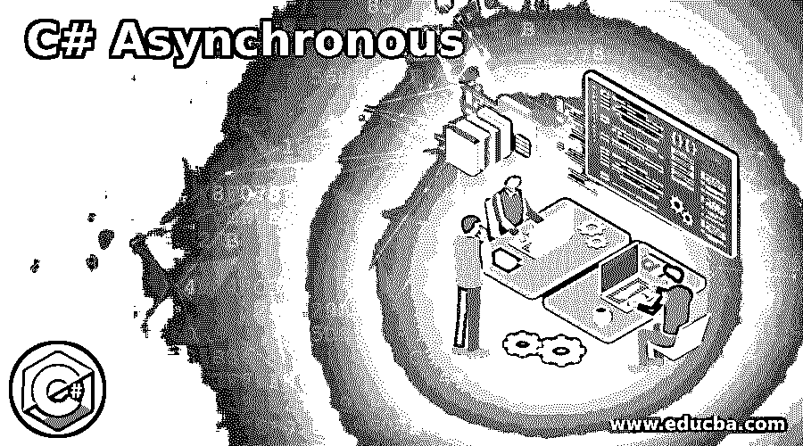

# C#异步

> 原文：<https://www.educba.com/c-sharp-asynchronous/>




## C#异步简介

C#中异步执行的一个特殊方法称为异步方法，通过使用修饰符 async 可以使一个方法异步，并且可以使用 C#中的异步方法执行异步任务，通过使用 C#中的 await 表达式可以暂停方法执行，如果这个 await 表达式在具有修饰符 async 的方法中不存在，则同步和异步执行相应的方法，即使该方法是异步方法并且异步方法的返回类型是 Task、Task <tresult>、Void(对于事件处理程序)和 System。Threading.Tasks.ValueTask</tresult>

**c#异步方法的语法:**

<small>网页开发、编程语言、软件测试&其他</small>

```
public async Task<int> Method_name()
{
// Block of code
}
```

*   async 是使用的修饰符。
*   Methodname 是为方法指定的名称。

### C#中异步方法的工作原理

*   每当程序中的逻辑需要使用可等待的任务时，我们就利用异步方法来执行需要很长时间才能完成的操作，如从网上下载、读取大文件或执行非常复杂的计算，而不会干扰或阻止应用程序的正常执行。这可以通过在我们的程序中使用修饰符 async 和 await 来实现。
*   异步方法与执行与程序流无关的任务的关联任务一起单独调用，并等待它完成任务，并根据其定义返回相应的值，这些值可用于以下语句，或者它可能仍在执行任务，而控制转到异步方法的调用方并继续执行 程序，而不中断任务的执行，一旦任务完成，异步方法的其余部分将被执行，并根据其定义返回相应的值。

### C#异步的例子

下面是提到的例子:

#### 示例#1

C#程序演示了用异步方法在程序中读取文件的内容，并确定文件中字符数的计数。

**代码:**

```
using System;
using System.IO;
using System.Threading.Tasks;
//a class called check is defined
class Check
{
//main method is called
public static void Main()
{
//a file is created
String pat = @"D:\Ext.txt";
//an instance of the string writer class is created, and the path of the file is passed as a parameter to append text to the file
using (StreamWritersw = File.AppendText(pat))
{
//data to be appended to the file is included
sw.WriteLine("Welcome to StreamWriter class in C#");
//the instance of the streamwriter class is closed after writing data to the File
sw.Close();
}
//ReadFileusingAsync method is called by creating a task and the control moves to ReadFileusingAsync method
Task<int>taskname = ReadFileusingAsync();
//When the control reaches await modifier in ReadFileusingAsync method, the control returns here as the task is still going on and the following statements are executed
Console.WriteLine("Task is being performed by the asynchronous method and we are asked to wait until the completion of the task using await method");
string givemeinput = Console.ReadLine();
Console.WriteLine("The flow of the program is resumed once the task is completed by the asynchronous method and the value is returned " + givemeinput);
//We are waiting to receive the value from the task of asynchronous method in case the value is not returned yet.
taskname.Wait();
//We have used Result method to obtain the value returned from the asynchronous method after the completion of task assigned to it
var z = taskname.Result;
Console.WriteLine("The number of characters in the file are: " + z);
Console.WriteLine("The program has completed its normal execution and the asynchronous method has read the file to count the number of characters in the file");
Console.ReadLine();
}
static async Task<int>ReadFileusingAsync()
{
string fileread = @"D:\Ext.txt";
//The following statements are executed which can take a longer time
Console.WriteLine("We have opened the file to read the contents of the file");
int counter = 0;
using (StreamReader read = new StreamReader(fileread))
{
//await modifier is used to ask the caller function to wait till the reading of the file is complete
string vart = await read.ReadToEndAsync();
counter += vart.Length;
//This is the unnecessary code that is time consuming we have included for the sake of explanation
for (int r = 0; r < 20000; r++)
{
int z = vart.GetHashCode();
if (z == 0)
{
counter--;
}
}
}
Console.WriteLine("We are done reading the file");
return counter;
}
}
```

**输出:**


**说明:**

*   在上面的程序中，定义了一个名为 check 的类，然后调用 main 方法，在该方法中我们创建了一个文件并将内容写入该文件。
*   然后创建一个调用异步方法 ReadFileusingAsync 的任务，并且控制移动到执行读取文件内容的任务的方法。
*   然后在读取文件内容时使用 length 函数获得字符的长度，并将其返回给调用方法。
*   调用方法一直等到控件返回，然后程序的正常流程继续显示结果。

#### 实施例 2

C#程序来演示程序中的异步方法。

**代码:**

```
using System;
using System.Threading.Tasks;
//a class called check is defined
class Check
{
static void Main()
{
while (true)
{
//the asynchronous method is called.
keeptrying();
string res = Console.ReadLine();
Console.WriteLine("The input given by the user while the computation is going on by the asynchronous method is: " + res);
}
}
static async void keeptrying()
{
//the caller function is asked to await
int t = await Task.Run(() =>compute());
Console.WriteLine("The total digits count in the string is: " + t);
}
static intcompute()
{
int counter = 0;
for (int a = 0; a < 10; a++)
{
for (int b = 0; b < 1000; b++)
{
string value = b.ToString();
counter += value.Length;
}
}
return counter;
}
}
```

**输出:**


**说明:**

*   在上面的程序中，定义了一个名为 check 的类。
*   然后调用 main 方法，在该方法中调用异步方法，并且控制移动到异步方法，在该方法中计算字符串中的总位数，这要求调用者方法等待，同时 main 方法继续显示用户提供的输入。

### 推荐文章

这是一个 C#异步的指南。在这里，我们讨论 C#异步的介绍，异步方法的工作以及编程示例。您也可以看看以下文章，了解更多信息–

1.  [C#流写入器](https://www.educba.com/c-sharp-streamwriter/)
2.  [C#系统。IO](https://www.educba.com/c-sharp-system-dot-io/)
3.  [C#序列化](https://www.educba.com/c-serialization/)
4.  [C#元组](https://www.educba.com/c-sharp-tuples/)


