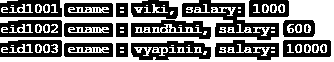
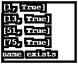
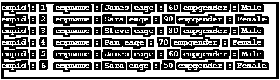

# IEnumerable C#

> 原文：<https://www.educba.com/ienumerable-c-sharp/>


## IEnumerable C#简介

IEnumerable 是一个接口，它只定义了一个方法 GetEnumerator。该方法返回 IEnumerator 接口。此接口用于迭代匿名类型的列表或类集合。它包含了系统。收藏。通用名称空间。它也用于处理 LINQ 查询表达式。这仅允许对集合进行只读访问，然后可以使用 for-each 循环迭代继承主集合的集合。IEnumerable 接口是所有非泛型列表的基接口。IEnumerable 接口有四种扩展方法。它们是 AsParallel()、AsQueryable()、Cast <tresult>()、Type <tresult>()。本文将通过各种例子详细解释 IEnumerable 接口。</tresult></tresult>

### IEnumerable C#的语法

语法如下:

<small>网页开发、编程语言、软件测试&其他</small>

```
public interface IEnumerable
```

使用 movenext()和 reset()方法迭代该集合。

#### IEnumerable C#中的扩展方法

以下是方法:

*   **Cast<t result>(IEnumerable)**:IEnumerable 接口的非泛型集合被转换成指定的类型。
*   **of type<TResult>(IEnumerable)**:IEnumerable 的元素根据所提到的类型进行过滤。
*   **AsParallel(IEnumerable)** :用于启用并行查询的运行。
*   **AsQueryable(IEnumerable)** :用于将 IEnumerable 接口转换为 IQueryable 接口。

### IEnumerable C#的实现示例

下面是一些例子:

#### 示例#1

**代码:**

```
using System;
using System.Diagnostics;
using System.Reflection;
using System.Collections;
namespace TestEg
{
class Test : IEnumerable
{
Test[] coll = null;
int Fi = 0;
public String Fname { get; set; }
public string lastnme { get; set; }
public Test()
{
coll = new Test[10];
}
public void Add(Test item)
{
coll[Fi] = item;
Fi++;
}
// IEnumerable Member
public IEnumeratorGetEnumerator()
{
foreach (object o in coll)
{
if(o == null)
{
break;
}
yield return o;
}
}
}
class Program
{
public static void Main(String[] args)
{
Test tobj = new Test();
tobj.Fname = "viki";
tobj.lastnme = "krish";
Test tobj1 = new Test();
tobj1.Fname = "nand";
tobj1.lastnme = "viki";
Test myList = new Test();
Test tobj2 = new Test();
tobj2.Fname = "vyapini";
tobj2.lastnme = "viki";
Test tobj3 = new Test();
tobj3.Fname = "tai";
tobj3.lastnme = "viki";
myList.Add(tobj);
myList.Add(tobj1);
myList.Add(tobj2);
myList.Add(tobj3);
foreach (Test obj in myList)
{
Console.WriteLine("Fname:" +  obj.Fname + "\t\t" + "lastnme :" + obj.lastnme);
}
Console.ReadLine();
}
}
}
```

**输出:**


#### 实施例 2

**代码:**

```
using System;
using System.Diagnostics;
using System.Reflection;
using System.Collections;
public class test : IEnumerable
{
public string Student1 { get; set; }
public string Student2 { get; set; }
public string Student3 { get; set; }
public IEnumeratorGetEnumerator() { return new testEnumerator(this); }
}
public class testEnumerator : IEnumerator
{
public testEnumerator(test ts) { _ts = ts; }
private test _ts;
private int _index = 0;
public void Reset() { _index = 0; Current = null; }
public object Current { get; private set; }
public bool MoveNext()
{
_index++;
/**/ if (_index == 1) { Current = _ts.Student1; return true; }
else if (_index == 2) { Current = _ts.Student2; return true; }
else if (_index == 3) { Current = _ts.Student3; return true; }
else return false;
}
}
class Program
{
public static void Main(String[] args)
{
varts = new test() {Student1 = "vignesh", Student2 = "nandhini", Student3 = "vyapini"};
foreach (string name in ts)
{
Console.WriteLine(name);
}
}
}
```

**输出:**


#### 实施例 3

**代码:**

```
using System.Linq;
using System.Collections.Generic;
using System;
namespace TestOper
{
public class testclass
{
public inteid { get; set; }
public string ename { get; set; }
public double salary { get; set; }
}
class Program
{
public static void Main()
{
List<testclass>listtestclasss = new List<testclass>
{
new testclass { eid= 1001, ename = "viki", salary = 1000 },
new testclass { eid= 1002, ename = "nandhini", salary = 600 },
new testclass { eid= 1003, ename = "vyapinin", salary = 10000 }
};
Dictionary<int, testclass>empdic = listtestclasss.ToDictionary(x =>x.eid);
foreach (KeyValuePair<int, testclass>kvp in empdic)
{
Console.WriteLine("eid" + kvp.Key + " ename : " + kvp.Value.ename + ", salary: " + kvp.Value.salary);
}
Console.ReadKey();
}
}
}
```

**输出:**




#### 实施例 4

**代码:**

```
using System;
using System.Collections.Generic;
using System.Linq;
class Program
{
static void Main()
{
int[] numbers = new int[]
{
1,13,51,75
};
Dictionary<int, bool>dic =
numbers.ToDictionary(v => v, v => true);
foreach (KeyValuePair<int, bool> pair in dic)
{
Console.WriteLine(pair);
}
List<string> names = new List<string>()
{
"vignesh","jagan","nyan","ravi","siva","sethu"
};
var result = names.ToDictionary(x => x, x => true);
if (result.ContainsKey("jagan"))
{
Console.WriteLine("name exists");
}
}
}
```

**输出:**




#### 实施例 5

**代码:**

```
using System;
using System.Collections.Generic;
using System.Linq;
namespace LINQDemo
{
class Program
{
static void Main(string[] args)
{
List<emp>sl = new List<emp>()
{
new emp(){empid = 1, empname = "James", empgender = "Male",eage=60},
new emp(){empid = 2, empname = "Sara", empgender = "Female",eage=90},
new emp(){empid = 3, empname = "Steve", empgender = "Male",eage=80},
new emp(){empid = 4, empname = "Pam", empgender = "Female",eage=70},
new emp(){empid = 5, empname = "James", empgender = "Male",eage=60},
new emp(){empid = 6, empname = "Sara", empgender = "Female",eage=50},
new emp(){empid = 7, empname = "Steve", empgender = "Male",eage=20},
new emp(){empid = 8, empname = "Pam", empgender = "Female",eage=40}
};
IQueryable<emp>iq = sl.AsQueryable()
.Where(t =>t.eage> 40);
foreach (varemp in iq)
{
Console.WriteLine( $"empid : {emp.empid}  empname : {emp.empname} eage : {emp.eage} empgender : {emp.empgender} ");
}
Console.ReadKey();
}
}
public class emp
{
public intempid { get; set; }
public string empname { get; set; }
public string empgender { get; set; }
public inteage { get; set; }
}
}
```

**输出:**




### 结论

因此，文章详细解释了 C#中的 IEnumerable。它还详细解释了各种方法，如 GetEnumerator 和其他与 IEnumerable 相关联的扩展方法，如 AsParallel()、AsQueryable()、Cast <tresult>()、OfType <tresult>()等。它还通过示例演示了 current、next 和 reset 方法的使用。要了解更多细节，最好编写示例程序并实践它们。</tresult></tresult>

### 推荐文章

这是 IEnumerable C#的使用指南。在这里，我们讨论一个关于 IEnumerable C#及其代码实现的例子的简要概述。您也可以浏览我们推荐的其他文章，了解更多信息——

1.  [c#中的方法重载](https://www.educba.com/method-overloading-in-c-sharp/)
2.  [c#中的静态构造函数](https://www.educba.com/static-constructor-in-c-sharp/)
3.  [c#中的多态性](https://www.educba.com/polymorphism-in-c-sharp/)
4.  [c#中的私有](https://www.educba.com/private-in-c-sharp/)


