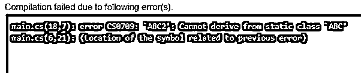

# C#中的静态类

> 原文：<https://www.educba.com/static-class-in-c-sharp/>


## C#中静态类的介绍

静态类是我们不能实例化的类。静态类唯一也是最重要的目标是提供继承类的蓝图。它是借助 C# 中的“ [static”关键字创建的。静态类只包含静态成员。我们无法为静态类创建对象。在这个主题中，我们将学习 C#中的静态类。](https://www.educba.com/static-keyword-in-c-sharp/)

### 静态成员

C#中的 static 类由两种类型的 static 组成，如下所示:

<small>网页开发、编程语言、软件测试&其他</small>

#### 1.静态数据成员

静态数据成员通过使用 Static 关键字来声明，因为静态类总是包含静态数据成员。也可以使用类名直接访问它们。静态数据成员的内存是单独分配的，不考虑它与对象的关系。

**语法:**

```
static class NameOfClass
{
public static name_of_datamember;
}
```

**举例:**

```
public class Vehicle
{
public static int Wheels = 4;
public static int GasTank
{
get
{
return 23;
}
}
public static void move() { }
public static event EventType RunOutOfGas;
// Extra non-static fields as well as properties
}
```

它们在静态成员第一次被访问之前和静态构造函数被调用之前被初始化。为了访问它，我们使用类名而不是变量名。

#### 2.静态方法

static 关键字的使用声明了静态方法，因为静态类总是包含静态方法。这些方法只能访问静态数据成员，不能访问非静态数据成员。

**语法:**

```
static class name_of_class
{
public static name_of_method()
{
// code
}
}
```

### C#中静态类的示例

下面举几个例子

#### 示例#1

**代码:**

```
/*
* C# Program to Check whether the Entered Number is Even or Odd
*/
using System;
using System.Collections.Generic;
using System.Linq;
using System.Text;
namespace check1
{
class EvenAndOdd
{
static void Main(string[] args)
{
int i;
if (4 % 2 == 0) // You can enter any number you wish to check for even / odd
{
Console.Write("Entered Number is an Even Number");
Console.Read();
}
else
{
Console.Write("Entered Number is an Odd Number");
Console.Read();
}
}
}
}
```

**输出:**


#### 实施例 2

**代码:**

```
using System;
using System.Collections.Generic;
using System.Linq;
using System.Text;
public static class ABC {
// declaration of static Method
static void details()
{
Console.Write("Static Method of the class ABC is");
}
}
// Inheritance of the class ABC which would give an error since static
// class cannot be inherited
class ABC2 : ABC
{
public static void Main(String[] args)
{
}
}
```

**输出:**




**解释:**第一个例子中，有一个静态类，用 static 关键字命名为 Book。Book 类由静态数据成员 name、l 和 t 以及一个名为 specs()的静态方法组成。静态类的这个方法是通过使用类名(即 Book)来调用的。specs()；.因为我们已经知道静态类不包含对象，所以 Book 类的数据成员通过使用它的类名来访问，即 Book.name，Book。l 和 Book.t。

**静态构造函数**

与普通构造函数(即在非静态数据成员的初始化中有用的非静态构造函数)相比，静态构造函数在静态数据成员的初始化中基本上是有用的。

**特性/规则:**

1.  它们不能有任何访问修饰符。
2.  它们不能与参数一起定义。
3.  他们无权访问非静态数据成员。

### 静态项目的内存分配

您必须知道应用程序内存的基本组件是堆和堆栈。堆内的一个特殊区域称为高频堆，其中存储静态成员。非静态类的静态成员也存储在一个堆中，然后在该类的所有实例中共享它们。因此，一个实例所做的更改会反映在所有其他实例中。

正如您已经知道的，静态成员只能包含其他静态成员，因为静态成员会被调用，而不管是否创建了实例。从今以后，它们不能访问非静态成员。

### C#中静态类的优势

1.  我们将得到一个错误的情况下，我们的任何成员作为一个非静态成员。
2.  如果我们试图为静态类创建一个实例，又会产生一个编译时错误，因为静态成员可以和它们的类名一起被直接访问。
3.  在类定义中，static 关键字用在 class 关键字之前，以声明静态类。
4.  静态类成员可以通过类名后跟成员名来访问。

### 结论

*   我们不能使用 new 关键字实例化静态类
*   静态项目只能访问其他静态项目。考虑静态类只包含静态成员，如变量、方法等。
*   静态方法只包含静态变量，而且它们只能访问其余的静态项。
*   静态项目具有在多个用户之间共享资源的能力。
*   我们不能将 static 与索引器、析构器或类以外的类型一起使用。
*   此外，非静态类中的静态构造函数在该类第一次被实例化时将只运行一次。
*   此外，每当第一次访问任何静态成员时，静态类中的静态构造函数将只运行一次。
*   静态成员在内存的高频率堆区域中分配。

### 推荐文章

这是一个 C#中静态类的指南。这里我们讨论 C#中的静态类，包括两种类型的静态和示例以及代码和输出。您也可以看看以下文章，了解更多信息–

1.  [C++静态](https://www.educba.com/c-plus-plus-static/)
2.  [C#目录信息](https://www.educba.com/c-sharp-directoryinfo/)
3.  [锁定 C#](https://www.educba.com/lock-in-c-sharp/)
4.  [C#基础](https://www.educba.com/c-sharp-base/)


