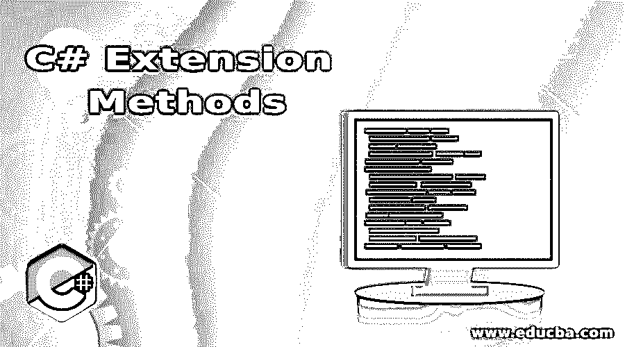

# C#扩展方法

> 原文：<https://www.educba.com/c-sharp-extension-methods/>




## C#扩展方法简介

按照扩展的字面意思，这些额外的方法被称为 C#扩展方法，使用这些方法可以添加额外的方法，而无需做任何更改或继承或重构原始结构、类或接口，我们可以将这些扩展方法添加到我们创建的自定义类中。NET 框架或来自第三方的类或接口，并且通过包含定义这些扩展方法的命名空间，这些扩展方法在整个程序流中都是可访问的，并且它是在静态类中定义的特殊类型的静态方法。

### C#扩展方法的语法

定义命名空间、类和扩展方法。

<small>网页开发、编程语言、软件测试&其他</small>

**语法:**

```
namespace namespace_name
{
public static class class_name
{
public static bool extension_method_name(parameters_list)
{
//Blocks of code
}
}
}
```

其中，名称空间名称是定义扩展方法的名称空间的名称。

Class_name 是定义扩展方法的静态类的名称。

扩展方法名称是扩展方法的名称。

参数列表是一个参数列表，第一个参数是该方法将要操作的操作符的类型，该操作符的前缀是 this 关键字。

### C#扩展方法的工作原理

*   扩展方法是额外创建的自定义方法，不是原始类的一部分。
*   定义一个命名空间，在其中定义一个静态类，然后在静态类中定义扩展方法。通过使用在其中定义扩展方法的命名空间，该方法可以在整个应用程序中使用。
*   扩展方法是在静态类中定义的静态方法的一个特例，静态类的第一个参数是它要操作的带有前缀 this 关键字的操作符的类型。
*   扩展方法可以包含在。NET framework 类、自定义类、结构或接口、第三方类。

### 实现 C#扩展方法的示例

下面是 C#扩展方法的例子

#### 示例#1

C#程序演示了在程序中扩展方法来比较两个整数:

**代码:**

```
using System;
using System.Text;
//a namespace called check is defined
namespace check
{
// a static class called extensionclassmethod is defined
public static class extensionmethodclass
{
//extension method to compare two integers is defined
public static bool extensionmethodname(this intstr, intval)
{
return str>val;
}
}
//a class called check1 is defined
class check1
{
//main method is called
static void Main(string[] args)
{
intstri = 565;
//extension method defined in another static class is called here
bool z = stri.myExtensionMethod(200);
Console.WriteLine("The result of the comparison is: {0}", z);
Console.ReadLine();
}
}
}
```

**输出:**


**说明:**在上面的程序中，定义了一个名为 check 的命名空间。然后定义一个称为扩展方法类的静态类，其中定义了比较两个整数的扩展方法。然后定义另一个名为 check1 的类，可以在该类中添加扩展方法，即使它是在不同的类中定义的，但属于相同的名称空间。extension 方法返回两个整数的比较结果。快照的输出如上面的快照所示。

#### 实施例 2

C#程序，演示在程序中用扩展方法找出一个字符串的长度:

**代码:**

```
using System;
using System.Text;
//a namespace called check is defined
namespace check
{
// a static class called extensionclassmethod is defined
public static class extensionmethodclass
{
//extension method to find out the length of a string is defined
public static intextensionmethodname(this string str)
{
return str.Length;
}
}
//a class called check1 is defined
class check1
{
//main method is called
static void Main(string[] args)
{
string stri = "ShobhaShivakumar";
//extension method defined in another static class is called here
int z = stri.extensionmethodname();
Console.WriteLine("The length of the string obtained by using extension method is: {0}", z);
Console.ReadLine();
}
}
}
```

**输出:**


**说明:**在上面的程序中，定义了一个名为 check 的命名空间。然后定义一个名为 extension method class 的静态类，其中定义了计算作为参数传递给它的字符串长度的扩展方法。然后定义另一个名为 check1 的类，可以在该类中添加扩展方法，即使它是在不同的类中定义的，但属于相同的名称空间。extension 方法返回作为参数传递给它的字符串长度作为结果。快照的输出如上面的快照所示。

#### 实施例 3

**代码:**

```
using System;
using System.Text;
//a namespace called check is defined
namespace check
{
// a static class called extensionclassmethod is defined
public static class extensionmethodclass
{
//extension method to add two numbers is defined
public static intextensionmethodname(this intstr, intval)
{
return str+val;
}
}
//a class called check1 is defined
class check1
{
//main method is called
static void Main(string[] args)
{
intstri = 100;
//extension method defined in another static class is called here
int z = stri.extensionmethodname(200);
Console.WriteLine("The result of addition of two numbers obtained by using extension method is: {0}", z);
Console.ReadLine();
}
}
}
```

**输出:**


**说明:**在上面的程序中，定义了一个名为 check 的命名空间。然后定义一个名为扩展方法类的静态类，其中定义了将两个数字相加作为参数传递给它的扩展方法。然后定义另一个名为 check1 的类，可以在该类中添加扩展方法，即使它是在不同的类中定义的，但属于相同的名称空间。extension 方法返回两个数相加后的结果。

### 结论

在本教程中，我们通过定义、语法和编程示例及其输出来理解 C#扩展方法的概念。

### 推荐文章

这是一个 C#扩展方法的指南。在这里，我们讨论了 C#扩展方法的介绍，以及它的例子和代码实现。您也可以浏览我们推荐的其他文章，了解更多信息——

1.  [c#中的随机数生成器](https://www.educba.com/random-number-generator-in-sharp/)
2.  [Java 中的静态构造函数](https://www.educba.com/static-constructor-in-java/)
3.  [c#中的 text writer](https://www.educba.com/textwriter-in-c-sharp/)
4.  [c#中的静态构造函数](https://www.educba.com/static-constructor-in-c-sharp/)


