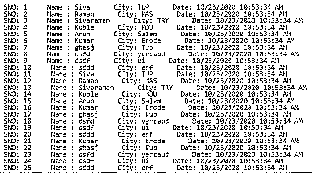
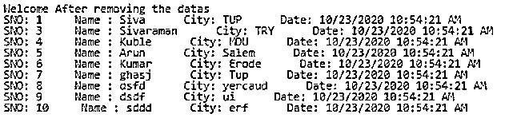

# C#数据表

> 原文：<https://www.educba.com/c-sharp-datatable/>


## C#数据表简介

C# DataTable 被定义为包含许多行和列的类，用于从内存和数据库中存储和检索数据；它还表示 UI 区域中的网格表单；这是一个 C # ADO.NET 包类，使用该类我们可以将数据添加到 datatable 中，并且我们将使用数据绑定概念将数据绑定到相同的 datatable 和 datagridview 控件中。它还包含依赖于表中一个或多个列数的主键，数据集合只是行和列值的唯一性。

### C#数据表的语法

通常情况下，datatable 类为 CRUD 操作提供一组方法和属性，此外还像复制、删除和克隆操作一样。datatable 类有像添加或删除表中的行和列这样的方法。

<small>网页开发、编程语言、软件测试&其他</small>

```
using system;
using System.Data;
class classname
{
returntype methodname()
{
DataTable referencename=new DataTable();
referencename.Columns.Add(); //Adding the columns to the table
referencename.Rows.Add(); // Adding the rows to the table
---some logics—
}
Main()
{
DataTable referencename=methodname();
---some logics based on the requirement---
}
}
```

以上代码是 C#语言中数据表的基本语法。我们可以对行和列进行添加或删除操作。它在数据表中有一些预定义的方法，用于存储和检索数据库中的数据。

### C#中的 DataTable 是如何工作的？

*   数据表是系统类的一部分，就像系统一样。表名称空间中的数据。
*   使用这些类，我们可以添加、选择和迭代数据库中的数据。还有，在克隆操作中额外使用的 datatable 类；在过滤器的帮助下，我们可以存储和检索表中的数据。
*   它有自己的约束，通过使用主键，我们可以以独特的方式进行操作。
*   约束条件是，它是允许用户访问表中所有数据的属性之一，比如父子关系表。
*   我们还可以通过使用主键和父表引用来创建子表；在两个表中分别创建对象。
*   我们还可以创建自己的定制视图，以及包含默认视图属性的表。使用用户界面中的 DataGridView 控件显示数据表。

### C#数据表示例

下面是 C#数据表的示例:

#### 示例#1

**代码:**

```
using System;
using System.Data;
public class Example
{
public static void Main()
{
DataTable dtable = new DataTable();
dtable.Columns.Add("SNO", typeof(int));
dtable.Columns.Add("Name", typeof(string));
dtable.Columns.Add("City", typeof(string));
dtable.Columns.Add("Date", typeof(DateTime));
dtable.Rows.Add(1, "Siva", "TUP", DateTime.Now);
dtable.Rows.Add(2, "Raman", "MAS", DateTime.Now);
dtable.Rows.Add(3, "Sivaraman", "TRY", DateTime.Now);
dtable.Rows.Add(4, "Kuble", "MDU", DateTime.Now);
dtable.Rows.Add(5, "Arun", "Salem", DateTime.Now);
dtable.Rows.Add(6, "Kumar", "Erode", DateTime.Now);
dtable.Rows.Add(7, "ghasj", "Tup", DateTime.Now);
dtable.Rows.Add(8, "dsfd", "yercaud", DateTime.Now);
dtable.Rows.Add(9, "dsdf", "ui", DateTime.Now);
dtable.Rows.Add(10, "sddd", "erf", DateTime.Now);
dtable.Rows.Add(1, "Siva", "TUP", DateTime.Now);
dtable.Rows.Add(2, "Raman", "MAS", DateTime.Now);
dtable.Rows.Add(3, "Sivaraman", "TRY", DateTime.Now);
dtable.Rows.Add(4, "Kuble", "MDU", DateTime.Now);
dtable.Rows.Add(5, "Arun", "Salem", DateTime.Now);
dtable.Rows.Add(6, "Kumar", "Erode", DateTime.Now);
dtable.Rows.Add(7, "ghasj", "Tup", DateTime.Now);
dtable.Rows.Add(8, "dsfd", "yercaud", DateTime.Now);
dtable.Rows.Add(9, "dsdf", "ui", DateTime.Now);
dtable.Rows.Add(10, "sddd", "erf", DateTime.Now);
dtable.Rows.Add(11, "Siva", "TUP", DateTime.Now);
dtable.Rows.Add(12, "Raman", "MAS", DateTime.Now);
dtable.Rows.Add(13, "Sivaraman", "TRY", DateTime.Now);
dtable.Rows.Add(14, "Kuble", "MDU", DateTime.Now);
dtable.Rows.Add(1, "Arun", "Salem", DateTime.Now);
dtable.Rows.Add(16, "Kumar", "Erode", DateTime.Now);
dtable.Rows.Add(17, "ghasj", "Tup", DateTime.Now);
dtable.Rows.Add(18, "dsfd", "yercaud", DateTime.Now);
dtable.Rows.Add(19, "dsdf", "ui", DateTime.Now);
dtable.Rows.Add(20, "sddd", "erf", DateTime.Now);
dtable.Rows.Add(21, "Kumar", "Erode", DateTime.Now);
dtable.Rows.Add(22, "ghasj", "Tup", DateTime.Now);
dtable.Rows.Add(23, "dsfd", "yercaud", DateTime.Now);
dtable.Rows.Add(24, "dsdf", "ui", DateTime.Now);
dtable.Rows.Add(25, "sddd", "erf", DateTime.Now);
dtable.Rows.Add(26, "Kumar", "Erode", DateTime.Now);
dtable.Rows.Add(27, "ghasj", "Tup", DateTime.Now);
dtable.Rows.Add(28, "dsfd", "yercaud", DateTime.Now);
dtable.Rows.Add(29, "dsdf", "ui", DateTime.Now);
dtable.Rows.Add(30, "sddd", "erf", DateTime.Now);
dtable.Rows.Add(20, "sddd", "erf", DateTime.Now);
dtable.Rows.Add(31, "Kumar", "Erode", DateTime.Now);
dtable.Rows.Add(32, "ghasj", "Tup", DateTime.Now);
dtable.Rows.Add(33, "dsfd", "yercaud", DateTime.Now);
dtable.Rows.Add(34, "dsdf", "ui", DateTime.Now);
dtable.Rows.Add(35, "sddd", "erf", DateTime.Now);
dtable.Rows.Add(36, "Kumar", "Erode", DateTime.Now);
dtable.Rows.Add(37, "ghasj", "Tup", DateTime.Now);
dtable.Rows.Add(38, "dsfd", "yercaud", DateTime.Now);
dtable.Rows.Add(39, "dsdf", "ui", DateTime.Now);
dtable.Rows.Add(40, "sddd", "erf", DateTime.Now);
dtable.Rows.Add(41, "sddd", "erf", DateTime.Now);
dtable.Rows.Add(42, "Kumar", "Erode", DateTime.Now);
dtable.Rows.Add(43, "ghasj", "Tup", DateTime.Now);
dtable.Rows.Add(44, "dsfd", "yercaud", DateTime.Now);
dtable.Rows.Add(45, "dsdf", "ui", DateTime.Now);
dtable.Rows.Add(46, "sddd", "erf", DateTime.Now);
dtable.Rows.Add(47, "Kumar", "Erode", DateTime.Now);
dtable.Rows.Add(48, "ghasj", "Tup", DateTime.Now);
dtable.Rows.Add(49, "dsfd", "yercaud", DateTime.Now);
dtable.Rows.Add(50, "dsdf", "ui", DateTime.Now);
dtable.Rows.Add(51, "sddd", "erf", DateTime.Now);
int n=0;
DataRow[] row;
row = dtable.Select("City='Tup'");
n = row.Length;
Console.WriteLine(“Welcome Users”);
Console.WriteLine(n);
}
}
```

**输出:**


#### 实施例 2

**代码:**

```
using System;
using System.Data;
public class Example
{
public static void Main()
{
DataTable dtable = new DataTable();
dtable.Columns.Add("SNO", typeof(int));
dtable.Columns.Add("Name", typeof(string));
dtable.Columns.Add("City", typeof(string));
dtable.Columns.Add("Date", typeof(DateTime));
dtable.Rows.Add(1, "Siva", "TUP", DateTime.Now);
dtable.Rows.Add(2, "Raman", "MAS", DateTime.Now);
dtable.Rows.Add(3, "Sivaraman", "TRY", DateTime.Now);
dtable.Rows.Add(4, "Kuble", "MDU", DateTime.Now);
dtable.Rows.Add(5, "Arun", "Salem", DateTime.Now);
dtable.Rows.Add(6, "Kumar", "Erode", DateTime.Now);
dtable.Rows.Add(7, "ghasj", "Tup", DateTime.Now);
dtable.Rows.Add(8, "dsfd", "yercaud", DateTime.Now);
dtable.Rows.Add(9, "dsdf", "ui", DateTime.Now);
dtable.Rows.Add(10, "sddd", "erf", DateTime.Now);
dtable.Rows.Add(11, "Siva", "TUP", DateTime.Now);
dtable.Rows.Add(12, "Raman", "MAS", DateTime.Now);
dtable.Rows.Add(13, "Sivaraman", "TRY", DateTime.Now);
dtable.Rows.Add(14, "Kuble", "MDU", DateTime.Now);
dtable.Rows.Add(15, "Arun", "Salem", DateTime.Now);
dtable.Rows.Add(16, "Kumar", "Erode", DateTime.Now);
dtable.Rows.Add(17, "ghasj", "Tup", DateTime.Now);
dtable.Rows.Add(18, "dsfd", "yercaud", DateTime.Now);
dtable.Rows.Add(19, "dsdf", "ui", DateTime.Now);
dtable.Rows.Add(20, "sddd", "erf", DateTime.Now);
dtable.Rows.Add(21, "Kumar", "Erode", DateTime.Now);
dtable.Rows.Add(22, "ghasj", "Tup", DateTime.Now);
dtable.Rows.Add(23, "dsfd", "yercaud", DateTime.Now);
dtable.Rows.Add(24, "dsdf", "ui", DateTime.Now);
dtable.Rows.Add(25, "sddd", "erf", DateTime.Now);
dtable.Rows.Add(26, "Kumar", "Erode", DateTime.Now);
dtable.Rows.Add(27, "ghasj", "Tup", DateTime.Now);
dtable.Rows.Add(28, "dsfd", "yercaud", DateTime.Now);
dtable.Rows.Add(29, "dsdf", "ui", DateTime.Now);
dtable.Rows.Add(30, "sddd", "erf", DateTime.Now);
foreach (DataRow r in dtable.Rows)
{
Console.WriteLine("SNO: {0}\t Name : {1} \t City: {2} \t Date: {3} \t ", r[0], r[1], r[2], r[3]);
}
}
}
```

**输出:**




#### 实施例 3

**代码:**

```
using System;
using System.Data;
public class Example
{
public static DataTable demo()
{
DataTable dtable = new DataTable();
dtable.Columns.Add("SNO", typeof(int));
dtable.Columns.Add("Name", typeof(string));
dtable.Columns.Add("City", typeof(string));
dtable.Columns.Add("Date", typeof(DateTime));
dtable.Rows.Add(1, "Siva", "TUP", DateTime.Now);
dtable.Rows.Add(2, "Raman", "MAS", DateTime.Now);
dtable.Rows.Add(3, "Sivaraman", "TRY", DateTime.Now);
dtable.Rows.Add(4, "Kuble", "MDU", DateTime.Now);
dtable.Rows.Add(5, "Arun", "Salem", DateTime.Now);
dtable.Rows.Add(6, "Kumar", "Erode", DateTime.Now);
dtable.Rows.Add(7, "ghasj", "Tup", DateTime.Now);
dtable.Rows.Add(8, "dsfd", "yercaud", DateTime.Now);
dtable.Rows.Add(9, "dsdf", "ui", DateTime.Now);
dtable.Rows.Add(10, "sddd", "erf", DateTime.Now);
return dtable;
}
public static void Main()
{
DataTable tables = demo();
foreach (DataRow r in tables.Select())
{
if (r["SNO"].ToString().Equals("2"))
{
tables.Rows.Remove(r);
}
}
Console.WriteLine("Welcome After removing the datas");
foreach (DataRow r1 in tables.Rows)
{
Console.WriteLine("SNO: {0}\t Name : {1} \t City: {2} \t Date: {3} \t ", r1[0], r1[1], r1[2], r1[3]);
}
}
}
```

**输出:**




### 结论

datatable 类也用于其他预定义的类和表的对象，这主要是相互协调和联系的。此外，应用程序会直接从数据库中选择要填充的数据。使用数据网格视图，数据显示在用户屏幕上。

### 推荐文章

这是一个 C#数据表的指南。这里我们讨论一下入门，C#中的 DataTable 是如何工作的？并分别举例说明。您也可以看看以下文章，了解更多信息–

1.  [C# SOAP](https://www.educba.com/c-sharp-soap/)
2.  [C# Basec](https://www.educba.com/c-sharp-base/)
3.  [C#通过引用调用](https://www.educba.com/c-sharp-call-by-reference/)
4.  [C#排序字典](https://www.educba.com/c-sharp-sorteddictionary/)


