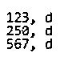
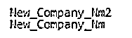
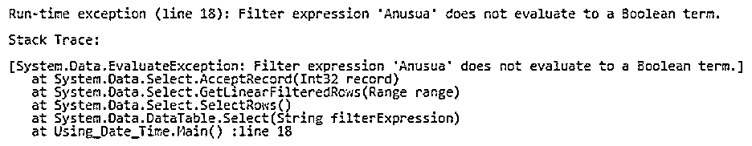
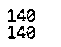

# C#数据表筛选器

> 原文：<https://www.educba.com/c-sharp-datatable-filter/>


## C#数据表筛选器简介

C# DataTable 是一个中央对象，用于访问与数据表相关的大多数对象和数据。由于数据表包含大量数据，并且不是有组织的格式，因此需要应用过滤器。为了满足与 C#相关的 DataTable 中的过滤属性，需要让过滤器对数据进行排列和排序。

**语法:**

<small>网页开发、编程语言、软件测试&其他</small>

C# DataTable 筛选器没有特定的语法，但它仍然使用与列相关联的筛选函数，如下所示:

```
dataView.RowFilter = "s_id=180";
```

与文字相关联的数据表筛选函数表示如下:

```
dataView.RowFilter = "s_name = 'anu'"
```

与数值相关联的数据表过滤函数表示如下:

```
dataView.RowFilter = "dt_of_brth = 1987"
```

### C#中如何过滤数据表？

C#中的 Filter 函数主要用于数据及其相关操作数量庞大的情况。如果数据表中的数据越来越多，那么行和列过滤的唯一救星就是数据表中的过滤器。

让我们看看 C#中过滤数据表的工作模式:

*   在 C#中过滤数据表不是唯一的，并且不同于其他类型的过滤技术；然而，它可以通过多种方式实现。
*   过滤数据表的各种方式包括 select(String)方法，它选择所需的行或列，然后基于此应用过滤器。
*   可以使用 Select、Where、AND、OR、NOT 逻辑运算符进行过滤，并在此基础上应用值。
*   数据表中的数据行和列也使用排序方法，该方法根据需要以升序或降序的格式对数据进行排序。
*   在保存任何对象时，将字符串选择为可枚举是有用的，然后基于计算应用过滤和排序操作有助于提供所需的结果。
*   对于 true 或 false 返回函数，也需要注意对 DataTable 及其关联字符串的评估。

### C#数据表筛选器的示例

下面是 C#数据表筛选器的示例:

#### 示例#1

此程序演示了如何使用 select 语句作为筛选语句来筛选和提取行数据，因为每个语句都有 and、or 和 NOT 条件，并返回大于上述数字但小于输出中显示的另一个上限的任何数字。

**代码:**

```
using System;
using System.Data;
using System.Xml;
using System.Collections.Generic;
using System.Linq;
using System.Data.DataSetExtensions;
public class Data_tbl_Demo
{
public static void Main()
{
DataTable tbl_1 = new DataTable("Creation of Data for players");
tbl_1.Columns.Add(new DataColumn("Size_of_team", typeof(int)));
tbl_1.Columns.Add(new DataColumn("Team_work", typeof(char)));
tbl_1.Rows.Add(50, 'c');
tbl_1.Rows.Add(100, 'c');
tbl_1.Rows.Add(250, 'd');
tbl_1.Rows.Add(567, 'd');
tbl_1.Rows.Add(123, 'd');
DataRow[] rslt = tbl_1.Select("Size_of_team >= 123 AND Team_work = 'd'");
foreach (DataRow row in rslt)
{
Console.WriteLine("{0}, {1}", row[0], row[1]);
}
}
}
```

**输出:**




#### 实施例 2

该程序用于演示 DataTable 筛选表达式，该表达式用于在按照输出中所示的降序排序后返回 DataRow 对象的数组。

**代码:**

```
using System;
using System.Data;
using System.Xml;
using System.Collections.Generic;
using System.Linq;
using System.Data.DataSetExtensions;
public class Data_tbl_Demo
{
public static void Main()
{
DataTable tbl2_2 = new DataTable("Orders_plcd");
tbl2_2.Columns.Add("Order_ID", typeof(Int32));
tbl2_2.Columns.Add("Order_Quantity", typeof(Int32));
tbl2_2.Columns.Add("Company_Name", typeof(string));
tbl2_2.Columns.Add("Date_on_day", typeof(DateTime));
DataRow nw_row = tbl2_2.NewRow();
nw_row["Order_ID"] = 1;
nw_row["Order_Quantity"] = 5;
nw_row["Company_Name"] = "New_Company_Nm";
nw_row["Date_on_day"] = "2014, 5, 25";
tbl2_2.Rows.Add(nw_row);
DataRow nw_row2 = tbl2_2.NewRow();
nw_row2["Order_ID"] = 2;
nw_row2["Order_Quantity"] = 6;
nw_row2["Company_Name"] = "New_Company_Nm2";
tbl2_2.Rows.Add(nw_row2);
DataRow nw_row3 = tbl2_2.NewRow();
nw_row3["Order_ID"] = 3;
nw_row3["Order_Quantity"] = 8;
nw_row3["Company_Name"] = "New_Company_Nm3";
tbl2_2.Rows.Add(nw_row3);
string exprsn = "Date_on_day = '5/25/2014' or Order_ID = 2";
string sort_Order = "Company_Name DESC";
DataRow[] sorted_Rows;
sorted_Rows = tbl2_2.Select(exprsn, sort_Order);
for (int i = 0; i < sorted_Rows.Length; i++)
Console.WriteLine(sorted_Rows[i][2]);
}
}
```

**输出:**




#### 实施例 3

这个程序演示了 select 查询，在该查询中，DataTable 查找两个匹配的行，这两个行的日期采用更新的格式，并使用 DateTime 进行筛选，如输出中所示。

**代码:**

```
using System;
using System.Data;
using System.Xml;
using System.Collections.Generic;
using System.Linq;
using System.Data.DataSetExtensions;
public class Using_Date_Time
{
public static void Main()
{
DataTable tbl_dt_time = new DataTable("Widgets");
tbl_dt_time.Columns.Add(new DataColumn("rw_ID", typeof(int)));
tbl_dt_time.Columns.Add(new DataColumn("Date", typeof(DateTime)));
tbl_dt_time.Rows.Add(180, new DateTime(2003, 1, 1));
tbl_dt_time.Rows.Add(123, new DateTime(2000,1, 1));
tbl_dt_time.Rows.Add(350, new DateTime(2001,1, 1));
DataRow[] filterd_result = tbl_dt_time.Select("Date > #6/1/2001#");
foreach (DataRow row in filterd_result)
{
Console.WriteLine(row["rw_ID"]);
}
}
}
```

**输出:**


#### 实施例 4

这个程序通过选择一个像 A 这样的值来说明一个无效的表达式，这个值不会被计算为 true 或 false，并抛出一个讨厌的错误。

**代码:**

```
using System;
using System.Data;
using System.Xml;
using System.Collections.Generic;
using System.Linq;
using System.Data.DataSetExtensions;
public class Using_Date_Time
{
public static void Main()
{
DataTable table = new DataTable();
table.Columns.Add("Anusua", typeof(int));
table.Rows.Add(1);
table.Rows.Add(2);
table.Rows.Add(3);
table.Rows.Add(4);
table.Rows.Add(5);
DataRow[] rows = table.Select("Anusua");
System.Console.WriteLine(rows.Length);
}
}
```

**输出:**




**注:**要克服上述对数据表求值，通过求值来筛选数据表的情况，适当涉及这些集合语句。

语句包括如下行:

**DataRow[] rows =表格。Select("阿奴苏阿>1 ")；**

**系统。Console.WriteLine(行。长度)；**

如果像前面提到的例子一样，通过替换 select 语句来正确执行，上面两行将提供所需的输出。

输出结果如下:


#### 实施例 5

这个程序演示了要过滤的数据表，并执行一个 sum 操作，该操作将驻留在创建为 sum 的对象中，从中获得所需的 sum 并显示在输出中。

**代码:**

```
using System;
using System.Data;
using System.Xml;
using System.Collections.Generic;
using System.Linq;
using System.Data.DataSetExtensions;
public class Program
{
public static void Main()
{
DataTable dt_4 = new DataTable();
dt_4.Columns.Add("emp_Id",typeof(int));
dt_4.Columns.Add("customer_Name",typeof(string));
dt_4.Columns.Add("Amount_type",typeof(decimal));
dt_4.Rows.Add(1,"A",50);
dt_4.Rows.Add(2,"b",68);
dt_4.Rows.Add(3,"c",22);
dt_4.Rows.Add(4,"d",null);
decimal dec_ml = 0;
object sum_Obj;
sum_Obj = dt_4.Compute("Sum(Amount_type)", string.Empty);
decimal total = dt_4.AsEnumerable().Where(r => !r.IsNull("Amount_type") && decimal.TryParse(r["Amount_type"].ToString(), out dec_ml)).Sum(r => dec_ml);
Console.WriteLine(sum_Obj);
Console.WriteLine(total);
}
}
```

**输出:**




### 结论

在处理大量数据时，C#和任何其他编程语言中的 DataTable 都起着举足轻重的作用。关于数据库及其后续子集的过滤也起着重要的作用，因为在从数据库获取和检索数据方面，数据库应该总是被优化和高效的。

### 推荐文章

这是一个 C#数据表过滤器指南。这里我们讨论一下入门，C#中如何过滤数据表？和示例。您也可以看看以下文章，了解更多信息–

1.  [C#秒表](https://www.educba.com/c-sharp-stopwatch/)
2.  [C#目录信息](https://www.educba.com/c-sharp-directoryinfo/)
3.  [C# SOAP](https://www.educba.com/c-sharp-soap/)
4.  [C# Compare()](https://www.educba.com/c-sharp-compare/)


