# C#中的模式

> 原文：<https://www.educba.com/patterns-in-c-sharp/>

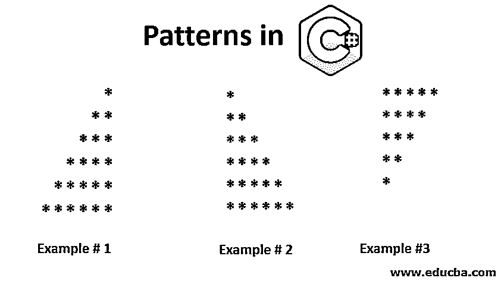


## C#中的模式介绍

图案是重复的装饰设计。有一个用 C#写模式的简单代码。我们可以编写代码来打印不同类型的图案，如星形图案、字符图案和数字图案。以下是打印星形、字符和数值图案的各种示例。这些例子[由循环或嵌套循环](https://www.educba.com/nested-loop-in-javascript/)组成，嵌套循环是循环中的循环。模式是一种按顺序或逻辑方式进行设计的方式。我们可以打印三角形、金字塔形、菱形和其他对称形状。

### C#中最常见的三种模式

下面提到了 c#中最常见的 3 种模式。

<small>网页开发、编程语言、软件测试&其他</small>

#### 1.星形图案

以下是打印星形图案的示例。

**例#1**

```
using System;
using System.Collections.Generic;
using System.Linq;
using System.Text;
namespace StarPattern
{
class Program
{
static void Main(string[] args)
{
int x, y, z;
for (x =6; x >= 1; x--)
{
for (y = 1; y < x; y++)
{
Console.Write(" ");
}
for (z = 6; z >= x; z--)
{
Console.Write("*");
}
Console.WriteLine();
}
Console.ReadLine();
}
}
}
```

****输出:****


**例 2**

```
using System;
using System.Collections.Generic;
using System.Linq;
using System.Text;
namespace StarPattern
{
class Program
{
static void Main(string[] args)
{
int x, y;
for (x = 1; x <= 6; x++)
{
for (y = 1; y <= x; y++)
{
Console.Write("*");
}
Console.WriteLine();
}
Console.ReadLine();
}
}
}
```

****输出:****


**例 3**

```
using System;
using System.Collections.Generic;
using System.Linq;
using System.Text;
namespace StarPattern
{
class Program
{
static void Main(string[] args)
{
int x, y;
for (x = 5; x >= 1; x--)
{
for (y = 1; y <= x; y++)
{
Console.Write("*");
}
Console.WriteLine();
}
Console.ReadLine();
}
}
}
```

****输出:****


**例#4**

```
using System;
using System.Collections.Generic;
using System.Linq;
using System.Text;
namespace StarPattern
{
class Program
{
static void Main(string[] args)
{
int x, y, z;
for (x = 5; x >= 1; x--)
{
for (y = 5; y > x; y--)
{
Console.Write(" ");
}
for (z = 1; z <=x; z++)
{
Console.Write("*");
}
Console.WriteLine();
}
Console.ReadLine();
}
}
}
```

****输出:****

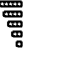


**例#5**

```
using System;
using System.Collections.Generic;
using System.Linq;
using System.Text;
namespace StarPattern
{
class Program
{
static void Main(string[] args)
{
int x, y, z;
for (x= 1; x <= 5; x++)
{
for (y = x; y < 5; y++)
{
Console.Write(" ");
}
for (z = 1; z < (x * 2); z++)
{
Console.Write("*");
}
Console.WriteLine();
}
Console.ReadLine();
}
}
}
```

****输出:****


**例#6**

```
using System;
using System.Collections.Generic;
using System.Linq;
using System.Text;
namespace StarPattern
{
class Program
{
static void Main(string[] args)
{
int x, y, z;
for (x = 5; x >= 1; x--)
{
for (y = 5; y > x; y--)
{
Console.Write(" ");
}
for (z = 1; z < (x * 2); z++)
{
Console.Write("*");
}
Console.WriteLine();
}
Console.ReadLine();
}
}
}
```

****输出:****

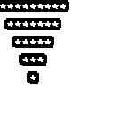


**例#7**

```
using System;
using System.Collections.Generic;
using System.Linq;
using System.Text;
namespace StarPattern
{
class Program
{
static void Main(string[] args)
{
int x, y;
for (x = 1; x <= 5; x++)
{
for (y = x; y < 5; y++)
{
Console.Write(" ");
}
for (y = 1; y <= (2 * x - 1); y++)
{
if (x == 5 || y == 1 || y == (2 * x - 1))
{
Console.Write("*");
}
else
{
Console.Write(" ");
}
}
Console.WriteLine();
}
Console.ReadLine();
}
}
}
```

****输出:****


**例#8**

```
using System;
using System.Collections.Generic;
using System.Linq;
using System.Text;
namespace CharacterPattern
{
class Program
{
static void Main(string[] args)
{
int x, y;
for (x = 1; x <= 5; x++)
{
for (y = 1; y <= 5; y++)
{
Console.Write("*");
}
Console.WriteLine();
}
Console.ReadLine();
}
}
}
```

****输出:****


**例 9**

```
using System;
using System.Collections.Generic;
using System.Linq;
using System.Text;
namespace CharacterPattern
{
class Program
{
static void Main(string[] args)
{
int x, y;
for (x = 1; x <= 5; x++)
{
for (y = 1; y <= x; y++)
{
if (y == 1 || y== x || x == 5)
{
Console.Write("*");
}
else
{
Console.Write(" ");
}
}
Console.WriteLine();
}
Console.ReadLine();
}
}
}
```

****输出:****


#### 2.数字模式

以下是打印数字模式的示例。

**例#1**

```
using System;
using System.Collections.Generic;
using System.Linq;
using System.Text;
namespace NumberPattern
{
class Program
{
static void Main(string[] args)
{
int x, y;
for (x = 1; x <= 5; x++)
{
for (y = 1; y <= x; y++)
{
Console.Write(y);
}
Console.WriteLine();
}
Console.ReadLine();
}
}
}
```

****输出:****


**例 2**

```
using System;
using System.Collections.Generic;
using System.Linq;
using System.Text;
namespace NumberPattern
{
class Program
{
static void Main(string[] args)
{
int x, y;
for (x = 5; x >= 1; x--)
{
for (y = 1; y <= x; y++)
{
Console.Write(y);
}
Console.WriteLine();
}
Console.ReadLine();
}
}
}
```

****输出:****

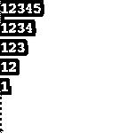


**例 3**

```
using System;
using System.Collections.Generic;
using System.Linq;
using System.Text;
namespace NumberPattern
{
class Program
{
static void Main(string[] args)
{
int x, y;
for (x = 5; x >= 1; x--)
{
for (y = x; y <= 5; y++)
{
Console.Write(y);
}
Console.WriteLine();
}
Console.ReadLine();
}
}
}
```

****输出:****

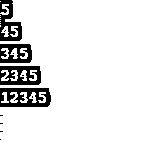


**例#4**

```
using System;
using System.Collections.Generic;
using System.Linq;
using System.Text;
namespace NumberPattern
{
class Program
{
static void Main(string[] args)
{
int x, y;
for (x = 1; x <= 5; x++)
{
for (y = x; y <= 5; y++)
{
Console.Write(y);
}
Console.WriteLine();
}
Console.ReadLine();
}
}
}
```

****输出:****

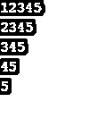


**例#5**

```
using System;
using System.Collections.Generic;
using System.Linq;
using System.Text;
using System.Threading.Tasks;
namespace NumberPattern
{
class Program
{
static void Main(string[] args)
{
int x, y;
for (x = 1; x <= 5; x++)
{
for (y = 1; y <= x; y++)
{
Console.Write(x);
}
Console.WriteLine();
}
Console.ReadLine();
}
}
}
```

****输出:****

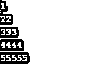


**例#6**

```
using System;
using System.Collections.Generic;
using System.Linq;
using System.Text;
using System.Threading.Tasks;
namespace NumberPattern
{
class Program
{
static void Main(string[] args)
{
int x, y;
for (x = 5; x >= 1; x--)
{
for (y = 5; y >= x; y--)
{
Console.Write(x);
}
Console.WriteLine();
}
Console.ReadLine();
}
}
}
```

****输出:****

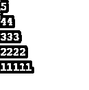


**例#7**

```
using System;
using System.Collections.Generic;
using System.Linq;
using System.Text;
using System.Threading.Tasks;
namespace NumberPattern
{
class Program
{
static void Main(string[] args)
{
int x, y;
for (x = 5; x >= 1; x--)
{
for (y = 1; y <= x; y++)
{
Console.Write(x);
}
Console.WriteLine();
}
Console.ReadLine();
}
}
}
```

****输出:****

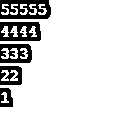


**例#8**

```
using System;
using System.Collections.Generic;
using System.Linq;
using System.Text;
using System.Threading.Tasks;
namespace NumberPattern
{
class Program
{
static void Main(string[] args)
{
int x, y;
for (x = 1; x <= 5; x++)
{
for (y = 5; y >= x; y--)
{
Console.Write(x);
}
Console.WriteLine();
}
Console.ReadLine();
}
}
}
```

****输出:****

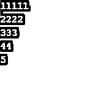


**例 9**

```
using System;
using System.Collections.Generic;
using System.Linq;
using System.Text;
using System.Threading.Tasks;
namespace NumberPattern
{
class Program
{
static void Main(string[] args)
{
int x, y;
for (x = 6; x >= 1; x--)
{
for (y = x; y >= 1; y--)
{
Console.Write(y);
}
Console.WriteLine();
}
Console.ReadLine();
}
}
}
```

****输出:****

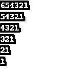


**例#10**

```
using System;
using System.Collections.Generic;
using System.Linq;
using System.Text;
using System.Threading.Tasks;
namespace NumberPattern
{
class Program
{
static void Main(string[] args)
{
int x, y;
for (x = 1; x <= 5; x++)
{
for (y = 6; y >= x; y--)
{
Console.Write(y);
}
Console.WriteLine();
}
Console.ReadLine();
}
}
}
```

****输出:****


**例 11**

```
using System;
using System.Collections.Generic;
using System.Linq;
using System.Text;
using System.Threading.Tasks;
namespace NumberPattern
{
class Program
{
static void Main(string[] args)
{
int x, y;
for (x = 7; x >= 1; x -= 2)
{
for (y = 1; y <= x; y++)
{
Console.Write(y);
}
Console.WriteLine();
}
Console.ReadLine();
}
}
}
```

****输出:****

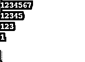


#### 3.字符模式

下面的是打印字符图案的例子。

**例#1**

```
using System;
using System.Collections.Generic;
using System.Linq;
using System.Text;
namespace CharacterPattern
{
class Program
{
static void Main(string[] args)
{
int x, y;
int z = 5;
for (x = 1; x <= z; x++)
{
for (y = 1; y <= x; y++)
{
Console.Write((char)(x + 64));
}
Console.WriteLine("");
}
Console.ReadLine();
}
}
}
```

****输出:****

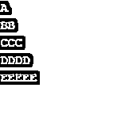


**例 2**

```
using System;
using System.Collections.Generic;
using System.Linq;
using System.Text;
namespace CharacterPattern
{
class Program
{
static void Main(string[] args)
{
int x, y;
int z = 5;
for (x = 1; x <= z; x++)
{
for (y = x; y <= z; y++)
{
Console.Write((char)(x + 64));
}
Console.WriteLine("");
}
Console.ReadLine();
}
}
}
```

****输出:****

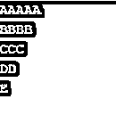


**例 3**

```
using System;
using System.Collections.Generic;
using System.Linq;
using System.Text;
namespace CharacterPattern
{
class Program
{
static void Main(string[] args)
{
int x, y;
int z = 5;
for (x = 1; x <= z; x++)
{
for (y = 1; y <= x; y++)
{
Console.Write((char)(z - x + 1 + 64));
}
Console.WriteLine("");
}
Console.ReadLine();
}
}
}
```

****输出:****

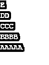


**例#4**

```
using System;
using System.Collections.Generic;
using System.Linq;
using System.Text;
namespace CharacterPattern
{
class Program
{
static void Main(string[] args)
{
int x, y;
int z = 5;
for (x = 1; x <= z; x++)
{
for (y = x; y<= z; y++)
{
Console.Write((char)(y + 64));
}
Console.WriteLine();
}
Console.ReadLine();
}
}
}
```

****输出:****

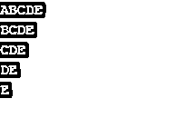


**例#5**

```
using System;
using System.Collections.Generic;
using System.Linq;
using System.Text;
namespace CharacterPattern
{
class Program
{
static void Main(string[] args)
{
int x, y, z;
int k = 5;
for (x = 1; x <= k; x++)
{
for (y = 1; y <= k - x; y++)
{
Console.Write(" ");
}
for (z = 1; z <= x; z++)
{
Console.Write((char)(x + 64));
}
Console.WriteLine();
}
Console.ReadLine();
}
}
}
```

****输出:****

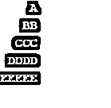


**例#6**

```
using System;
using System.Collections.Generic;
using System.Linq;
using System.Text;
namespace CharacterPattern
{
class Program
{
static void Main(string[] args)
{
int x, y;
int a = 5;
for (x = 1; x <= a; x++)
{
for (y = x; y >= 1; y--)
{
Console.Write((char)(y + 64));
}
Console.WriteLine("");
}
Console.ReadLine();
}
}
}
```

****输出:****

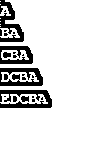


**例#7**

```
using System;
using System.Collections.Generic;
using System.Linq;
using System.Text;
namespace CharacterPattern
{
class Program
{
static void Main(string[] args)
{
int x, y;
int a = 5;
for (x = a; x >= 1; x--)
{
for (y = a; y >= x; y--)
{
Console.Write((char)(y + 64));
}
Console.WriteLine("");
}
Console.ReadLine();
}
}
}
```

**输出:**

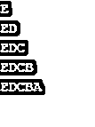


**例#8**

```
using System;
using System.Collections.Generic;
using System.Linq;
using System.Text;
namespace CharacterPattern
{
class Program
{
static void Main(string[] args)
{
int x, y;
int a = 5;
for (x = 1; x <= a; x++)
{
for (y = a; y >= x; y--)
{
Console.Write((char)(y + 64));
}
Console.WriteLine("");
}
Console.ReadLine();
}
}
}
```

****输出:****

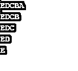


**例 9**

```
using System;
using System.Collections.Generic;
using System.Linq;
using System.Text;
namespace CharacterPattern
{
class Program
{
static void Main(string[] args)
{
int x, y;
int z = 5;
for (x = z; x >= 1; x--)
{
for (y = x; y >= 1; y--)
{
Console.Write((char)(y + 64));
}
Console.WriteLine("");
}
Console.ReadLine();
}
}
}
```

****输出:****

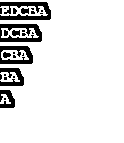


**例#10**

```
using System;
using System.Collections.Generic;
using System.Linq;
using System.Text;
namespace CharacterPattern
{
class Program
{
static void Main(string[] args)
{
int x, y;
int z = 6;
for (x = 1; x <= z; x++)
{
for (y = 1; y<= z - x; y++)
{
Console.Write(" ");
}
for (y = 1; y <= x; y++)
{
Console.Write((char)(y + 64));
}
for (y = x - 1; y >= 1; y--)
{
Console.Write((char)(y + 64));
}
Console.WriteLine();
}
Console.ReadLine();
}
}
}
```

****输出:****


### 结论

所以以上是各种类型模式的一些例子。我们可以印出任何类型的图案，只要在线圈上做些改变。

### 推荐文章

这是 C#模式指南。在这里，我们讨论 C#中的介绍和前 3 种模式，以及它的例子和代码实现。你也可以看看下面的文章来了解更多-

1.  [c#中的设计模式是什么？](https://www.educba.com/what-is-design-pattern-in-c-sharp/)
2.  [C#设计模式面试题](https://www.educba.com/c-sharp-design-pattern-interview-questions/)
3.  [c#中的 2D 数组](https://www.educba.com/2d-arrays-in-c-sharp/)
4.  [在 C#中覆盖](https://www.educba.com/overriding-in-c-sharp/)


