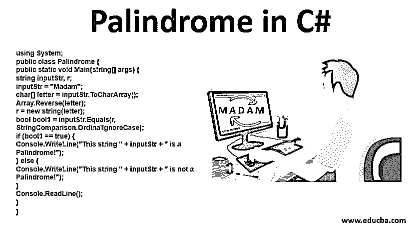

# C#中的回文

> 原文：<https://www.educba.com/palindrome-in-c-sharp/>




## C#中的回文概述

每个学院或大学都倾向于给学生一些锻炼。为了好玩，把回文这样的程序给学生。每种编程语言都有自己写回文程序的方式。很多人可能熟悉也可能不熟悉这个概念。不要担心它。在接下来的 c#回文文章中，你将理解回文到底是什么，以及我们如何以编程方式实现它。

我们来谈谈回文到底是什么意思。任何一个数，即使我们把它反过来也是一样的。

<small>网页开发、编程语言、软件测试&其他</small>

例如:1234321 = >这个数字，即使你试图以相反的顺序书写，给你的也是同一个号码
更多的例子是 565，757，99899，52125 等等。

现在，让我们看看计算它的确切方法。

假设我们有一个 434 号。现在，让我们反过来，我们只得到 434。

关于回文最好笑的是，如果我们把它们相加，我们会得到一个新的回文号。

例:214 + 412 = 626 (626 只不过是回文号)
这简单地意味着，如果我们向前和向后都没有遍历，那么我们得到的也是相同的回文号
在不同的语言中有特定的方法来检查回文。这里我们要用 C#来检查。

### C#中回文背后的逻辑

这里使用的简单逻辑向前和向后遍历密集的输入，给定的数字或字符串与初始的相同，相应的输出称为回文。

仔细看看下面的程序，它接受用户的输入，并检查它是否是回文。一旦你知道了回文的概念，这就很容易识别了。

**代码:**

```
using System;
public class IsPalindrome
{
public static void Main(string[] args)
{
int no,total=0,t,rev;
Console.Write("Please provide the no: ");
no = int.Parse(Console.ReadLine());
t=no;
while(no>0)
{
rev=no%10;
total=(total*10)+rev;
no=no/10;
}
if(t==total)
Console.Write("The given number is Palindrome.");
else
Console.Write("The given number is not Palindrome");
}
}
```

**输出:**

要求用户输入任何数字的输出。

现在，在输入 no 后，它显示 no 是否是一个回文。


在上面的程序中，我们接受用户的输入。我们通过解析方法将输入转换成整数。在 while 循环的帮助下，我们反转了编号，并与原始编号进行了核对。

如果用户提供的 no 和我们反向的 no 相同，那么这个 no 就是一个回文。在我们的例子中，我们取了 212。作为给定的[数，我们得到的输出是一个回文](https://www.educba.com/palindrome-in-javascript/)。

### 如何用各种方法检查 C#中的回文？

到目前为止，我们只检查了回文的数字。但是让我告诉你，我们也可以用绳子来检查。因为某些字符串的组合也具有类似回文的性质。

#### 示例 1–女士

夫人，让我们把这根绳子反过来，我们会找到同样的绳子。以编程方式查看会很好。

**代码:**

```
using System;
public class Palindrome {
public static void Main(string[] args) {
string inputStr, r;
inputStr = "Madam";
char[] letter = inputStr.ToCharArray();
Array.Reverse(letter);
r = new string(letter);
bool bool1 = inputStr.Equals(r, StringComparison.OrdinalIgnoreCase);
if (bool1 == true) {
Console.WriteLine("This string " + inputStr + " is a Palindrome!");
} else {
Console.WriteLine("This string " + inputStr + " is not a Palindrome!");
}
Console.ReadLine();
}
}
```

**输出:**


现在，我们来谈谈上面的程序。我们实际上做了什么。

我们在这里取了一个字符串，就是“Madam”。然后我们把这个字符串转换成一个字符数组。我们使用 ToCharArray()方法来创建一个字符数组。在创建了一个字符数组后，我们在这个数组上使用了 reverse 方法来使它反转。然后我们在 Equals()方法的帮助下比较了给定的字符串和反转的字符串。我们在这个方法的输出中存储了一个名为 bool1 的变量，它的类型是 Boolean。

现在，最后，在 if-else 条件的帮助下，我们检查了变量 bool1 等于 true 还是 false。在我们的程序中，if 条件被执行。因此输出是“字符串 Madam 是一个回文。”

寻找单词或数字没有限制。

你可以用它做拼图。有很多条件，比如你有一整段，有人让你检查是否有任何字符串是回文。

有些例子就像他们有一个段落，但整个句子本身是一个回文。

#### 例子 2——我看到的是一辆车还是一只猫？

如果我们颠倒上面的句子，那么我们再次得到同样的句子。

我们来举个例子；请检查下面的代码。

**代码:**

```
using System;
public class Palindrome
{
public static bool IsPalindrome(string value)
{
int x = 0;
int y = value.Length - 1;
while (true)
{
if (x > y)
{
return true;
}
char i = value[x];
char j = value[y];
// Scan forward for a while invalid.
while (!char.IsLetterOrDigit(i))
{
x++;
if (x > y)
{
return true;
}
i = value[x];
}
while (!char.IsLetterOrDigit(j))
{
y--;
if (x > y)
{
return true;
}
j = value[y];
}
if (char.ToLower(i) != char.ToLower(j))
{
return false;
}
x++;
y--;
}
}
public static void Main()
{
string[] ary =
{
"Was it a car or a cat I saw?"
};
foreach (string value in ary)
{
Console.WriteLine("{0} = {1}", value, IsPalindrome(value));
}
}
}
```

**输出:**


因此，正如我们谈到的，整个句子本身就是一个回文。如果你把它也反过来，它会给你同样的句子。

在上面的程序中，我们遍历整个句子直到最后一个。然后，我们将其转换成小写，并对照给定的句子进行检查。通过自己编码来尝试这个程序；那么只有你才能了解这些程序的实际流程。

### 结论

类似回文的招数还有很多。我们已经看到了刺和数，它们本质上是回文。通过一些步骤，我们多么轻松地实现了它。

### 推荐文章

这是一个 C#中的回文指南。这里我们用不同的例子和代码实现来讨论逻辑以及如何在 C#中检查回文。您也可以阅读以下文章，了解更多信息——

1.  [c#中的斐波那契数列](https://www.educba.com/fibonacci-series-in-c-sharp/)
2.  [c#中的析构函数](https://www.educba.com/destructor-in-c-sharp/)
3.  [c++中的回文](https://www.educba.com/palindrome-in-c-plus-plus/)
4.  [ASP.NET vs c#](https://www.educba.com/asp-net-vs-c-sharp/)


