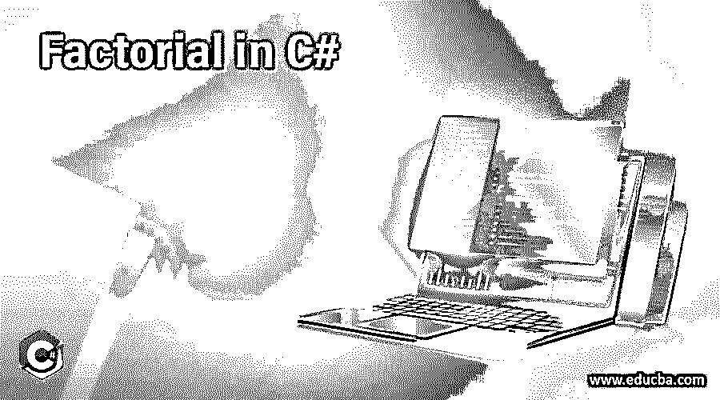
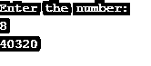

# C#中的阶乘

> 原文：<https://www.educba.com/factorial-in-c-sharp/>




## C#中的阶乘简介

在这一节中，我们将详细了解 c#中的阶乘。阶乘在数学领域是一个非常重要的概念，比如在代数或数学分析中。它用感叹号(！idspnonenote)表示。).阶乘是任意正整数 k，用 k 表示！它是所有小于或等于 k 的正整数的乘积。

k！= k *(k-1)*(k-2)*(k-3)*(k-4)*……. 3 * 2 * 1。

<small>网页开发、编程语言、软件测试&其他</small>

**计算给定数字的阶乘的逻辑**

例如，如果我们想计算 4 的阶乘，

**例#1**

4! = 4 * (4-1) *(4-2) * (4-3)

4! = 4 * 3 * 2 * 1

4! = 24.

所以 4 的阶乘是 24

**例 2**

6! = 6 * (6-1)* (6-2)* (6-3) * 6-4)* (6-5)

6! = 6*5*4*3*2*1

6! = 720

所以 6 的阶乘是 720

同样，通过使用这种技术，我们可以计算任何正整数的阶乘。这里重要的一点是 0 的阶乘是 1。

0! =1.

对于这一点有很多解释，就像对于 n！其中 n=0 表示没有数的乘积，它等于乘法实体。{ \ display style { \ binom { 0 } { 0 } } = { 0！}{0!0!}}=1.}

阶乘函数主要用于计算排列和组合，也用于二项式。借助阶乘函数，我们还可以计算概率。例如，我们可以用多少种方式排列 k 个项目。我们对第一件事有 k 个选择，所以对于这 k 个选择中的每一个，我们对第二件事有 k-1 个选择(因为第一个选择已经做出了)，所以现在我们有 k(k-1)个选择，所以现在对于第三个选择我们有 k(k-1)(k-2)个选择，等等，直到我们得到一个剩余的东西。所以我们总共有 k(k-1)(k-2)(k-3)…3..1.

另一个实时例子是假设我们要去参加一个婚礼，我们想选择哪一件西装外套。让我们假设我们有 k 件外套，但是有空间装下唯一的 n 件，那么我们有多少种方法可以使用 k 件外套中的 n 件外套呢？/(n！.(k-n)！).

### C#中的阶乘示例

下面的例子展示了我们如何用不同的方法计算任意数的阶乘，

#### 示例#1

1.在这些示例中，for 循环用于计算一个数的阶乘。

**代码:**

```
using System;
using System.Collections.Generic;
using System.Linq;
using System.Text;
using System.Threading.Tasks;
namespace Factorial
{
class Program
{
static void Main()
{
int a = 7;
int fact = 1;
for (int x = 1; x <= a; x++)
{
fact *= x;
}
Console.WriteLine(fact);
Console.ReadLine();
}
}
}
```

在此示例中，整数数据类型的变量被初始化，for 循环用于计算数字。

**输出:**


2.在这个例子中，允许用户输入数字来计算阶乘。

**代码:**

```
using System;
using System.Collections.Generic;
using System.Linq;
using System.Text;
using  System.Threading.Tasks;
namespace FactorialExample
{
class Program
{
static void Main()
{
Console.WriteLine("Enter the number: ");
int a = int.Parse(Console.ReadLine());
int fact = 1;
for (int x = 1; x <= a; x++)
{
fact *= x;
}
Console.WriteLine(fact);
Console.ReadLine();
}
}
}
```

**输出:**




#### 实施例 2

1.在这些示例中，for 循环用于计算一个数的阶乘。

**代码:**

```
using System;
using System.Collections.Generic;
using System.Linq;
using System.Text;
using System.Threading.Tasks;
namespace Factorial
{
class Program
{
static void Main()
{
int a = 10;
int fact = 1;
while (true)
{
Console.Write(a);
if (a == 1)
{
break;
}
Console.Write("*");
fact *= a;
a--;
}
Console.WriteLine(" = {0}", fact);
Console.ReadLine();
}
}
}
```

**输出:**


2.在这些示例中，while 循环用于计算一个数的阶乘。

**代码:**

```
using System;
using System.Collections.Generic;
using System.Linq;
using System.Text;
using System.Threading.Tasks;
namespace FactorialExample
{
class Program
{
static void Main()
{
Console.WriteLine("Enter the number: ");
int a = int.Parse(Console.ReadLine());
int fact = 1;
while(true)
{
Console.Write(a);
if(a==1)
{
break;
}
Console.Write("*");
fact *= a;
a--;
}
Console.WriteLine(" = {0}", fact);
Console.ReadLine();
}
}
}
```

**输出:**


#### 实施例 3

1.在这个例子中，do-while 用于计算一个数的阶乘。

**代码:**

```
using System;
using System.Collections.Generic;
using System.Linq;
using System.Text;
using System.Threading.Tasks;
namespace Factorial
{
class Program
{
static void Main()
{
int a = 6;
int fact = 1;
do
{
fact *= a;
a--;
} while (a > 0);
Console.WriteLine("Factorial = {0}", fact);
Console.ReadLine();
}
}
}
```

**输出:**


2.在这个例子中，do-while 用于计算一个数的阶乘。

**代码:**

```
using System;
using System.Collections.Generic;
using System.Linq;
using System.Text;
using System.Threading.Tasks;
namespace FactorialExample
{
class Program
{
static void Main()
{
Console.Write("Enter the number: ");
int a = int.Parse(Console.ReadLine());
int fact = 1;
do
{
fact *= a;
a--;
} while (a > 0);
Console.WriteLine("Factorial = {0}", fact);
Console.ReadLine();
}
}
}
```

**输出:**


#### 实施例 4

1.在此示例中，递归函数用于计算数字的阶乘。

**代码:**

```
using System;
using System.Collections.Generic;
using System.Linq;
using System.Text;
using System.Threading.Tasks;
namespace Factorial
{
class Program
{
static void Main()
{
int n= 5;
long fact = Fact(n);
Console.WriteLine("factorial is {1}", n, fact);
Console.ReadKey();
}
private static long Fact(int n)
{
if (n == 0)
{
return 1;
}
return n * Fact(n - 1);
}
}
}
```

在上面的例子中，一个数的阶乘是通过递归得到的。递归背后的思想是在小实例中解决问题。所以每当一个函数创建一个循环并调用它自己，这就叫做递归。

**输出:**


2.在这个例子中，[递归函数](https://www.educba.com/recursive-function-in-c-sharp/)用于计算一个数的阶乘。

**代码:**

```
using System;
using System.Collections.Generic;
using System.Linq;
using System.Text;
using System.Threading.Tasks;
namespace FactorialExample
{
class Program
{
static void Main()
{
Console.WriteLine("Enter the number");
int n = Convert.ToInt32(Console.ReadLine());
long fact = Fact(n);
Console.WriteLine("factorial is {1}", n, fact);
Console.ReadKey();
}
private static long Fact(int n)
{
if (n == 0)
{
return 1;
}
return n * Fact(n - 1);
}
}
}
```

**输出:**


### 结论

因此，阶乘的概念在数学领域非常重要，例如二项式、排列和组合，这就是我们如何通过使用多种方法打印任意数字的阶乘，例如 for、while、do-while、function 等。

### 推荐文章

这是 C#中阶乘的指南。这里我们讨论 c#中阶乘的基本概念，以及不同的例子和代码实现。您也可以阅读以下文章，了解更多信息——

1.  [c#中的虚拟关键字](https://www.educba.com/virtual-keyword-in-c-sharp/)
2.  [c#中的 text writer](https://www.educba.com/textwriter-in-c-sharp/)
3.  [C#排序集](https://www.educba.com/c-sharp-sortedset/)
4.  [C#最后](https://www.educba.com/c-sharp-finally/)


